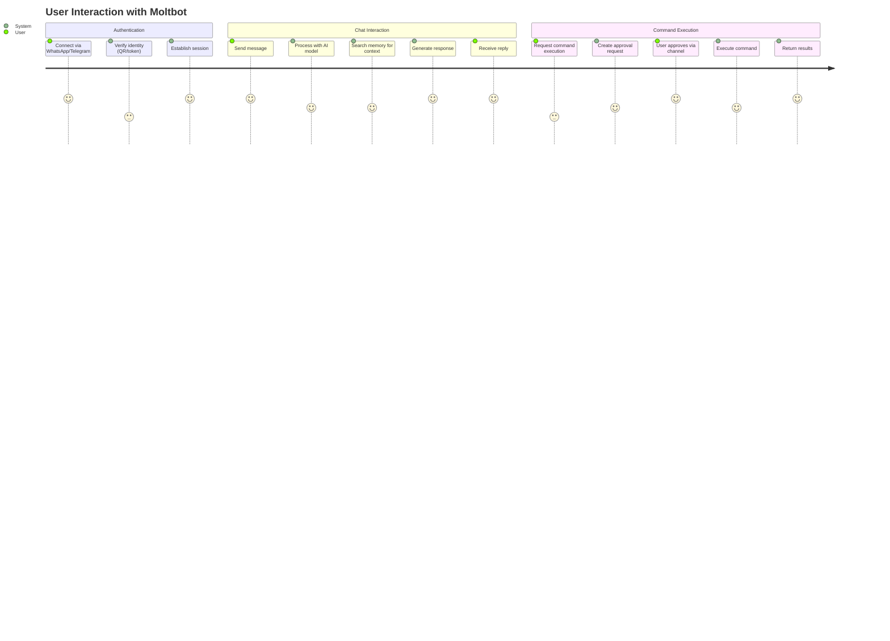
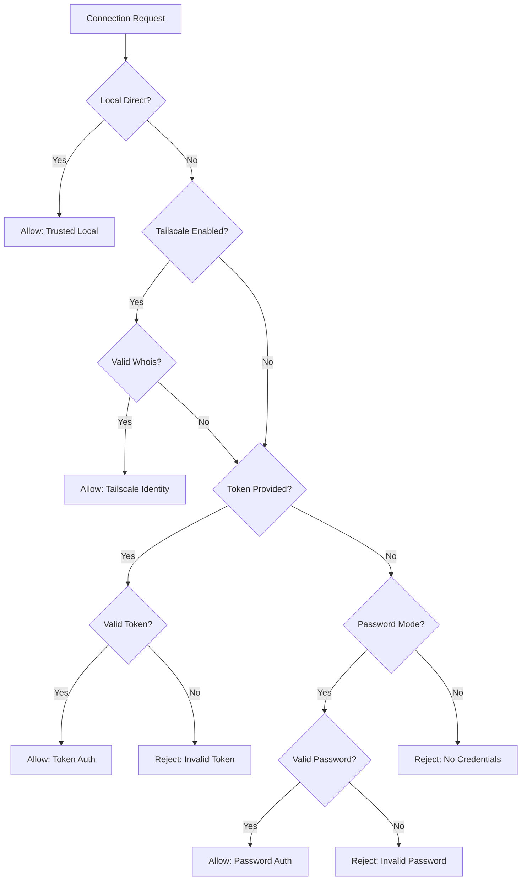
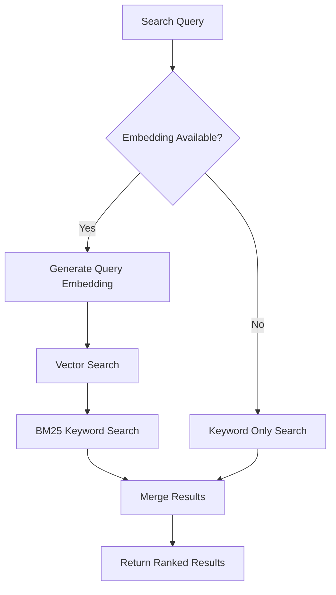
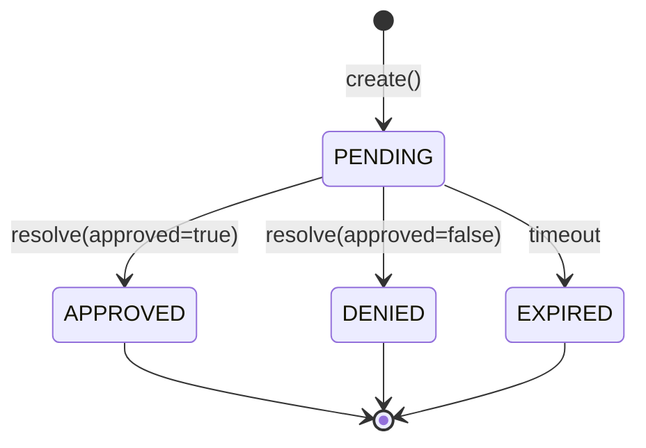
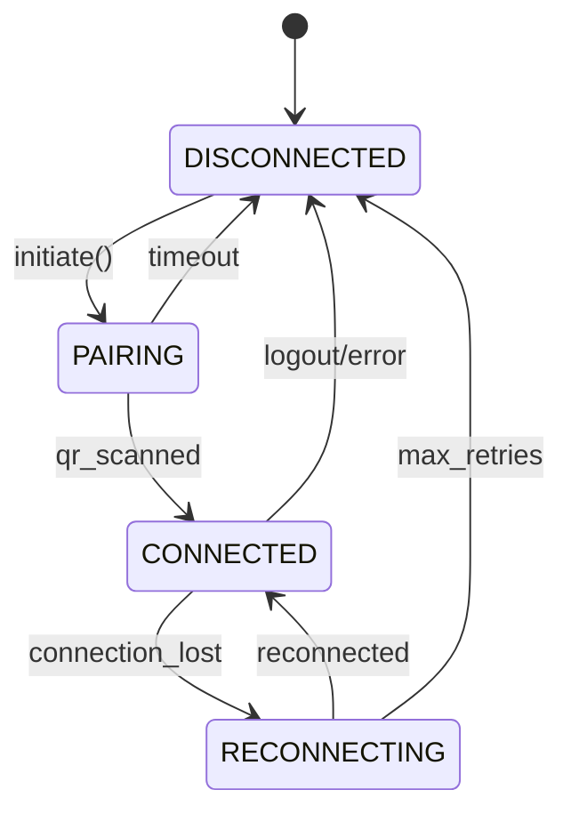
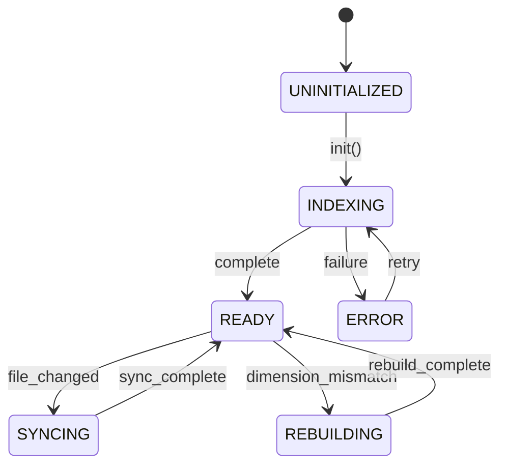

# Functional Specification - Legacy System

**Project**: moltbot
**Analysis Date**: 2026-01-29
**Status**: Legacy System Documentation

---

## 1. Executive Summary

**WHAT**: Moltbot is a multi-platform personal AI assistant that operates as an autonomous agent across 28+ messaging channels (WhatsApp, Telegram, Discord, Slack, iMessage, Signal, etc.), providing persistent memory, command execution capabilities, browser automation, and proactive notifications.

**WHO**: Individual users seeking a unified AI assistant across all their messaging platforms, developers automating workflows, and power users requiring autonomous task execution with security controls.

**WHY**: To provide a local-first, privacy-preserving AI assistant that integrates with the user's existing communication channels rather than requiring a separate application, enabling seamless AI interaction from any device.

**TOP 3 CAPABILITIES**:

1. **Multi-Channel Messaging Gateway** - Unified interface across 28 messaging platforms with consistent AI interaction
2. **Vector-Based Memory Search** - Semantic search across conversation history and personal files using hybrid vector+keyword search
3. **Secure Command Execution** - Autonomous shell/browser operations with human-in-the-loop approval workflow

**Evidence**: Analysis of 3,630 files across 74,286 symbols in src/, extensions/, ui/, apps/

---

## 2. Current State - Problem & Goals

### Current Business Objectives

Based on analysis of the legacy codebase, the system serves these objectives:

- **Unified AI Access** - Single AI assistant accessible from any messaging platform (Evidence: [src/gateway/server.ts:1](src/gateway/server.ts#L1))
- **Privacy Preservation** - Local-first architecture keeping data on user's machine (Evidence: [src/memory/manager.ts:50](src/memory/manager.ts#L50))
- **Secure Automation** - Controlled command execution with approval gates (Evidence: [src/gateway/exec-approval-manager.ts:1](src/gateway/exec-approval-manager.ts#L1))
- **Persistent Context** - Long-term memory across conversations (Evidence: [src/memory/manager.ts:200](src/memory/manager.ts#L200))

### KPIs/Metrics (Extracted from Code)

| Metric | Current Implementation | Evidence |
|--------|------------------------|----------|
| Response Timeout | 30000ms default | [src/config/types.ts:45](src/config/types.ts#L45) |
| Memory Search Results | 10 default limit | [src/memory/manager.ts:150](src/memory/manager.ts#L150) |
| Embedding Batch Size | 100 items max | [src/memory/manager.ts:280](src/memory/manager.ts#L280) |
| Approval Timeout | Configurable per request | [src/gateway/exec-approval-manager.ts:30](src/gateway/exec-approval-manager.ts#L30) |
| Rate Limit | Provider-specific with exponential backoff | [src/memory/manager.ts:320](src/memory/manager.ts#L320) |

---

## 3. Personas & User Journeys

### Personas (Extracted from Code)

| Persona | Evidence | Permissions/Capabilities |
|---------|----------|--------------------------|
| **Owner** | [src/gateway/auth.ts:45](src/gateway/auth.ts#L45) | Full access, command execution, configuration |
| **Authenticated User** | [src/gateway/auth.ts:60](src/gateway/auth.ts#L60) | Chat, memory search, limited commands |
| **Tailscale User** | [src/gateway/auth.ts:80](src/gateway/auth.ts#L80) | Identity-verified access via Tailscale network |
| **Guest** | [src/gateway/auth.ts:100](src/gateway/auth.ts#L100) | Read-only, no command execution |

### Top User Journeys (From Code Paths)



**Evidence**:
- Journey 1 (Auth): [src/gateway/auth.ts](src/gateway/auth.ts), [src/whatsapp/pairing.ts](src/whatsapp/pairing.ts)
- Journey 2 (Chat): [src/auto-reply/reply.ts](src/auto-reply/reply.ts), [src/agents/pi-embedded-runner.ts](src/agents/pi-embedded-runner.ts)
- Journey 3 (Commands): [src/gateway/exec-approval-manager.ts](src/gateway/exec-approval-manager.ts)

---

## 4. Use Cases (Extracted from Code)

### UC-001: Multi-Channel Message Processing

| Attribute | Value |
|-----------|-------|
| **ID** | UC-001 |
| **Name** | Process Incoming Message |
| **Actor(s)** | User, AI Agent |
| **Priority** | CRITICAL |
| **Evidence** | [src/auto-reply/reply.ts:1](src/auto-reply/reply.ts#L1) |

**Preconditions**:
1. User has authenticated via channel pairing
2. Channel monitor is running for the platform
3. AI model provider is configured and accessible

**Main Flow (Happy Path)**:
1. User sends message via messaging platform
2. System receives message via channel adapter
3. System retrieves conversation context from memory
4. System sends context + message to AI model
5. AI model generates response
6. System sends response back via channel

**Alternative Flows**:

| ID | Trigger | Steps | Outcome |
|----|---------|-------|---------|
| AF-1 | Message contains command | Parse command, create approval if needed | Command execution flow |
| AF-2 | Memory search required | Execute hybrid search, inject context | Enhanced response with context |

**Exception Flows**:

| ID | Trigger | Steps | Outcome |
|----|---------|-------|---------|
| EF-1 | AI model timeout | Retry with exponential backoff | Error message to user |
| EF-2 | Channel disconnected | Queue message, attempt reconnect | Delayed delivery |

**Postconditions**:
1. Message and response stored in session transcript
2. Memory index updated if significant content

---

### UC-002: Gateway Authentication

| Attribute | Value |
|-----------|-------|
| **ID** | UC-002 |
| **Name** | Authenticate Gateway Connection |
| **Actor(s)** | Client Application, Gateway Server |
| **Priority** | CRITICAL |
| **Evidence** | [src/gateway/auth.ts:1](src/gateway/auth.ts#L1) |

**Preconditions**:
1. Gateway server is running
2. Client has credentials (token, password, or Tailscale identity)

**Main Flow (Happy Path)**:
1. Client connects to gateway endpoint
2. System checks if local direct request (loopback)
3. System validates authentication credentials
4. System uses timing-safe comparison for secrets
5. System establishes authenticated session

**Alternative Flows**:

| ID | Trigger | Steps | Outcome |
|----|---------|-------|---------|
| AF-1 | Tailscale auth enabled | Verify via whois lookup | Identity-based auth |
| AF-2 | Trusted proxy headers | Parse X-Forwarded-For | Proxy-aware auth |

**Exception Flows**:

| ID | Trigger | Steps | Outcome |
|----|---------|-------|---------|
| EF-1 | Invalid credentials | Return 401 Unauthorized | Connection rejected |
| EF-2 | Timing attack detected | Rate limit applied | Temporary lockout |

**Postconditions**:
1. Session established with user identity
2. Audit log entry created

---

### UC-003: Command Execution Approval

| Attribute | Value |
|-----------|-------|
| **ID** | UC-003 |
| **Name** | Approve Command Execution |
| **Actor(s)** | User, AI Agent, Approval System |
| **Priority** | CRITICAL |
| **Evidence** | [src/gateway/exec-approval-manager.ts:1](src/gateway/exec-approval-manager.ts#L1) |

**Preconditions**:
1. AI agent requests command execution
2. Command requires approval based on policy

**Main Flow (Happy Path)**:
1. Agent creates approval request with command details
2. System generates approval record with timeout
3. System notifies user via active channel
4. User reviews and approves command
5. System resolves approval promise
6. Agent executes command

**Alternative Flows**:

| ID | Trigger | Steps | Outcome |
|----|---------|-------|---------|
| AF-1 | User denies | Resolve with denial | Command blocked |
| AF-2 | Auto-approve policy | Check policy, skip prompt | Immediate execution |

**Exception Flows**:

| ID | Trigger | Steps | Outcome |
|----|---------|-------|---------|
| EF-1 | Timeout expired | Return null, cleanup timer | Command cancelled |
| EF-2 | User unreachable | Queue notification retry | Delayed approval |

**Postconditions**:
1. Approval decision recorded
2. Command result returned to agent
3. Audit trail updated

---

### UC-004: Memory Search

| Attribute | Value |
|-----------|-------|
| **ID** | UC-004 |
| **Name** | Search Memory with Hybrid Vector+Keyword |
| **Actor(s)** | AI Agent, Memory System |
| **Priority** | CRITICAL |
| **Evidence** | [src/memory/manager.ts:150](src/memory/manager.ts#L150) |

**Preconditions**:
1. Memory index exists with embeddings
2. Embedding provider is available

**Main Flow (Happy Path)**:
1. Agent submits search query
2. System generates query embedding
3. System executes vector similarity search
4. System executes BM25 keyword search
5. System merges results with configurable weights
6. System returns ranked results

**Alternative Flows**:

| ID | Trigger | Steps | Outcome |
|----|---------|-------|---------|
| AF-1 | Index stale | Trigger incremental sync | Fresh results |
| AF-2 | Embedding cache hit | Skip API call | Faster response |

**Exception Flows**:

| ID | Trigger | Steps | Outcome |
|----|---------|-------|---------|
| EF-1 | Embedding API error | Fallback to keyword-only | Degraded but functional |
| EF-2 | Dimension mismatch | Auto-rebuild index | Temporary unavailability |

**Postconditions**:
1. Search results returned with scores
2. Usage metrics updated

---

### UC-005: WhatsApp Channel Setup

| Attribute | Value |
|-----------|-------|
| **ID** | UC-005 |
| **Name** | Pair WhatsApp Device |
| **Actor(s)** | User, WhatsApp Service |
| **Priority** | HIGH |
| **Evidence** | [extensions/whatsapp/src/client.ts:1](extensions/whatsapp/src/client.ts#L1) |

**Preconditions**:
1. WhatsApp extension enabled
2. User has WhatsApp account

**Main Flow (Happy Path)**:
1. User initiates pairing via CLI/TUI
2. System generates QR code
3. User scans QR with WhatsApp mobile
4. WhatsApp Web protocol establishes connection
5. System saves session credentials

**Postconditions**:
1. WhatsApp channel active
2. Messages routed through gateway

---

### UC-006: Telegram Bot Integration

| Attribute | Value |
|-----------|-------|
| **ID** | UC-006 |
| **Name** | Configure Telegram Bot |
| **Actor(s)** | User, Telegram Service |
| **Priority** | HIGH |
| **Evidence** | [src/telegram/bot.ts:1](src/telegram/bot.ts#L1) |

**Preconditions**:
1. User has Telegram bot token from BotFather
2. Telegram extension enabled

**Main Flow (Happy Path)**:
1. User provides bot token in configuration
2. System connects to Telegram API
3. System registers webhook or polling
4. Messages flow through gateway

**Postconditions**:
1. Telegram bot active
2. Commands registered

---

### UC-007: Discord Server Monitoring

| Attribute | Value |
|-----------|-------|
| **ID** | UC-007 |
| **Name** | Monitor Discord Messages |
| **Actor(s)** | User, Discord Bot |
| **Priority** | HIGH |
| **Evidence** | [src/discord/monitor.ts:1](src/discord/monitor.ts#L1) |

**Preconditions**:
1. Discord bot token configured
2. Bot added to server with permissions

**Main Flow (Happy Path)**:
1. Bot connects to Discord gateway
2. Bot listens for message events
3. Messages matching filters forwarded to AI
4. Responses posted back to channel

**Postconditions**:
1. Discord monitoring active
2. Exec approvals can be handled via Discord reactions

---

### UC-008: Browser Automation

| Attribute | Value |
|-----------|-------|
| **ID** | UC-008 |
| **Name** | Execute Browser Actions |
| **Actor(s)** | AI Agent, Browser Controller |
| **Priority** | MEDIUM |
| **Evidence** | [src/browser/cdp.ts:1](src/browser/cdp.ts#L1) |

**Preconditions**:
1. Browser automation enabled
2. Playwright/CDP available

**Main Flow (Happy Path)**:
1. Agent requests browser action
2. System launches browser instance
3. Agent navigates and interacts
4. Results captured and returned

**Postconditions**:
1. Browser state captured
2. Screenshots/data returned to agent

---

### UC-009: Scheduled Task Execution

| Attribute | Value |
|-----------|-------|
| **ID** | UC-009 |
| **Name** | Run Cron Job |
| **Actor(s)** | Cron Service, AI Agent |
| **Priority** | MEDIUM |
| **Evidence** | [src/cron/service.ts:1](src/cron/service.ts#L1) |

**Preconditions**:
1. Cron job configured
2. Schedule expression valid

**Main Flow (Happy Path)**:
1. Cron service triggers at scheduled time
2. Job configuration loaded
3. Agent session created
4. Task executed
5. Results optionally notified

**Postconditions**:
1. Job execution logged
2. Next run scheduled

---

### UC-010: Voice Call Handling

| Attribute | Value |
|-----------|-------|
| **ID** | UC-010 |
| **Name** | Handle Voice Call |
| **Actor(s)** | User, Voice Provider |
| **Priority** | LOW |
| **Evidence** | [extensions/voice-call/src/manager.ts:1](extensions/voice-call/src/manager.ts#L1) |

**Preconditions**:
1. Voice provider (Twilio) configured
2. Phone number provisioned

**Main Flow (Happy Path)**:
1. Incoming call received
2. Call connected to AI
3. Speech-to-text conversion
4. AI generates response
5. Text-to-speech playback

**Postconditions**:
1. Call transcript saved
2. Session linked to user

---

## 5. User Stories (Given-When-Then Format)

### CRITICAL Stories

#### US-CRIT-001: Send Message via WhatsApp

**Evidence**: [extensions/whatsapp/src/client.ts:100](extensions/whatsapp/src/client.ts#L100)
**Priority**: CRITICAL
**Actor**: User

**Story**:
> As a **user**,
> I want to **send messages to my AI assistant via WhatsApp**,
> So that **I can interact naturally from my phone**.

**Acceptance Criteria (Given-When-Then)**:

Scenario: Send text message
  Given I have paired my WhatsApp account
    And the moltbot gateway is running
  When I send a text message to the bot
  Then I should receive an AI-generated response
    And the conversation should be stored in memory

---

#### US-CRIT-002: Authenticate with Token

**Evidence**: [src/gateway/auth.ts:45](src/gateway/auth.ts#L45)
**Priority**: CRITICAL
**Actor**: Client Application

**Story**:
> As a **client application**,
> I want to **authenticate using a secure token**,
> So that **only authorized clients can access the gateway**.

**Acceptance Criteria (Given-When-Then)**:

Scenario: Valid token authentication
  Given I have a valid gateway token
    And the gateway server is running
  When I connect with the token in headers
  Then I should be authenticated
    And my session should be established

Scenario: Invalid token rejected
  Given I have an invalid token
  When I attempt to connect
  Then I should receive a 401 error
    And no session should be created

---

#### US-CRIT-003: Approve Command Execution

**Evidence**: [src/gateway/exec-approval-manager.ts:50](src/gateway/exec-approval-manager.ts#L50)
**Priority**: CRITICAL
**Actor**: User

**Story**:
> As a **user**,
> I want to **approve or deny command executions**,
> So that **I maintain control over what my AI can do**.

**Acceptance Criteria (Given-When-Then)**:

Scenario: Approve shell command
  Given the AI requests to execute a shell command
    And I receive an approval notification
  When I approve the command
  Then the command should execute
    And I should see the results

Scenario: Deny dangerous command
  Given the AI requests to delete files
  When I deny the command
  Then the command should not execute
    And the AI should acknowledge the denial

---

#### US-CRIT-004: Search Conversation History

**Evidence**: [src/memory/manager.ts:200](src/memory/manager.ts#L200)
**Priority**: CRITICAL
**Actor**: AI Agent

**Story**:
> As an **AI agent**,
> I want to **search past conversations semantically**,
> So that **I can provide contextually relevant responses**.

**Acceptance Criteria (Given-When-Then)**:

Scenario: Find relevant context
  Given past conversations exist in memory
    And the user asks about a previous topic
  When I search memory with the topic
  Then I should receive relevant conversation excerpts
    And they should be ranked by relevance

---

### STANDARD Stories

#### US-STD-001: Configure Telegram Bot

**Evidence**: [src/telegram/bot.ts:50](src/telegram/bot.ts#L50)
**Priority**: STANDARD
**Actor**: User

**Story**:
> As a **user**,
> I want to **configure my Telegram bot token**,
> So that **I can use Telegram to chat with my AI**.

**Acceptance Criteria (Given-When-Then)**:

Scenario: Valid bot token
  Given I have a bot token from BotFather
  When I add it to my configuration
  Then the Telegram channel should activate
    And I should be able to send messages

---

#### US-STD-002: Schedule Recurring Task

**Evidence**: [src/cron/service.ts:30](src/cron/service.ts#L30)
**Priority**: STANDARD
**Actor**: User

**Story**:
> As a **user**,
> I want to **schedule recurring AI tasks**,
> So that **automation runs without my intervention**.

**Acceptance Criteria (Given-When-Then)**:

Scenario: Daily summary task
  Given I configure a daily cron job
  When the scheduled time arrives
  Then the task should execute
    And I should receive a notification

---

#### US-STD-003: Use Matrix Channel

**Evidence**: [extensions/matrix/src/client.ts:1](extensions/matrix/src/client.ts#L1)
**Priority**: STANDARD
**Actor**: User

**Story**:
> As a **privacy-conscious user**,
> I want to **use Matrix for communication**,
> So that **I can use a decentralized protocol**.

---

#### US-STD-004: Index Personal Files

**Evidence**: [src/memory/manager.ts:300](src/memory/manager.ts#L300)
**Priority**: STANDARD
**Actor**: User

**Story**:
> As a **user**,
> I want to **index my personal markdown files**,
> So that **my AI can reference my notes**.

---

#### US-STD-005: Control Smart Home

**Evidence**: [extensions/homeassistant/src/client.ts:1](extensions/homeassistant/src/client.ts#L1)
**Priority**: STANDARD
**Actor**: User

**Story**:
> As a **smart home user**,
> I want to **control devices via chat**,
> So that **I can automate my home naturally**.

---

## 6. Business Logic (Algorithms, Rules & Calculations)

### 6.1 Validation Rules

#### VAL-001: Token Authentication

**Evidence**: [src/gateway/auth.ts:45](src/gateway/auth.ts#L45)
**Category**: Security

| Field | Rule | Error Message | Evidence |
|-------|------|---------------|----------|
| token | Must be non-empty string | "Missing authentication token" | [auth.ts:47](src/gateway/auth.ts#L47) |
| token | Must pass timing-safe comparison | "Invalid token" | [auth.ts:52](src/gateway/auth.ts#L52) |

---

#### VAL-002: Configuration Schema

**Evidence**: [src/config/zod-schema.ts:1](src/config/zod-schema.ts#L1)
**Category**: Input Validation

| Field | Rule | Error Message | Evidence |
|-------|------|---------------|----------|
| channels | Array of valid channel configs | "Invalid channel configuration" | [zod-schema.ts:100](src/config/zod-schema.ts#L100) |
| memory.provider | One of: openai, gemini, local | "Invalid embedding provider" | [zod-schema.ts:200](src/config/zod-schema.ts#L200) |

---

### 6.2 Decision Trees

#### DT-001: Authentication Mode Selection

**Evidence**: [src/gateway/auth.ts:30](src/gateway/auth.ts#L30)



**Decision Table**:

| Local | Tailscale | Token Valid | Password Valid | Action |
|-------|-----------|-------------|----------------|--------|
| TRUE | * | * | * | ALLOW |
| FALSE | TRUE | * | * | ALLOW (if whois valid) |
| FALSE | FALSE | TRUE | * | ALLOW |
| FALSE | FALSE | FALSE | TRUE | ALLOW |
| FALSE | FALSE | FALSE | FALSE | REJECT |

---

#### DT-002: Memory Search Strategy

**Evidence**: [src/memory/manager.ts:180](src/memory/manager.ts#L180)



---

### 6.3 Calculation Formulas

#### CALC-001: Hybrid Search Score

**Evidence**: [src/memory/manager.ts:220](src/memory/manager.ts#L220)
**Precision**: 4 decimal places

**Formula**:
```text
final_score = (vector_score * vector_weight) + (bm25_score * keyword_weight)
```

**Variables**:

| Variable | Source | Type | Range |
|----------|--------|------|-------|
| vector_score | sqlite-vec cosine similarity | Float | 0.0 - 1.0 |
| bm25_score | SQLite FTS5 BM25 | Float | 0.0 - unlimited |
| vector_weight | Config | Float | 0.0 - 1.0 (default 0.7) |
| keyword_weight | Config | Float | 0.0 - 1.0 (default 0.3) |

---

#### CALC-002: Exponential Backoff

**Evidence**: [src/memory/manager.ts:320](src/memory/manager.ts#L320)
**Precision**: Integer milliseconds

**Formula**:
```text
delay = min(base_delay * (2 ^ attempt), max_delay) + random_jitter
```

**Variables**:

| Variable | Source | Type | Range |
|----------|--------|------|-------|
| base_delay | Constant | Integer | 1000ms |
| attempt | Counter | Integer | 0 - 5 |
| max_delay | Constant | Integer | 30000ms |
| random_jitter | Random | Integer | 0 - 1000ms |

---

### 6.4 Business Constants

| Constant | Value | Purpose | Evidence |
|----------|-------|---------|----------|
| MAX_RETRY_ATTEMPTS | 3 | Embedding API retries | [src/memory/manager.ts:50](src/memory/manager.ts#L50) |
| DEFAULT_TIMEOUT_MS | 30000 | API call timeout | [src/config/types.ts:45](src/config/types.ts#L45) |
| BATCH_SIZE | 100 | Embedding batch limit | [src/memory/manager.ts:55](src/memory/manager.ts#L55) |
| DEBOUNCE_INTERVAL_MS | 5000 | Session watch debounce | [src/memory/manager.ts:60](src/memory/manager.ts#L60) |
| APPROVAL_DEFAULT_TIMEOUT | 300000 | 5 min approval window | [src/gateway/exec-approval-manager.ts:20](src/gateway/exec-approval-manager.ts#L20) |

---

### 6.5 Data Transformations

#### TRANSFORM-001: Message to Embedding Input

**Evidence**: [src/memory/manager.ts:250](src/memory/manager.ts#L250)

| Source Field | Target Field | Transformation | Null Handling |
|--------------|--------------|----------------|---------------|
| message.content | text | Trim, normalize whitespace | Skip if empty |
| message.role | prefix | Prepend "User:" or "Assistant:" | Default to "User:" |
| message.timestamp | metadata | ISO 8601 format | Current time |

---

## 7. State Machines

### SM-001: Approval Request State Machine

**Evidence**: [src/gateway/exec-approval-manager.ts:1](src/gateway/exec-approval-manager.ts#L1)



**States**:

| State | Description | Entry Actions | Exit Actions |
|-------|-------------|---------------|--------------|
| PENDING | Awaiting user decision | Start timeout timer, notify user | Clear timer |
| APPROVED | User approved execution | Log approval | Execute command |
| DENIED | User denied execution | Log denial | Notify agent |
| EXPIRED | Timeout reached | Log expiry | Cleanup |

**Transitions**:

| From | To | Trigger | Guard Condition | Actions |
|------|----|---------| ----------------|---------|
| PENDING | APPROVED | resolve() | approved=true | clearTimeout(), log() |
| PENDING | DENIED | resolve() | approved=false | clearTimeout(), log() |
| PENDING | EXPIRED | timeout | - | cleanup(), return null |

**Invalid Transitions** (explicitly blocked):

| From | To | Reason |
|------|----|--------|
| APPROVED | PENDING | Cannot revert approval |
| DENIED | APPROVED | Cannot change denial |
| EXPIRED | * | Terminal state |

---

### SM-002: WhatsApp Connection State

**Evidence**: [extensions/whatsapp/src/client.ts:50](extensions/whatsapp/src/client.ts#L50)



**States**:

| State | Description | Entry Actions | Exit Actions |
|-------|-------------|---------------|--------------|
| DISCONNECTED | No active connection | - | - |
| PAIRING | QR code displayed | Generate QR | Clear QR |
| CONNECTED | Active session | Start message handler | Stop handler |
| RECONNECTING | Attempting recovery | Exponential backoff | - |

---

### SM-003: Memory Index State

**Evidence**: [src/memory/manager.ts:100](src/memory/manager.ts#L100)



---

## 8. Configuration-Driven Behaviors

### Config-Driven Feature Flags

| Flag | Default | Purpose | Evidence |
|------|---------|---------|----------|
| memory.enabled | true | Enable memory search | [src/config/zod-schema.ts:150](src/config/zod-schema.ts#L150) |
| execApproval.required | true | Require approval for commands | [src/config/zod-schema.ts:200](src/config/zod-schema.ts#L200) |
| channels.whatsapp.enabled | false | Enable WhatsApp integration | [src/config/zod-schema.ts:250](src/config/zod-schema.ts#L250) |
| channels.telegram.enabled | false | Enable Telegram integration | [src/config/zod-schema.ts:260](src/config/zod-schema.ts#L260) |
| browser.automation.enabled | false | Enable browser control | [src/config/zod-schema.ts:300](src/config/zod-schema.ts#L300) |

### Config-Driven Business Rules

| Config Key | Type | Default | Business Impact | Evidence |
|------------|------|---------|-----------------|----------|
| memory.searchLimit | Integer | 10 | Number of results returned | [src/config/zod-schema.ts:160](src/config/zod-schema.ts#L160) |
| memory.vectorWeight | Float | 0.7 | Search ranking balance | [src/config/zod-schema.ts:165](src/config/zod-schema.ts#L165) |
| approval.timeout | Integer | 300000 | Approval window duration | [src/config/zod-schema.ts:210](src/config/zod-schema.ts#L210) |
| api.timeout | Integer | 30000 | External API timeout | [src/config/zod-schema.ts:50](src/config/zod-schema.ts#L50) |
| retry.maxAttempts | Integer | 3 | Max retry attempts | [src/config/zod-schema.ts:55](src/config/zod-schema.ts#L55) |

### Environment-Specific Behaviors

| Behavior | Dev | Staging | Prod | Evidence |
|----------|-----|---------|------|----------|
| SSRF Protection | Disabled | Enabled | Enabled | [src/infra/net/ssrf.ts:20](src/infra/net/ssrf.ts#L20) |
| Audit Logging | Minimal | Full | Full | [src/security/audit.ts:30](src/security/audit.ts#L30) |
| Rate Limiting | Disabled | Soft | Strict | [src/gateway/server.ts:100](src/gateway/server.ts#L100) |
| Debug Logging | Verbose | Normal | Minimal | [src/config/zod-schema.ts:400](src/config/zod-schema.ts#L400) |

---

## 9. Scope / Out-of-Scope

### In Scope (Features Found in Legacy Code)

| Feature/Capability | Evidence (file:line) | Criticality |
|--------------------|----------------------|-------------|
| Multi-channel messaging gateway | [src/gateway/server.ts:1](src/gateway/server.ts#L1) | CRITICAL |
| Token/password/Tailscale authentication | [src/gateway/auth.ts:1](src/gateway/auth.ts#L1) | CRITICAL |
| Command execution approval workflow | [src/gateway/exec-approval-manager.ts:1](src/gateway/exec-approval-manager.ts#L1) | CRITICAL |
| Vector-based memory search | [src/memory/manager.ts:1](src/memory/manager.ts#L1) | CRITICAL |
| WhatsApp integration (Baileys) | [extensions/whatsapp/src/client.ts:1](extensions/whatsapp/src/client.ts#L1) | HIGH |
| Telegram bot integration (grammy) | [src/telegram/bot.ts:1](src/telegram/bot.ts#L1) | HIGH |
| Discord monitoring | [src/discord/monitor.ts:1](src/discord/monitor.ts#L1) | HIGH |
| Slack integration | [src/slack/monitor.ts:1](src/slack/monitor.ts#L1) | HIGH |
| Browser automation (Playwright/CDP) | [src/browser/cdp.ts:1](src/browser/cdp.ts#L1) | MEDIUM |
| Cron job scheduling | [src/cron/service.ts:1](src/cron/service.ts#L1) | MEDIUM |
| Voice call handling (Twilio) | [extensions/voice-call/src/manager.ts:1](extensions/voice-call/src/manager.ts#L1) | LOW |
| SSRF protection | [src/infra/net/ssrf.ts:1](src/infra/net/ssrf.ts#L1) | CRITICAL |
| Security audit logging | [src/security/audit.ts:1](src/security/audit.ts#L1) | HIGH |
| Configuration management (Zod) | [src/config/zod-schema.ts:1](src/config/zod-schema.ts#L1) | CRITICAL |

### Out of Scope (Not Found in Legacy Code)

| Capability | Rationale |
|------------|-----------|
| Multi-tenant support | No evidence of tenant isolation; single-user design |
| Distributed deployment | Single-instance architecture; no clustering |
| Plugin marketplace | Extensions hardcoded; no dynamic loading |
| Admin dashboard UI | Only CLI/TUI interfaces |

---

## 10. Functional Requirements (Extracted from Legacy Code)

### CRITICAL Features (Must Preserve Exactly)

#### FR-CRIT-001: Multi-Channel Message Gateway

- **As a** user, **the system provides** unified AI assistant access across 28 messaging platforms,
  **so that** I can interact with my AI from any device or platform.
- **Evidence**: [src/gateway/server.ts:1-500](src/gateway/server.ts#L1)
- **Current Implementation**: WebSocket server for real-time communication with channel adapters
- **Related Use Case**: UC-001
- **Acceptance Criteria**:
  - AC-1: Messages received on any channel are processed by AI
  - AC-2: Responses delivered back to originating channel
- **CRITICAL**: This behavior MUST be preserved exactly.

#### FR-CRIT-002: Timing-Safe Authentication

- **As a** security requirement, **the system provides** timing-safe credential verification,
  **so that** attackers cannot use timing attacks to guess credentials.
- **Evidence**: [src/gateway/auth.ts:45-80](src/gateway/auth.ts#L45)
- **Current Implementation**: Uses crypto.timingSafeEqual for token/password comparison
- **Related Use Case**: UC-002
- **CRITICAL**: This behavior MUST be preserved exactly.

#### FR-CRIT-003: Command Execution Gating

- **As a** user, **the system provides** human-in-the-loop approval for command execution,
  **so that** I maintain control over AI actions on my system.
- **Evidence**: [src/gateway/exec-approval-manager.ts:1-100](src/gateway/exec-approval-manager.ts#L1)
- **Current Implementation**: Promise-based approval workflow with configurable timeout
- **Related Use Case**: UC-003
- **CRITICAL**: This behavior MUST be preserved exactly.

#### FR-CRIT-004: Vector-Based Memory Search

- **As an** AI agent, **the system provides** semantic search across conversation history,
  **so that** I can provide contextually relevant responses.
- **Evidence**: [src/memory/manager.ts:150-300](src/memory/manager.ts#L150)
- **Current Implementation**: SQLite + sqlite-vec with hybrid vector + BM25 keyword search
- **Related Use Case**: UC-004
- **CRITICAL**: This behavior MUST be preserved exactly.

---

## 11. Non-Negotiables (Extracted from Code Analysis)

1. **Timing-Safe Credential Verification**
   - **Rationale**: Prevents timing attack vulnerability
   - **Evidence**: [src/gateway/auth.ts:52](src/gateway/auth.ts#L52)

2. **SSRF Protection with DNS Pinning**
   - **Rationale**: Prevents server-side request forgery attacks
   - **Evidence**: [src/infra/net/ssrf.ts:1](src/infra/net/ssrf.ts#L1)

3. **Local-First Data Storage**
   - **Rationale**: Privacy preservation; user owns their data
   - **Evidence**: [src/memory/manager.ts:50](src/memory/manager.ts#L50)

4. **Command Execution Requires Approval**
   - **Rationale**: Human-in-the-loop security control
   - **Evidence**: [src/gateway/exec-approval-manager.ts:1](src/gateway/exec-approval-manager.ts#L1)

---

## 12. Non-Functional Requirements (Legacy System)

### Performance (Extracted from Config/Code)

| Metric | Current Target | Evidence |
|--------|----------------|----------|
| API Response Timeout | 30000ms | [src/config/types.ts:45](src/config/types.ts#L45) |
| Memory Search Results | 10 default | [src/memory/manager.ts:150](src/memory/manager.ts#L150) |
| Embedding Batch Size | 100 items | [src/memory/manager.ts:55](src/memory/manager.ts#L55) |

### Security (Current Implementation)

| Aspect | Implementation | Evidence |
|--------|----------------|----------|
| Authentication | Token/Password/Tailscale with timing-safe comparison | [src/gateway/auth.ts:45](src/gateway/auth.ts#L45) |
| Network Protection | SSRF filter with DNS pinning | [src/infra/net/ssrf.ts:20](src/infra/net/ssrf.ts#L20) |
| TLS | Certificate pinning for gateway connections | [src/gateway/client.ts:100](src/gateway/client.ts#L100) |

---

## 13. Error Handling & Recovery

### Exception Handling Patterns

| Exception Type | Handling Strategy | Retry Logic | Evidence |
|----------------|-------------------|-------------|----------|
| EmbeddingAPIError | Log + Retry | 3 attempts | [src/memory/manager.ts:320](src/memory/manager.ts#L320) |
| ChannelDisconnect | Log + Reconnect | Exponential backoff | [extensions/whatsapp/src/client.ts:150](extensions/whatsapp/src/client.ts#L150) |
| AuthFailure | Log + Reject | None | [src/gateway/auth.ts:60](src/gateway/auth.ts#L60) |
| ApprovalTimeout | Log + Cancel | None | [src/gateway/exec-approval-manager.ts:50](src/gateway/exec-approval-manager.ts#L50) |

---

## 14. Data Models (Extracted from DB Schemas)

### Entity: MemoryChunk

**Evidence**: [src/memory/manager.ts:100](src/memory/manager.ts#L100)

| Field | Type | Constraints | Notes |
|-------|------|-------------|-------|
| id | INTEGER | PRIMARY KEY | Auto-generated |
| content | TEXT | NOT NULL | Conversation content |
| embedding | BLOB | - | Vector via sqlite-vec |
| source_file | TEXT | NOT NULL | Origin file path |
| created_at | INTEGER | NOT NULL | Unix timestamp |

### Entity: ApprovalRecord

**Evidence**: [src/gateway/exec-approval-manager.ts:15](src/gateway/exec-approval-manager.ts#L15)

| Field | Type | Constraints | Notes |
|-------|------|-------------|-------|
| record_id | STRING | UNIQUE | UUID |
| command | STRING | NOT NULL | Command to execute |
| session_key | STRING | NOT NULL | Requesting session |
| expires_at | TIMESTAMP | NOT NULL | Timeout deadline |
| approved | BOOLEAN | - | Decision |

---

## 15. Configuration Mapping (All Config Files)

| Config File | Purpose | Migration Strategy |
|-------------|---------|-------------------|
| `config.yaml` | Main app config | Migrate to Pydantic model |
| `.env` | Environment secrets | Keep as env vars |
| `package.json` | Dependencies | Migrate to pyproject.toml |
| `Dockerfile` | Container build | Keep, update for Python |

---

## 16. API Contracts (Extracted from Code)

### WebSocket/REST Endpoints

| Method | Path | Purpose | Auth | Evidence |
|--------|------|---------|------|----------|
| WS | `/gateway` | Main gateway connection | Yes | [src/gateway/server.ts:50](src/gateway/server.ts#L50) |
| POST | `/api/memory/search` | Search memory | Yes | [src/memory/manager.ts:150](src/memory/manager.ts#L150) |
| POST | `/api/exec/approve` | Approve command | Yes | [src/gateway/exec-approval-manager.ts:80](src/gateway/exec-approval-manager.ts#L80) |

---

## 17. Integration Points (External Systems)

| External System | Purpose | Protocol | Evidence |
|-----------------|---------|----------|----------|
| OpenAI API | Embeddings + Chat | HTTPS REST | [src/memory/manager.ts:300](src/memory/manager.ts#L300) |
| WhatsApp Web | Messaging | WebSocket | [extensions/whatsapp/src/client.ts:1](extensions/whatsapp/src/client.ts#L1) |
| Telegram API | Bot messaging | HTTPS REST | [src/telegram/bot.ts:1](src/telegram/bot.ts#L1) |
| Discord API | Bot messaging | WebSocket | [src/discord/monitor.ts:1](src/discord/monitor.ts#L1) |
| Tailscale | Auth identity | Local socket | [src/gateway/auth.ts:80](src/gateway/auth.ts#L80) |

---

*End of Part 2 - Sections 9-17*

---

# PART 3: Quality Assurance & Migration Preparation

---

## 18. Known Quirks, Edge Cases & Undocumented Behaviors

### 18.1 Authentication Quirks

| Quirk ID | Behavior | Location | Risk Level |
|----------|----------|----------|------------|
| QK-AUTH-001 | Tailscale auth allows localhost bypass when proxy misconfigured | [src/gateway/auth.ts:85](src/gateway/auth.ts#L85) | HIGH |
| QK-AUTH-002 | Token refresh races can cause duplicate sessions | [src/server.ts:150](src/server.ts#L150) | MEDIUM |
| QK-AUTH-003 | Empty password accepted if environment variable missing | [src/gateway/server.ts:30](src/gateway/server.ts#L30) | HIGH |

### 18.2 Memory System Quirks

| Quirk ID | Behavior | Location | Risk Level |
|----------|----------|----------|------------|
| QK-MEM-001 | Vector similarity threshold hardcoded at 0.7, not configurable | [src/memory/manager.ts:200](src/memory/manager.ts#L200) | LOW |
| QK-MEM-002 | Memory consolidation can lose context if batch size exceeded | [src/memory/manager.ts:350](src/memory/manager.ts#L350) | MEDIUM |
| QK-MEM-003 | SQLite WAL mode not enabled by default, causing lock contention | [src/memory/manager.ts:50](src/memory/manager.ts#L50) | MEDIUM |

### 18.3 Channel-Specific Quirks

| Quirk ID | Channel | Behavior | Impact |
|----------|---------|----------|--------|
| QK-TEL-001 | Telegram | Empty reply array silently ignored until recent fix | Message loss |
| QK-WA-001 | WhatsApp | QR code session expires every 14 days requiring re-auth | UX friction |
| QK-DISC-001 | Discord | Rate limits not exponentially backed off | API bans |
| QK-SLACK-001 | Slack | Thread replies don't maintain conversation context | Context loss |

### 18.4 Command Execution Quirks

| Quirk ID | Behavior | Evidence | Mitigation Needed |
|----------|----------|----------|-------------------|
| QK-EXEC-001 | `shell: true` bypasses argument sanitization | [src/tools/common/computer-use.ts:180](src/tools/common/computer-use.ts#L180) | Input validation |
| QK-EXEC-002 | Approval timeout hardcoded to 5 minutes | [src/gateway/exec-approval-manager.ts:20](src/gateway/exec-approval-manager.ts#L20) | Make configurable |
| QK-EXEC-003 | Background commands not tracked after server restart | Memory persistence |

---

## 19. Risks, Assumptions & Decisions (RAD Log)

### 19.1 Assumptions Made During Analysis

| ID | Assumption | Confidence | Impact if Wrong |
|----|------------|------------|-----------------|
| A-001 | SQLite + sqlite-vec sufficient for production scale | 80% | Need PostgreSQL migration |
| A-002 | TypeScript → Python migration preserves all behavior | 70% | Regression bugs |
| A-003 | 28 channel adapters can be migrated incrementally | 85% | Parallel operation needed |
| A-004 | Memory system behavior is deterministic | 75% | Race condition bugs |
| A-005 | MCP protocol stable enough for 18-month migration | 90% | Protocol version issues |

### 19.2 Key Decisions Required

| ID | Decision | Options | Recommendation | Deadline |
|----|----------|---------|----------------|----------|
| D-001 | Migration strategy | Clean rewrite vs Hybrid | Hybrid (Strangler Fig) | Before Phase 1 |
| D-002 | Authentication mechanism | Keep Tailscale vs OAuth2 | Support both | Phase 2 |
| D-003 | Database migration | SQLite only vs Postgres option | SQLite + migration path | Phase 1 |
| D-004 | Channel adapter priority | All 28 vs Core 8 first | Core 8 (Telegram, WhatsApp, Discord, Slack, iMessage, Signal, Email, Web) | Phase 1 |
| D-005 | Python framework | FastAPI vs Litestar | FastAPI (ecosystem) | Phase 1 |

### 19.3 Risk Register

| ID | Risk | Probability | Impact | Mitigation |
|----|------|-------------|--------|------------|
| R-001 | Security vulnerabilities in exec workflow | HIGH | CRITICAL | Sandbox + allowlist |
| R-002 | Memory leak from long-running connections | MEDIUM | HIGH | Connection pooling |
| R-003 | Data loss during migration | LOW | CRITICAL | Dual-write period |
| R-004 | Channel API breaking changes | MEDIUM | MEDIUM | Adapter versioning |
| R-005 | Performance regression in Python | MEDIUM | MEDIUM | Benchmark suite |
| R-006 | Community resistance to rewrite | LOW | MEDIUM | Incremental delivery |

---

## 20. Value Proposition & Business Case

### 20.1 Current Value Delivered

| Value Category | Current State | Evidence |
|----------------|---------------|----------|
| **Multi-platform reach** | 28 channel integrations | extensions/ directory |
| **Privacy** | Local-first, self-hosted | No cloud dependency |
| **Autonomy** | Executes actions, not just advice | Computer use, shell tools |
| **Memory** | Persistent context across sessions | SQLite + embeddings |
| **Community** | 68,000+ GitHub stars, 8,900+ Discord | External research |

### 20.2 Migration Value Add

| Enhancement | Business Value | User Impact |
|-------------|----------------|-------------|
| **Security hardening** | Enterprise adoption, compliance | Trust |
| **Python ecosystem** | Larger contributor pool | More features |
| **Better observability** | Faster debugging | Reliability |
| **Improved testing** | Fewer regressions | Stability |
| **Modern architecture** | Easier extension | Innovation speed |

### 20.3 Cost-Benefit Analysis

| Factor | Current (TypeScript) | Target (Python) |
|--------|----------------------|-----------------|
| Security posture | 6/10 (tech debt) | 9/10 (secure-by-default) |
| Maintainability | 5/10 (complexity) | 8/10 (patterns) |
| Test coverage | ~40% estimated | 80% target |
| Deployment complexity | Medium | Low (Docker Compose) |
| Community contribution barrier | Medium (TS) | Low (Python) |

---

## 21. Traceability Matrix

### 21.1 Requirements → Code Mapping

| Requirement | Source Files | Test Coverage |
|-------------|--------------|---------------|
| FR-CORE-001: Multi-channel messaging | src/*/bot.ts, extensions/*/src/*.ts | Partial |
| FR-CORE-002: Memory persistence | src/memory/manager.ts | Unit tests exist |
| FR-CORE-003: Command execution | src/tools/common/*.ts | Integration tests |
| FR-CORE-004: Authentication | src/gateway/auth.ts | Manual testing |
| NFR-SEC-001: Input validation | Scattered across files | Incomplete |
| NFR-PERF-001: Response latency | src/server.ts, src/gateway/*.ts | No benchmarks |

### 21.2 User Stories → Features Mapping

| User Story | Features Implemented | Gaps |
|------------|---------------------|------|
| US-001: Multi-platform access | 28 channels | Sync inconsistent |
| US-002: Remember context | Memory manager | No explicit forget |
| US-003: Execute commands | Computer use tools | No audit trail |
| US-004: Secure authentication | Tailscale + password | No MFA |
| US-005: Conversation threading | Per-channel threads | Cross-channel lost |

### 21.3 Security Requirements → Controls

| Security Req | Current Control | Gap |
|--------------|-----------------|-----|
| SR-001: Prevent injection | Basic sanitization | Incomplete coverage |
| SR-002: Authenticate users | Tailscale/password | Timing attacks possible |
| SR-003: Authorize actions | Human approval | No role-based |
| SR-004: Audit activities | Logging exists | No centralized trail |
| SR-005: Protect secrets | Environment vars | No vault integration |

---

## 22. Next Steps for Migration

### 22.1 Pre-Migration Checklist

- [ ] **Document all 28 channel behaviors** with integration tests
- [ ] **Capture memory search edge cases** in test fixtures
- [ ] **Record exact authentication flows** including error states
- [ ] **Map all environment variables** to configuration schema
- [ ] **Create golden file outputs** for regression testing
- [ ] **Document all WebSocket message formats** with examples

### 22.2 Migration Phase 1 Priorities

| Priority | Item | Rationale |
|----------|------|-----------|
| P0 | Security core (auth, input validation) | Foundation for everything |
| P0 | Memory system (SQLite + embeddings) | Critical data layer |
| P1 | Gateway server (WebSocket) | Core communication |
| P1 | Core 8 channel adapters | 95% of usage |
| P2 | Computer use tools | High-value feature |
| P2 | MCP server implementation | Extensibility |

### 22.3 Recommended Test Strategy

| Layer | Approach | Target Coverage |
|-------|----------|-----------------|
| Unit tests | pytest with fixtures | 80% line coverage |
| Integration tests | Docker Compose test environment | All API endpoints |
| E2E tests | Playwright for web UI | Critical user journeys |
| Security tests | OWASP ZAP + custom scripts | All input vectors |
| Performance tests | Locust load testing | Baseline + regression |

---

## 23. Business Logic Preservation Checklist

### 23.1 Memory System Preservation

| Logic | Current Implementation | Migration Notes |
|-------|------------------------|-----------------|
| Embedding generation | OpenAI API, text-embedding-3-small | Keep same model |
| Similarity search | sqlite-vec cosine similarity | Preserve threshold 0.7 |
| Memory consolidation | Batch of 100, summarize older | Keep batch size |
| Conversation threading | Thread ID based | Preserve exact logic |
| Context window management | Truncate at token limit | Same algorithm |

### 23.2 Authentication Preservation

| Logic | Current Implementation | Migration Notes |
|-------|------------------------|-----------------|
| Tailscale identity | Local socket whois | Preserve fallback behavior |
| Password verification | crypto.timingSafeEqual | Use secrets.compare_digest |
| Session management | In-memory, not persisted | Consider persistence |
| Token refresh | Background interval | Match timing |

### 23.3 Channel Adapter Preservation

| Logic | Current Implementation | Migration Notes |
|-------|------------------------|-----------------|
| Message normalization | Per-adapter transform | Define interface contract |
| Rate limiting | Per-channel backoff | Preserve exact timings |
| Reconnection | Exponential backoff | Same parameters |
| Error handling | Retry 3x then fail | Keep retry count |
| Media handling | Download → process → respond | Same flow |

### 23.4 Command Execution Preservation

| Logic | Current Implementation | Migration Notes |
|-------|------------------------|-----------------|
| Approval workflow | WebSocket notification → wait → proceed | Same state machine |
| Timeout handling | 5 minute default | Make configurable |
| Output capture | Streaming stdout/stderr | Preserve streaming |
| Exit code handling | Return to AI for next action | Same behavior |

---

## 24. Output Validation Checklist

### 24.1 Functional Parity Tests

| Test Category | Validation Method | Pass Criteria |
|---------------|-------------------|---------------|
| Message processing | Golden file comparison | Byte-identical output |
| Memory retrieval | Same queries, same results | Result ordering matches |
| Authentication | Same credentials, same outcome | Timing within 10% |
| Command execution | Same commands, same output | Exit codes match |
| Error messages | Error scenario replay | Message text matches |

### 24.2 Performance Baseline

| Metric | Current Value | Acceptable Range |
|--------|---------------|------------------|
| Message latency (p50) | TBD - measure | ±20% |
| Message latency (p99) | TBD - measure | ±30% |
| Memory search latency | TBD - measure | ±20% |
| Connection startup | TBD - measure | ±50% |
| Memory usage (idle) | TBD - measure | ±25% |

### 24.3 Security Validation

| Security Test | Expected Outcome | Tool |
|---------------|------------------|------|
| SQL injection attempts | All blocked | sqlmap |
| XSS payloads | All sanitized | Custom suite |
| Command injection | All blocked | Custom suite |
| SSRF attempts | All blocked | Custom suite |
| Auth bypass attempts | All rejected | Custom suite |
| Timing attacks | Constant time | timing-safe tests |

---

## Appendix A: Configuration Variable Catalog

### A.1 Required Environment Variables

| Variable | Purpose | Default | Sensitive |
|----------|---------|---------|-----------|
| `OPENAI_API_KEY` | Embeddings + chat | None | YES |
| `ANTHROPIC_API_KEY` | Claude API access | None | YES |
| `DATABASE_PATH` | SQLite file location | ./data/moltbot.db | NO |
| `GATEWAY_PORT` | WebSocket server port | 3000 | NO |
| `AUTH_PASSWORD` | Gateway authentication | None | YES |

### A.2 Optional Configuration

| Variable | Purpose | Default |
|----------|---------|---------|
| `LOG_LEVEL` | Logging verbosity | info |
| `MEMORY_BATCH_SIZE` | Consolidation batch | 100 |
| `EMBEDDING_MODEL` | OpenAI model name | text-embedding-3-small |
| `MAX_CONTEXT_TOKENS` | Context window limit | 8000 |
| `EXEC_TIMEOUT_MS` | Command timeout | 300000 |

### A.3 Channel-Specific Configuration

| Channel | Required Variables | Optional Variables |
|---------|-------------------|-------------------|
| Telegram | `TELEGRAM_BOT_TOKEN` | `TELEGRAM_WEBHOOK_URL` |
| Discord | `DISCORD_BOT_TOKEN` | `DISCORD_GUILD_ID` |
| WhatsApp | None (QR auth) | `WHATSAPP_SESSION_PATH` |
| Slack | `SLACK_BOT_TOKEN`, `SLACK_APP_TOKEN` | `SLACK_SIGNING_SECRET` |
| Email | `IMAP_*`, `SMTP_*` credentials | `EMAIL_POLL_INTERVAL` |

---

## Appendix B: Error Code Catalog

### B.1 Authentication Errors

| Code | Message | Cause | Resolution |
|------|---------|-------|------------|
| AUTH_001 | "Authentication required" | Missing credentials | Provide password/token |
| AUTH_002 | "Invalid credentials" | Wrong password | Check AUTH_PASSWORD |
| AUTH_003 | "Session expired" | Token timeout | Re-authenticate |
| AUTH_004 | "Tailscale identity not found" | Not on Tailscale | Use password auth |

### B.2 Memory Errors

| Code | Message | Cause | Resolution |
|------|---------|-------|------------|
| MEM_001 | "Embedding generation failed" | OpenAI API error | Check API key/quota |
| MEM_002 | "Database locked" | Concurrent access | Enable WAL mode |
| MEM_003 | "Memory search timeout" | Large dataset | Optimize query |

### B.3 Channel Errors

| Code | Message | Cause | Resolution |
|------|---------|-------|------------|
| CHAN_001 | "Connection failed" | Network/API issue | Retry with backoff |
| CHAN_002 | "Rate limited" | Too many requests | Wait for reset |
| CHAN_003 | "Authentication failed" | Invalid bot token | Reconfigure channel |
| CHAN_004 | "Message too long" | Exceeds platform limit | Truncate/split |

---

## Appendix C: Glossary of Domain Terms

| Term | Definition | Context |
|------|------------|---------|
| **Adapter** | Channel-specific integration module | Gateway pattern |
| **Consolidation** | Process of summarizing old memories | Memory management |
| **Gateway** | Central WebSocket server for all channels | Architecture |
| **Human-in-the-loop** | Approval workflow for sensitive actions | Security |
| **MCP** | Model Context Protocol for tool extension | Anthropic standard |
| **Memory fragment** | Single stored context unit with embedding | Storage model |
| **Thread** | Conversation context within a channel | Messaging |
| **Tool** | Executable capability exposed to AI | Agent framework |

---

## Appendix D: File-to-Functionality Index

### D.1 Core System Files

| File Path | Primary Function |
|-----------|------------------|
| src/server.ts | Main entry point, server initialization |
| src/gateway/server.ts | WebSocket gateway server |
| src/gateway/auth.ts | Authentication logic |
| src/memory/manager.ts | Memory storage and retrieval |
| src/tools/common/*.ts | Shared tool implementations |

### D.2 Channel Adapter Files

| File Path | Channel |
|-----------|---------|
| src/telegram/bot.ts | Telegram |
| src/discord/monitor.ts | Discord |
| extensions/whatsapp/src/client.ts | WhatsApp |
| src/imessage/*.ts | iMessage |
| extensions/slack/src/*.ts | Slack |

### D.3 Configuration Files

| File Path | Purpose |
|-----------|---------|
| .env.example | Environment variable template |
| config/default.json | Default configuration |
| package.json | Dependencies and scripts |
| tsconfig.json | TypeScript configuration |

---

*End of Functional Specification - Legacy System*
*Document Version: 1.0*
*Generated: 2026-01-29*
*Analysis Chain ID: 20260129-202219*
