# Technical Specification - Target System

**Project**: Moltbot (Multi-Channel AI Messaging Assistant)
**Analysis Date**: 2026-01-29
**Status**: Target Architecture for Python 3.12+ Modernization
**Migration Approach**: Strangler Fig Pattern (68% confidence)

---

## 1. Architectural Principles (Target)

### Target Architecture Style

**Pattern**: Modular Monolith with Clean Architecture Boundaries → Microservices-Ready
**Rationale**: Maintain deployment simplicity while enabling future decomposition. Clean module boundaries prevent circular dependency issues from legacy system.

### Legacy → Target Mapping

| Legacy Principle | Target Principle | Transformation |
|------------------|------------------|----------------|
| Bidirectional dependencies (violation) | Unidirectional dependency flow | Dependency Inversion + Interface Segregation |
| Config as central hub (2300 symbols) | Config as leaf dependency | Invert ownership, inject config |
| Constructor DI (TypeScript) | Dependency Injection (Python) | dependency-injector or simple container |
| WebSocket JSON-RPC 2.0 | WebSocket JSON-RPC 2.0 | **Preserve** protocol compatibility |
| Plugin architecture | Adapter pattern with registry | Explicit registration, protocol buffers |
| In-memory state (exec approvals) | Persistent state (SQLite) | Move volatile state to database |

### Target Principles

| Principle | Implementation | Evidence/Decision |
|-----------|----------------|-------------------|
| **Clean Architecture** | Core domain isolated from I/O | Domain models have no framework dependencies |
| **Dependency Inversion** | High-level modules own interfaces | Infrastructure depends on domain, not reverse |
| **Single Responsibility** | One reason to change per module | Config, Auth, Gateway separate concerns |
| **Interface Segregation** | Small, focused protocols | `ChannelAdapter`, `AIProvider`, `StorageBackend` |
| **Explicit Dependencies** | Injected via constructor/factory | No global state, no implicit singletons |
| **Fail-Fast Validation** | Pydantic models at boundaries | Schema validation at entry points |

### Architectural Strengths (Target)

| Strength | Implementation | Benefit |
|----------|----------------|---------|
| No circular dependencies | Layered architecture with strict direction | Independent testing, easier refactoring |
| Persistent exec approvals | SQLite-backed approval queue | Survives restart, audit trail |
| Circuit breaker pattern | tenacity + circuit breaker wrapper | External API failure isolation |
| Async-first design | asyncio + ASGI (FastAPI) | High concurrency, better resource utilization |
| OpenTelemetry observability | Traces, metrics, logs from start | Production-ready monitoring |

### Architectural Constraints

| Constraint | Reason | Mitigation |
|------------|--------|------------|
| Python GIL | Single-threaded CPU-bound | Use asyncio for I/O, multiprocessing if needed |
| SQLite single-writer | Embedded database limitation | WAL mode, connection pooling, queue writes |
| 28 channel adapters | Each requires migration | Plugin architecture + selective installation |

---

## 1.1. Plugin Architecture

### Design Philosophy

**Principle**: Install only what you need. The core system is minimal; capabilities are added via plugins.

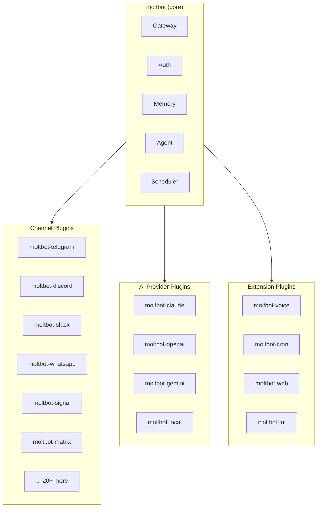
```mermaid
graph TB
    subgraph Core["moltbot (core)"]
        GATEWAY["Gateway"]
        AUTH["Auth"]
        MEMORY["Memory"]
        AGENT["Agent"]
        SCHEDULER["Scheduler"]
    end

    subgraph Channels["Channel Plugins"]
        TELEGRAM["moltbot-telegram"]
        DISCORD["moltbot-discord"]
        SLACK["moltbot-slack"]
        WHATSAPP["moltbot-whatsapp"]
        SIGNAL["moltbot-signal"]
        MATRIX["moltbot-matrix"]
        MORE_CH["... 20+ more"]
    end

    subgraph AI["AI Provider Plugins"]
        CLAUDE["moltbot-claude"]
        OPENAI["moltbot-openai"]
        GEMINI["moltbot-gemini"]
        LOCAL["moltbot-local"]
    end

    subgraph Extensions["Extension Plugins"]
        VOICE["moltbot-voice"]
        CRON["moltbot-cron"]
        WEB["moltbot-web"]
        TUI["moltbot-tui"]
    end

    Core --> Channels
    Core --> AI
    Core --> Extensions
```

### Plugin Categories

| Category | Package Pattern | Purpose | Examples |
|----------|-----------------|---------|----------|
| **Core** | `moltbot` | Essential runtime, gateway, auth | Required |
| **Channels** | `moltbot-{platform}` | Messaging platform adapters | `moltbot-telegram`, `moltbot-discord` |
| **AI Providers** | `moltbot-{provider}` | AI inference backends | `moltbot-claude`, `moltbot-openai` |
| **Extensions** | `moltbot-{feature}` | Optional features | `moltbot-voice`, `moltbot-cron` |
| **UI** | `moltbot-{ui}` | User interfaces | `moltbot-tui`, `moltbot-web` |

### Installation Examples

```bash
# Minimal: Core + Telegram + Claude
uv pip install moltbot moltbot-telegram moltbot-claude

# Personal use: Multiple channels
uv pip install moltbot moltbot-telegram moltbot-discord moltbot-signal moltbot-claude

# Business: Slack + Teams + Voice
uv pip install moltbot moltbot-slack moltbot-teams moltbot-voice moltbot-openai

# Full installation (development/testing)
uv pip install moltbot[all]

# With extras (recommended for end users)
uv pip install "moltbot[telegram,discord,claude]"
```

### Plugin Interface Contract

```python
# moltbot/core/plugin.py
from abc import ABC, abstractmethod
from typing import Protocol, runtime_checkable

@runtime_checkable
class MoltbotPlugin(Protocol):
    """Base protocol all plugins must implement."""

    @property
    def name(self) -> str:
        """Unique plugin identifier."""
        ...

    @property
    def version(self) -> str:
        """Plugin version (semver)."""
        ...

    async def initialize(self, app: "MoltbotApp") -> None:
        """Called when plugin is loaded."""
        ...

    async def shutdown(self) -> None:
        """Called when plugin is unloaded."""
        ...


class ChannelPlugin(MoltbotPlugin, Protocol):
    """Protocol for messaging channel plugins."""

    @property
    def channel_type(self) -> str:
        """Channel identifier (e.g., 'telegram', 'discord')."""
        ...

    async def connect(self) -> None:
        """Establish connection to platform."""
        ...

    async def disconnect(self) -> None:
        """Gracefully disconnect."""
        ...

    async def send_message(self, channel_id: str, content: str) -> None:
        """Send message to channel."""
        ...

    async def on_message(self, callback: MessageCallback) -> None:
        """Register message handler."""
        ...


class AIProviderPlugin(MoltbotPlugin, Protocol):
    """Protocol for AI provider plugins."""

    @property
    def provider_name(self) -> str:
        """Provider identifier (e.g., 'claude', 'openai')."""
        ...

    async def generate(
        self,
        messages: list[Message],
        **kwargs
    ) -> AIResponse:
        """Generate AI response."""
        ...

    async def embed(self, text: str) -> list[float]:
        """Generate embedding vector."""
        ...
```

### Plugin Discovery & Registration

```python
# Plugin discovery via entry points (pyproject.toml)
# Each plugin package declares its entry point:

# moltbot-telegram/pyproject.toml
[project.entry-points."moltbot.plugins"]
telegram = "moltbot_telegram:TelegramPlugin"

# moltbot-claude/pyproject.toml
[project.entry-points."moltbot.plugins"]
claude = "moltbot_claude:ClaudePlugin"

# Core discovers and loads plugins at startup:
# moltbot/core/plugin_loader.py
from importlib.metadata import entry_points

def discover_plugins() -> dict[str, type[MoltbotPlugin]]:
    """Discover all installed moltbot plugins."""
    plugins = {}
    eps = entry_points(group="moltbot.plugins")
    for ep in eps:
        try:
            plugin_class = ep.load()
            plugins[ep.name] = plugin_class
        except Exception as e:
            logger.warning(f"Failed to load plugin {ep.name}: {e}")
    return plugins
```

### Plugin Configuration

```yaml
# config/moltbot.yaml
core:
  gateway_port: 18789
  api_port: 8000

# Only configure plugins you have installed
plugins:
  telegram:
    enabled: true
    bot_token: ${TELEGRAM_BOT_TOKEN}

  discord:
    enabled: true
    bot_token: ${DISCORD_BOT_TOKEN}

  claude:
    enabled: true
    api_key: ${ANTHROPIC_API_KEY}
    model: claude-sonnet-4-20250514

  # Plugins not installed are simply ignored
  # No errors for missing plugin configs
```

### Dependency Isolation

Each plugin manages its own dependencies:

```
moltbot/                    # Core: minimal deps (fastapi, pydantic, aiosqlite)
moltbot-telegram/           # Deps: aiogram
moltbot-discord/            # Deps: discord.py
moltbot-slack/              # Deps: slack-sdk
moltbot-whatsapp/           # Deps: (none - uses subprocess bridge)
moltbot-claude/             # Deps: anthropic
moltbot-openai/             # Deps: openai
moltbot-voice/              # Deps: twilio, websockets
```

**Benefits**:
- No dependency conflicts between plugins
- Smaller installation footprint
- Faster startup (only load what's needed)
- Independent versioning and updates

### Plugin Lifecycle

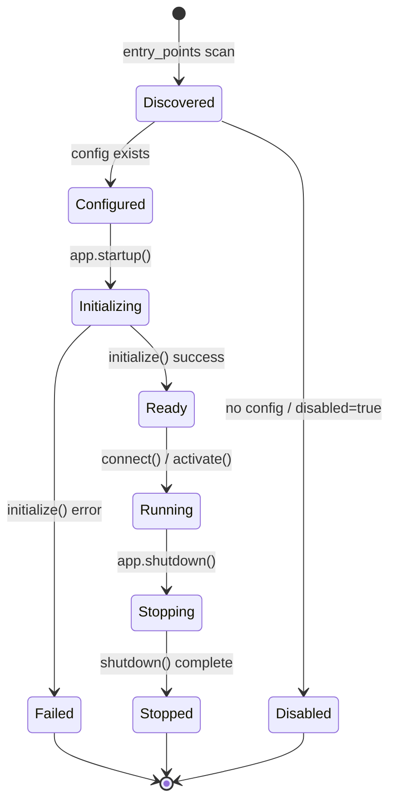
```mermaid
stateDiagram-v2
    [*] --> Discovered: entry_points scan
    Discovered --> Configured: config exists
    Discovered --> Disabled: no config / disabled=true
    Configured --> Initializing: app.startup()
    Initializing --> Ready: initialize() success
    Initializing --> Failed: initialize() error
    Ready --> Running: connect() / activate()
    Running --> Stopping: app.shutdown()
    Stopping --> Stopped: shutdown() complete
    Failed --> [*]
    Stopped --> [*]
    Disabled --> [*]
```

### Plugin Testing

```python
# Each plugin is independently testable
# tests/plugins/test_telegram.py

import pytest
from moltbot_telegram import TelegramPlugin
from moltbot.testing import MockApp, MockMessage

@pytest.fixture
def plugin():
    return TelegramPlugin()

@pytest.fixture
def mock_app():
    return MockApp()

async def test_plugin_initialization(plugin, mock_app):
    await plugin.initialize(mock_app)
    assert plugin.name == "telegram"
    assert mock_app.plugins["telegram"] == plugin

async def test_message_handling(plugin, mock_app):
    await plugin.initialize(mock_app)

    msg = MockMessage(text="Hello", channel_id="123")
    response = await plugin.handle_message(msg)

    assert response is not None
```

---

## 2. C4 Architecture Views (Target)

### 2.1 System Context (C4 Level 1) - Target

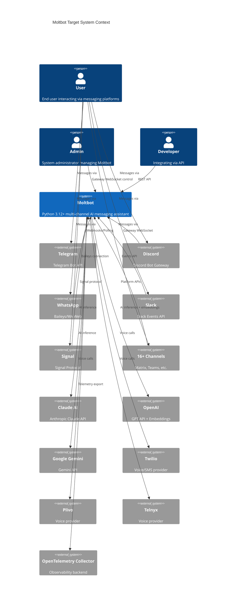
```mermaid
C4Context
    title Moltbot Target System Context

    Person(user, "User", "End user interacting via messaging platforms")
    Person(admin, "Admin", "System administrator managing Moltbot")
    Person(developer, "Developer", "Integrating via API")

    System(moltbot, "Moltbot", "Python 3.12+ multi-channel AI messaging assistant")

    System_Ext(telegram, "Telegram", "Telegram Bot API")
    System_Ext(discord, "Discord", "Discord Bot Gateway")
    System_Ext(whatsapp, "WhatsApp", "Baileys/WA Web")
    System_Ext(slack, "Slack", "Slack Events API")
    System_Ext(signal, "Signal", "Signal Protocol")
    System_Ext(channels, "16+ Channels", "Matrix, Teams, etc.")

    System_Ext(claude, "Claude AI", "Anthropic Claude API")
    System_Ext(openai, "OpenAI", "GPT API + Embeddings")
    System_Ext(gemini, "Google Gemini", "Gemini API")

    System_Ext(twilio, "Twilio", "Voice/SMS provider")
    System_Ext(plivo, "Plivo", "Voice provider")
    System_Ext(telnyx, "Telnyx", "Voice provider")

    System_Ext(otel, "OpenTelemetry Collector", "Observability backend")

    Rel(user, telegram, "Messages via")
    Rel(user, discord, "Messages via")
    Rel(user, whatsapp, "Messages via")
    Rel(user, slack, "Messages via")
    Rel(user, signal, "Messages via")
    Rel(user, channels, "Messages via")

    Rel(telegram, moltbot, "Webhooks/Polling")
    Rel(discord, moltbot, "Gateway WebSocket")
    Rel(whatsapp, moltbot, "Baileys connection")
    Rel(slack, moltbot, "Events API")
    Rel(signal, moltbot, "Signal protocol")
    Rel(channels, moltbot, "Platform APIs")

    Rel(moltbot, claude, "AI inference")
    Rel(moltbot, openai, "AI inference + embeddings")
    Rel(moltbot, gemini, "AI inference")

    Rel(moltbot, twilio, "Voice calls")
    Rel(moltbot, plivo, "Voice calls")
    Rel(moltbot, telnyx, "Voice calls")

    Rel(moltbot, otel, "Telemetry export")

    Rel(admin, moltbot, "Gateway WebSocket control")
    Rel(developer, moltbot, "REST API")
```

### 2.2 Container View (C4 Level 2) - Target

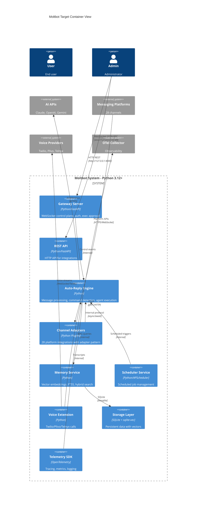
```mermaid
C4Container
    title Moltbot Target Container View

    Person(user, "User", "End user")
    Person(admin, "Admin", "Administrator")

    System_Boundary(moltbot, "Moltbot System - Python 3.12+") {
        Container(gateway, "Gateway Server", "Python/FastAPI", "WebSocket control plane, auth, exec approval")
        Container(api, "REST API", "Python/FastAPI", "HTTP API for integrations")
        Container(autoreply, "Auto-Reply Engine", "Python", "Message processing, command detection, agent execution")
        Container(adapters, "Channel Adapters", "Python Plugins", "28 platform integrations with adapter pattern")
        Container(memory, "Memory Service", "Python", "Vector embeddings, FTS5, hybrid search")
        Container(scheduler, "Scheduler Service", "Python/APScheduler", "Scheduled job management")
        Container(voice, "Voice Extension", "Python", "Twilio/Plivo/Telnyx calls")
        Container(storage, "Storage Layer", "SQLite + sqlite-vec", "Persistent data with vectors")
        Container(otel_sdk, "Telemetry SDK", "OpenTelemetry", "Tracing, metrics, logging")
    }

    System_Ext(aiapis, "AI APIs", "Claude, OpenAI, Gemini")
    System_Ext(platforms, "Messaging Platforms", "28 channels")
    System_Ext(voiceproviders, "Voice Providers", "Twilio, Plivo, Telnyx")
    System_Ext(otel_collector, "OTel Collector", "Observability")

    Rel(admin, gateway, "WebSocket JSON-RPC", "wss://127.0.0.1:18789")
    Rel(admin, api, "HTTP REST", "http://127.0.0.1:8000")

    Rel(platforms, adapters, "Platform APIs", "HTTPS/WebSocket")
    Rel(adapters, autoreply, "Internal protocol", "async/await")
    Rel(autoreply, aiapis, "AI inference", "HTTPS")
    Rel(autoreply, memory, "RAG queries", "Internal")
    Rel(memory, storage, "SQLite", "aiosqlite")
    Rel(gateway, autoreply, "Control events", "Internal")
    Rel(scheduler, autoreply, "Scheduled triggers", "Internal")
    Rel(voice, voiceproviders, "Voice streams", "WebSocket/TwiML")
    Rel(voice, autoreply, "Transcripts", "Internal")
    Rel(otel_sdk, otel_collector, "OTLP", "gRPC/HTTP")
```

### 2.3 Component View (C4 Level 3) - Target

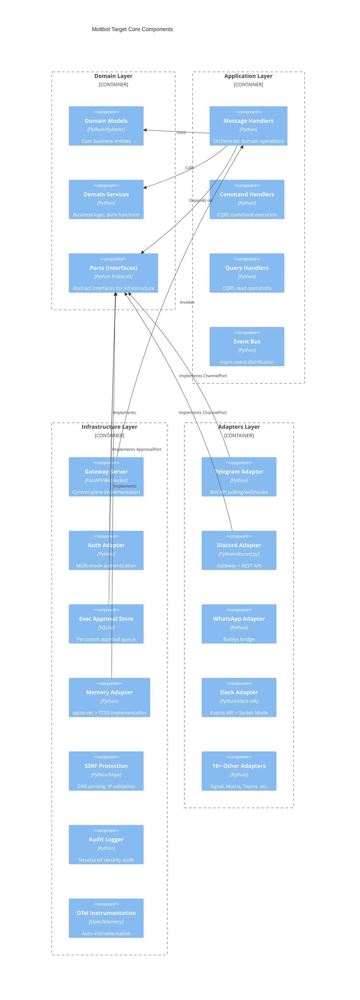
```mermaid
C4Component
    title Moltbot Target Core Components

    Container_Boundary(domain, "Domain Layer") {
        Component(models, "Domain Models", "Python/Pydantic", "Core business entities")
        Component(services, "Domain Services", "Python", "Business logic, pure functions")
        Component(ports, "Ports (Interfaces)", "Python Protocols", "Abstract interfaces for infrastructure")
    }

    Container_Boundary(application, "Application Layer") {
        Component(handlers, "Message Handlers", "Python", "Orchestrate domain operations")
        Component(commands, "Command Handlers", "Python", "CQRS command execution")
        Component(queries, "Query Handlers", "Python", "CQRS read operations")
        Component(events, "Event Bus", "Python", "Async event distribution")
    }

    Container_Boundary(infrastructure, "Infrastructure Layer") {
        Component(gateway_server, "Gateway Server", "FastAPI/WebSocket", "Control plane implementation")
        Component(gateway_auth, "Auth Adapter", "Python", "Multi-mode authentication")
        Component(exec_approval, "Exec Approval Store", "SQLite", "Persistent approval queue")
        Component(memory_adapter, "Memory Adapter", "Python", "sqlite-vec + FTS5 implementation")
        Component(ssrf, "SSRF Protection", "Python/httpx", "DNS pinning, IP validation")
        Component(audit, "Audit Logger", "Python", "Structured security audit")
        Component(otel, "OTel Instrumentation", "OpenTelemetry", "Auto-instrumentation")
    }

    Container_Boundary(adapters_layer, "Adapters Layer") {
        Component(telegram_adapter, "Telegram Adapter", "Python", "Bot API polling/webhooks")
        Component(discord_adapter, "Discord Adapter", "Python/discord.py", "Gateway + REST API")
        Component(whatsapp_adapter, "WhatsApp Adapter", "Python", "Baileys bridge")
        Component(slack_adapter, "Slack Adapter", "Python/slack-sdk", "Events API + Socket Mode")
        Component(other_adapters, "16+ Other Adapters", "Python", "Signal, Matrix, Teams, etc.")
    }

    Rel(handlers, models, "Uses")
    Rel(handlers, services, "Calls")
    Rel(handlers, ports, "Depends on")
    Rel(gateway_server, handlers, "Invokes")
    Rel(gateway_auth, ports, "Implements")
    Rel(memory_adapter, ports, "Implements")
    Rel(telegram_adapter, ports, "Implements ChannelPort")
    Rel(discord_adapter, ports, "Implements ChannelPort")
    Rel(exec_approval, ports, "Implements ApprovalPort")
```

**Key Changes from Legacy**:
- Clear layer separation with unidirectional dependencies
- Domain layer has zero external dependencies
- Infrastructure implements ports defined by domain
- Adapters are isolated, independently testable

---

## 3. Component Dependency Diagram (Target)

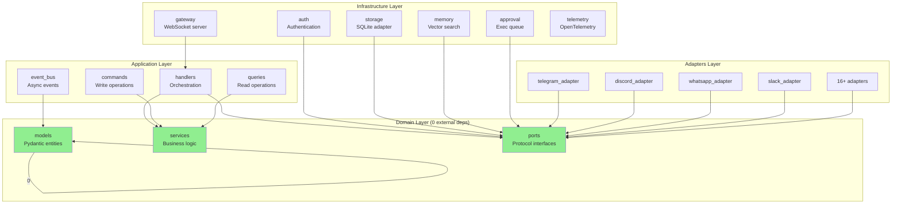
```mermaid
graph TB
    subgraph Domain["Domain Layer (0 external deps)"]
        MODELS["models<br/>Pydantic entities"]
        SERVICES["services<br/>Business logic"]
        PORTS["ports<br/>Protocol interfaces"]
    end

    subgraph Application["Application Layer"]
        HANDLERS["handlers<br/>Orchestration"]
        COMMANDS["commands<br/>Write operations"]
        QUERIES["queries<br/>Read operations"]
        EVENTS["event_bus<br/>Async events"]
    end

    subgraph Infrastructure["Infrastructure Layer"]
        GATEWAY["gateway<br/>WebSocket server"]
        AUTH["auth<br/>Authentication"]
        STORAGE["storage<br/>SQLite adapter"]
        MEMORY["memory<br/>Vector search"]
        APPROVAL["approval<br/>Exec queue"]
        OTEL["telemetry<br/>OpenTelemetry"]
    end

    subgraph Adapters["Adapters Layer"]
        TELEGRAM["telegram_adapter"]
        DISCORD["discord_adapter"]
        WHATSAPP["whatsapp_adapter"]
        SLACK["slack_adapter"]
        OTHERS["16+ adapters"]
    end

    %% Domain has NO dependencies
    MODELS --> |0| MODELS

    %% Application depends on Domain
    HANDLERS --> SERVICES
    HANDLERS --> PORTS
    COMMANDS --> SERVICES
    QUERIES --> SERVICES
    EVENTS --> MODELS

    %% Infrastructure depends on Application + Domain
    GATEWAY --> HANDLERS
    AUTH --> PORTS
    STORAGE --> PORTS
    MEMORY --> PORTS
    APPROVAL --> PORTS

    %% Adapters depend on Application + Domain
    TELEGRAM --> PORTS
    DISCORD --> PORTS
    WHATSAPP --> PORTS
    SLACK --> PORTS
    OTHERS --> PORTS

    %% No circular dependencies
    style MODELS fill:#90EE90
    style SERVICES fill:#90EE90
    style PORTS fill:#90EE90
```

### Legacy → Target Dependency Comparison

| Aspect | Legacy | Target | Improvement |
|--------|--------|--------|-------------|
| Circular dependencies | 1 cycle (10 components) | 0 cycles | 100% elimination |
| Config dependencies | 445+ bidirectional | ~30 unidirectional | 85% reduction |
| Cross-layer coupling | High (config hub) | None (strict layers) | Clean architecture |
| Test isolation | Difficult | Each layer independent | Full unit test coverage |

### Target Module Structure (Plugin-Based)

```
# CORE PACKAGE: moltbot (required)
moltbot/
├── core/                   # Plugin system
│   ├── plugin.py           # Plugin protocols & base classes
│   ├── loader.py           # Plugin discovery & loading
│   ├── registry.py         # Plugin registry
│   └── config.py           # Plugin configuration
├── domain/                 # Layer 0: Pure domain (no external deps)
│   ├── models/             # Pydantic entities
│   │   ├── message.py
│   │   ├── channel.py
│   │   ├── approval.py
│   │   └── session.py
│   ├── services/           # Business logic (pure functions)
│   │   ├── message_service.py
│   │   └── approval_service.py
│   └── ports/              # Abstract interfaces (Protocol classes)
│       ├── channel_port.py
│       ├── ai_provider_port.py
│       ├── storage_port.py
│       └── auth_port.py
├── application/            # Layer 1: Use cases
│   ├── handlers/           # Message orchestration
│   ├── commands/           # Write operations
│   ├── queries/            # Read operations
│   └── events/             # Event bus
├── infrastructure/         # Layer 2: Core implementations
│   ├── gateway/            # WebSocket server
│   ├── auth/               # Authentication
│   ├── storage/            # SQLite
│   ├── memory/             # Vector search
│   └── telemetry/          # OpenTelemetry
└── testing/                # Test utilities for plugins
    ├── mocks.py
    └── fixtures.py

# CHANNEL PLUGINS: Separate packages (install as needed)
moltbot-telegram/           # uv pip install moltbot-telegram
├── moltbot_telegram/
│   ├── __init__.py         # Exports TelegramPlugin
│   ├── plugin.py           # TelegramPlugin(ChannelPlugin)
│   ├── adapter.py          # Telegram API adapter
│   └── config.py           # Telegram-specific config
├── pyproject.toml          # Declares entry point
└── tests/

moltbot-discord/            # uv pip install moltbot-discord
moltbot-slack/              # uv pip install moltbot-slack
moltbot-whatsapp/           # uv pip install moltbot-whatsapp
moltbot-signal/             # uv pip install moltbot-signal
moltbot-matrix/             # uv pip install moltbot-matrix
# ... 20+ more channel plugins

# AI PROVIDER PLUGINS: Separate packages
moltbot-claude/             # uv pip install moltbot-claude
moltbot-openai/             # uv pip install moltbot-openai
moltbot-gemini/             # uv pip install moltbot-gemini
moltbot-local/              # uv pip install moltbot-local (ollama, etc.)

# EXTENSION PLUGINS: Optional features
moltbot-voice/              # uv pip install moltbot-voice
moltbot-cron/               # uv pip install moltbot-cron
moltbot-tui/                # uv pip install moltbot-tui
moltbot-web/                # uv pip install moltbot-web
```

---

## 4. Sequence Diagrams (Target)

### 4.1 Message Processing Flow (Target)

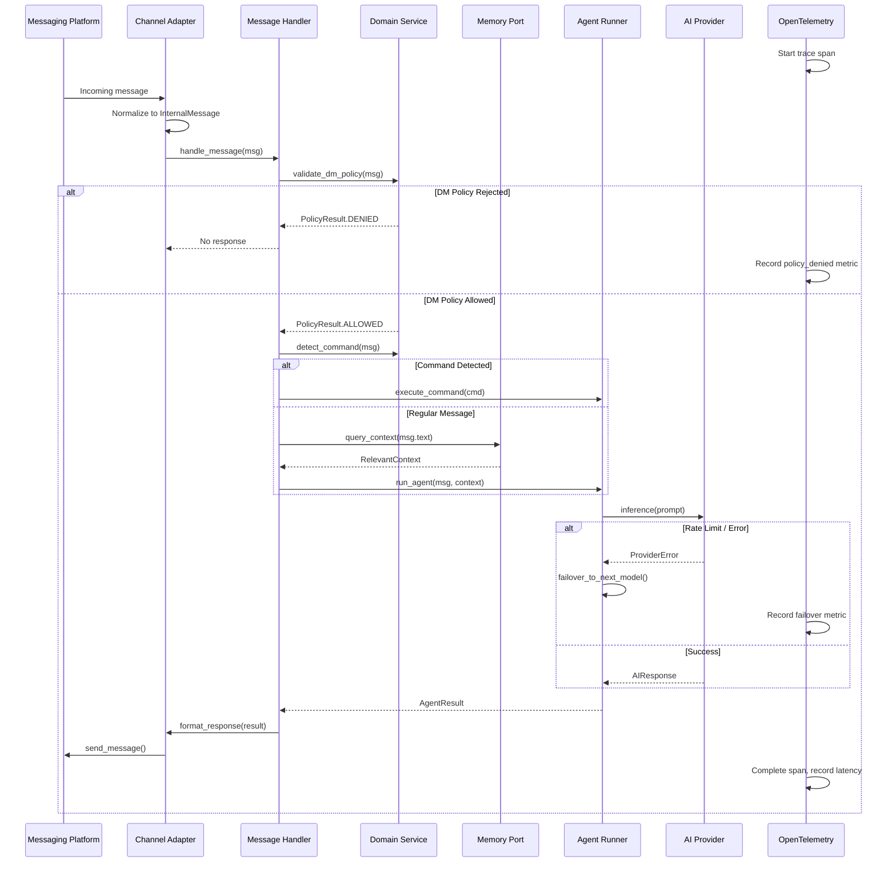
```mermaid
sequenceDiagram
    participant Platform as Messaging Platform
    participant Adapter as Channel Adapter
    participant Handler as Message Handler
    participant Service as Domain Service
    participant Memory as Memory Port
    participant Agent as Agent Runner
    participant AI as AI Provider
    participant OTel as OpenTelemetry

    OTel->>OTel: Start trace span

    Platform->>Adapter: Incoming message
    Adapter->>Adapter: Normalize to InternalMessage
    Adapter->>Handler: handle_message(msg)

    Handler->>Service: validate_dm_policy(msg)

    alt DM Policy Rejected
        Service-->>Handler: PolicyResult.DENIED
        Handler-->>Adapter: No response
        OTel->>OTel: Record policy_denied metric
    else DM Policy Allowed
        Service-->>Handler: PolicyResult.ALLOWED
        Handler->>Service: detect_command(msg)

        alt Command Detected
            Handler->>Agent: execute_command(cmd)
        else Regular Message
            Handler->>Memory: query_context(msg.text)
            Memory-->>Handler: RelevantContext

            Handler->>Agent: run_agent(msg, context)
        end

        Agent->>AI: inference(prompt)

        alt Rate Limit / Error
            AI-->>Agent: ProviderError
            Agent->>Agent: failover_to_next_model()
            OTel->>OTel: Record failover metric
        else Success
            AI-->>Agent: AIResponse
        end

        Agent-->>Handler: AgentResult
        Handler->>Adapter: format_response(result)
        Adapter->>Platform: send_message()

        OTel->>OTel: Complete span, record latency
    end
```

**Changes from Legacy**:
- OpenTelemetry tracing integrated from start
- Clear domain service boundaries
- Explicit failover metrics tracking

### 4.2 Gateway Authentication Flow (Target)

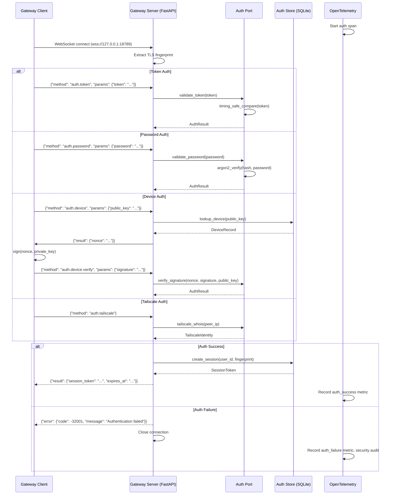
```mermaid
sequenceDiagram
    participant Client as Gateway Client
    participant Server as Gateway Server (FastAPI)
    participant Auth as Auth Port
    participant Store as Auth Store (SQLite)
    participant OTel as OpenTelemetry

    OTel->>OTel: Start auth span

    Client->>Server: WebSocket connect (wss://127.0.0.1:18789)
    Server->>Server: Extract TLS fingerprint

    alt Token Auth
        Client->>Server: {"method": "auth.token", "params": {"token": "..."}}
        Server->>Auth: validate_token(token)
        Auth->>Auth: timing_safe_compare(token)
        Auth-->>Server: AuthResult
    else Password Auth
        Client->>Server: {"method": "auth.password", "params": {"password": "..."}}
        Server->>Auth: validate_password(password)
        Auth->>Auth: argon2_verify(hash, password)
        Auth-->>Server: AuthResult
    else Device Auth
        Client->>Server: {"method": "auth.device", "params": {"public_key": "..."}}
        Server->>Store: lookup_device(public_key)
        Store-->>Server: DeviceRecord
        Server->>Client: {"result": {"nonce": "..."}}
        Client->>Client: sign(nonce, private_key)
        Client->>Server: {"method": "auth.device.verify", "params": {"signature": "..."}}
        Server->>Auth: verify_signature(nonce, signature, public_key)
        Auth-->>Server: AuthResult
    else Tailscale Auth
        Client->>Server: {"method": "auth.tailscale"}
        Server->>Auth: tailscale_whois(peer_ip)
        Auth-->>Server: TailscaleIdentity
    end

    alt Auth Success
        Server->>Store: create_session(user_id, fingerprint)
        Store-->>Server: SessionToken
        Server-->>Client: {"result": {"session_token": "...", "expires_at": "..."}}
        OTel->>OTel: Record auth_success metric
    else Auth Failure
        Server-->>Client: {"error": {"code": -32001, "message": "Authentication failed"}}
        Server->>Server: Close connection
        OTel->>OTel: Record auth_failure metric, security audit
    end
```

**Changes from Legacy**:
- Argon2 password hashing (upgraded from timing-safe comparison)
- Session tokens persisted to SQLite
- Security audit events via OpenTelemetry

### 4.3 Exec Approval Workflow (Target - Persistent)

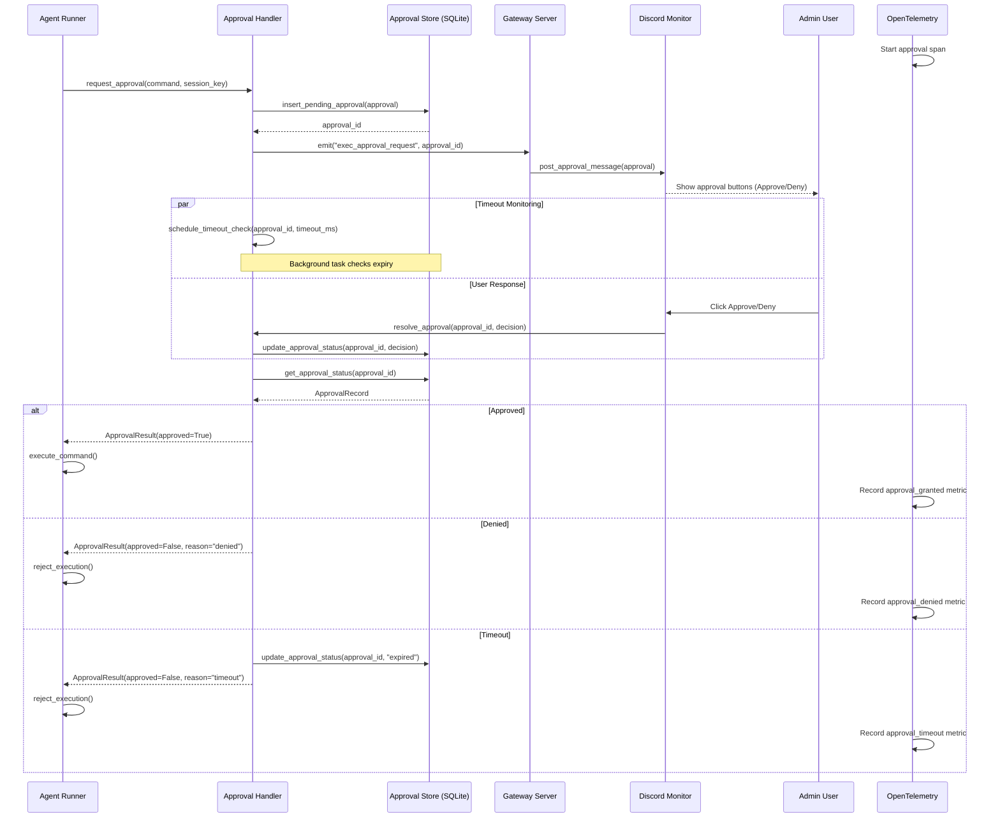
```mermaid
sequenceDiagram
    participant Agent as Agent Runner
    participant Handler as Approval Handler
    participant Store as Approval Store (SQLite)
    participant Gateway as Gateway Server
    participant Discord as Discord Monitor
    participant Admin as Admin User
    participant OTel as OpenTelemetry

    OTel->>OTel: Start approval span

    Agent->>Handler: request_approval(command, session_key)
    Handler->>Store: insert_pending_approval(approval)
    Store-->>Handler: approval_id

    Handler->>Gateway: emit("exec_approval_request", approval_id)
    Gateway->>Discord: post_approval_message(approval)
    Discord-->>Admin: Show approval buttons (Approve/Deny)

    par Timeout Monitoring
        Handler->>Handler: schedule_timeout_check(approval_id, timeout_ms)
        Note over Handler,Store: Background task checks expiry
    and User Response
        Admin->>Discord: Click Approve/Deny
        Discord->>Handler: resolve_approval(approval_id, decision)
        Handler->>Store: update_approval_status(approval_id, decision)
    end

    Handler->>Store: get_approval_status(approval_id)
    Store-->>Handler: ApprovalRecord

    alt Approved
        Handler-->>Agent: ApprovalResult(approved=True)
        Agent->>Agent: execute_command()
        OTel->>OTel: Record approval_granted metric
    else Denied
        Handler-->>Agent: ApprovalResult(approved=False, reason="denied")
        Agent->>Agent: reject_execution()
        OTel->>OTel: Record approval_denied metric
    else Timeout
        Handler->>Store: update_approval_status(approval_id, "expired")
        Handler-->>Agent: ApprovalResult(approved=False, reason="timeout")
        Agent->>Agent: reject_execution()
        OTel->>OTel: Record approval_timeout metric
    end
```

**Key Improvement**: Approvals are **persisted to SQLite**, surviving restarts. Audit trail maintained via OpenTelemetry.

### 4.4 Voice Call State Machine (Target)

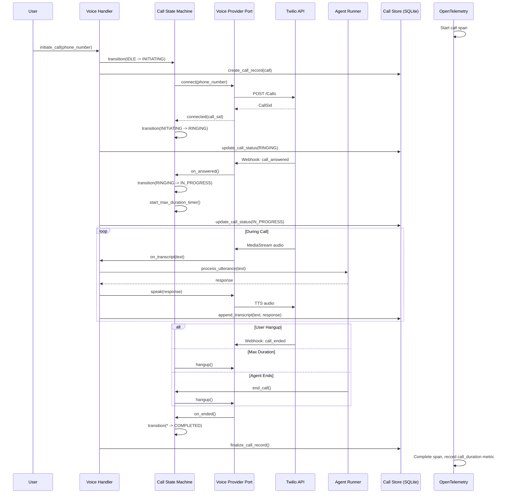
```mermaid
sequenceDiagram
    participant User as User
    participant Handler as Voice Handler
    participant FSM as Call State Machine
    participant Provider as Voice Provider Port
    participant Twilio as Twilio API
    participant Agent as Agent Runner
    participant Store as Call Store (SQLite)
    participant OTel as OpenTelemetry

    OTel->>OTel: Start call span

    User->>Handler: initiate_call(phone_number)
    Handler->>FSM: transition(IDLE -> INITIATING)
    Handler->>Store: create_call_record(call)

    FSM->>Provider: connect(phone_number)
    Provider->>Twilio: POST /Calls
    Twilio-->>Provider: CallSid
    Provider-->>FSM: connected(call_sid)

    FSM->>FSM: transition(INITIATING -> RINGING)
    Handler->>Store: update_call_status(RINGING)

    Twilio->>Provider: Webhook: call_answered
    Provider->>FSM: on_answered()
    FSM->>FSM: transition(RINGING -> IN_PROGRESS)
    FSM->>FSM: start_max_duration_timer()
    Handler->>Store: update_call_status(IN_PROGRESS)

    loop During Call
        Twilio->>Provider: MediaStream audio
        Provider->>Handler: on_transcript(text)
        Handler->>Agent: process_utterance(text)
        Agent-->>Handler: response
        Handler->>Provider: speak(response)
        Provider->>Twilio: TTS audio
        Handler->>Store: append_transcript(text, response)
    end

    alt User Hangup
        Twilio->>Provider: Webhook: call_ended
    else Max Duration
        FSM->>Provider: hangup()
    else Agent Ends
        Agent->>FSM: end_call()
        FSM->>Provider: hangup()
    end

    Provider->>FSM: on_ended()
    FSM->>FSM: transition(* -> COMPLETED)
    Handler->>Store: finalize_call_record()
    OTel->>OTel: Complete span, record call_duration metric
```

**Changes from Legacy**:
- Explicit state machine with validated transitions
- All call records persisted to SQLite immediately
- Call duration and transcript stored for analytics

---

## 5. Deployment Architecture (Target)

### Target Deployment Model

**Platform**: Docker Compose (user preference Q5/Q6)
**Container Runtime**: Docker (user preference Q7)
**Base Image**: python:3.12-slim-bookworm

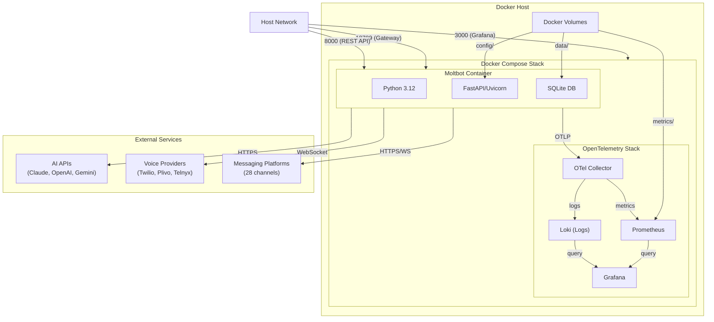
```mermaid
graph TB
    subgraph Host["Docker Host"]
        subgraph Compose["Docker Compose Stack"]
            subgraph App["Moltbot Container"]
                PYTHON["Python 3.12"]
                FASTAPI["FastAPI/Uvicorn"]
                SQLITE["SQLite DB"]
            end

            subgraph OTel["OpenTelemetry Stack"]
                COLLECTOR["OTel Collector"]
                PROMETHEUS["Prometheus"]
                GRAFANA["Grafana"]
                LOKI["Loki (Logs)"]
            end
        end

        VOLUMES["Docker Volumes"]
        VOLUMES -->|"data/"| SQLITE
        VOLUMES -->|"config/"| FASTAPI
        VOLUMES -->|"metrics/"| PROMETHEUS
    end

    subgraph External["External Services"]
        AI["AI APIs<br/>(Claude, OpenAI, Gemini)"]
        VOICE["Voice Providers<br/>(Twilio, Plivo, Telnyx)"]
        PLATFORMS["Messaging Platforms<br/>(28 channels)"]
    end

    HOST_NET["Host Network"]
    HOST_NET -->|"18789 (Gateway)"| App
    HOST_NET -->|"8000 (REST API)"| App
    HOST_NET -->|"3000 (Grafana)"| Compose

    App -->|"HTTPS"| AI
    App -->|"WebSocket"| VOICE
    App -->|"HTTPS/WS"| PLATFORMS

    App -->|"OTLP"| COLLECTOR
    COLLECTOR -->|"metrics"| PROMETHEUS
    COLLECTOR -->|"logs"| LOKI
    PROMETHEUS -->|"query"| GRAFANA
    LOKI -->|"query"| GRAFANA
```

### Docker Compose Configuration (Target)

```yaml
# docker-compose.yml (target)
services:
  moltbot:
    build:
      context: .
      dockerfile: Dockerfile
    image: moltbot:latest
    container_name: moltbot
    restart: unless-stopped
    user: "1000:1000"  # Non-root
    ports:
      - "127.0.0.1:18789:18789"  # Gateway WebSocket
      - "127.0.0.1:8000:8000"    # REST API
    volumes:
      - ./data:/app/data          # SQLite + vectors
      - ./config:/app/config:ro   # Config (read-only)
    environment:
      - OTEL_EXPORTER_OTLP_ENDPOINT=http://otel-collector:4317
      - MOLTBOT_LOG_FORMAT=json
    depends_on:
      - otel-collector
    healthcheck:
      test: ["CMD", "curl", "-f", "http://localhost:8000/health"]
      interval: 30s
      timeout: 10s
      retries: 3

  otel-collector:
    image: otel/opentelemetry-collector-contrib:latest
    container_name: otel-collector
    volumes:
      - ./config/otel-collector.yaml:/etc/otel-collector-config.yaml:ro
    command: ["--config=/etc/otel-collector-config.yaml"]
    ports:
      - "4317:4317"   # OTLP gRPC
      - "4318:4318"   # OTLP HTTP

  prometheus:
    image: prom/prometheus:latest
    container_name: prometheus
    volumes:
      - ./config/prometheus.yml:/etc/prometheus/prometheus.yml:ro
      - prometheus-data:/prometheus
    command:
      - '--config.file=/etc/prometheus/prometheus.yml'
      - '--storage.tsdb.path=/prometheus'

  grafana:
    image: grafana/grafana:latest
    container_name: grafana
    ports:
      - "127.0.0.1:3000:3000"
    volumes:
      - grafana-data:/var/lib/grafana
    environment:
      - GF_SECURITY_ADMIN_PASSWORD=${GRAFANA_PASSWORD:-admin}

volumes:
  prometheus-data:
  grafana-data:
```

### Infrastructure Components (Target)

| Component | Technology | Purpose | Evidence/Decision |
|-----------|------------|---------|-------------------|
| Runtime | Python 3.12+ | Application execution | Q1 preference |
| Package Manager | uv | Fast dependency management | Q4 preference |
| ASGI Server | Uvicorn | ASGI server for FastAPI | Production standard |
| Framework | FastAPI | REST + WebSocket support | Python ecosystem standard |
| Container | Docker | Deployment isolation | Q7 preference |
| Orchestration | Docker Compose | Single-host orchestration | Q5/Q6 preference |
| Database | SQLite + sqlite-vec | Embedded storage + vectors | Q2 preference (unchanged) |
| Observability | OpenTelemetry | Traces, metrics, logs | Q8 preference |
| Metrics | Prometheus | Time-series metrics | Q8.metrics preference |
| Logging | Structured JSON | Log aggregation | Q8.logging preference |

### Port Allocation (Target)

| Port | Service | Protocol | Binding | Legacy |
|------|---------|----------|---------|--------|
| 18789 | Gateway Server | WebSocket | 127.0.0.1 | **Preserved** |
| 8000 | REST API | HTTP | 127.0.0.1 | **New** |
| 4317 | OTel Collector | gRPC | Internal | **New** |
| 3000 | Grafana | HTTP | 127.0.0.1 | **New** |

### Security Hardening (Target)

| Measure | Implementation | Legacy Comparison |
|---------|----------------|-------------------|
| Non-root user | Container runs as uid 1000 | **Preserved** |
| TLS fingerprint | Pin client certificate fingerprint | **Preserved** |
| SSRF protection | DNS pinning, private IP blocking (httpx) | **Preserved** |
| Exec approval | Persistent approval queue in SQLite | **Improved** |
| Rate limiting | slowapi + Redis/in-memory | **New** |
| Secrets management | Environment variables + .env file | **Improved** |
| Audit logging | Structured JSON + OpenTelemetry | **Improved** |

---

## 6. Data Flow Diagrams (Target)

### 6.1 Request/Response Flow (Target)

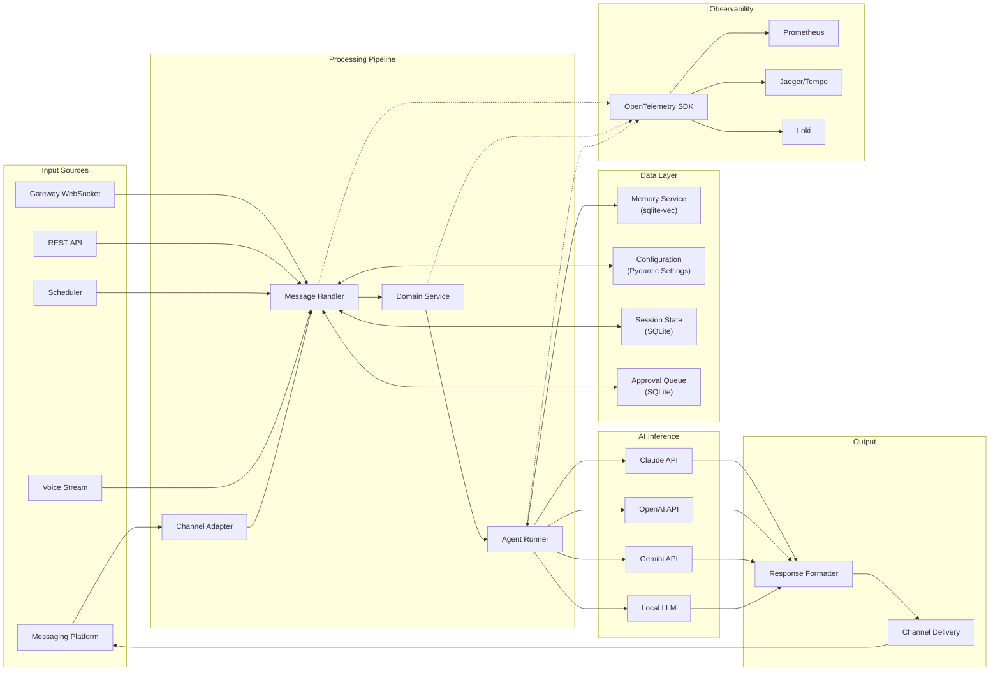
```mermaid
flowchart LR
    subgraph Input["Input Sources"]
        PLATFORM["Messaging Platform"]
        GATEWAY["Gateway WebSocket"]
        API["REST API"]
        SCHEDULER["Scheduler"]
        VOICE["Voice Stream"]
    end

    subgraph Processing["Processing Pipeline"]
        ADAPTER["Channel Adapter"]
        HANDLER["Message Handler"]
        SERVICE["Domain Service"]
        AGENT["Agent Runner"]
    end

    subgraph Data["Data Layer"]
        MEMORY["Memory Service<br/>(sqlite-vec)"]
        CONFIG["Configuration<br/>(Pydantic Settings)"]
        STATE["Session State<br/>(SQLite)"]
        APPROVAL["Approval Queue<br/>(SQLite)"]
    end

    subgraph AI["AI Inference"]
        CLAUDE["Claude API"]
        OPENAI["OpenAI API"]
        GEMINI["Gemini API"]
        LOCAL["Local LLM"]
    end

    subgraph Output["Output"]
        RESPONSE["Response Formatter"]
        DELIVERY["Channel Delivery"]
    end

    subgraph Observability["Observability"]
        OTEL["OpenTelemetry SDK"]
        METRICS["Prometheus"]
        TRACES["Jaeger/Tempo"]
        LOGS["Loki"]
    end

    PLATFORM --> ADAPTER
    GATEWAY --> HANDLER
    API --> HANDLER
    SCHEDULER --> HANDLER
    VOICE --> HANDLER

    ADAPTER --> HANDLER
    HANDLER --> SERVICE
    SERVICE --> AGENT

    AGENT <--> MEMORY
    HANDLER <--> CONFIG
    HANDLER <--> STATE
    HANDLER <--> APPROVAL

    AGENT --> CLAUDE
    AGENT --> OPENAI
    AGENT --> GEMINI
    AGENT --> LOCAL

    CLAUDE --> RESPONSE
    OPENAI --> RESPONSE
    GEMINI --> RESPONSE
    LOCAL --> RESPONSE

    RESPONSE --> DELIVERY
    DELIVERY --> PLATFORM

    HANDLER -.-> OTEL
    SERVICE -.-> OTEL
    AGENT -.-> OTEL
    OTEL --> METRICS
    OTEL --> TRACES
    OTEL --> LOGS
```

### 6.2 Data Transformation Points (Target)

| Source | Transform | Destination | Implementation |
|--------|-----------|-------------|----------------|
| Platform message | Normalize to InternalMessage | Message handler | `ChannelAdapter.to_internal()` |
| User query | Generate embedding vector | Memory service | OpenAI/local embedding model |
| Memory search | Hybrid ranking (vector + BM25) | Agent context | `MemoryService.hybrid_search()` |
| AI response | Chunk for platform limits | Response delivery | `ResponseFormatter.chunk()` |
| Voice audio | Transcribe to text | Agent input | Whisper/Deepgram |
| Agent response | Text-to-speech synthesis | Voice stream | Voice provider TTS |
| All operations | Telemetry extraction | OTel Collector | Auto-instrumentation |

### 6.3 Memory Indexing Flow (Target)

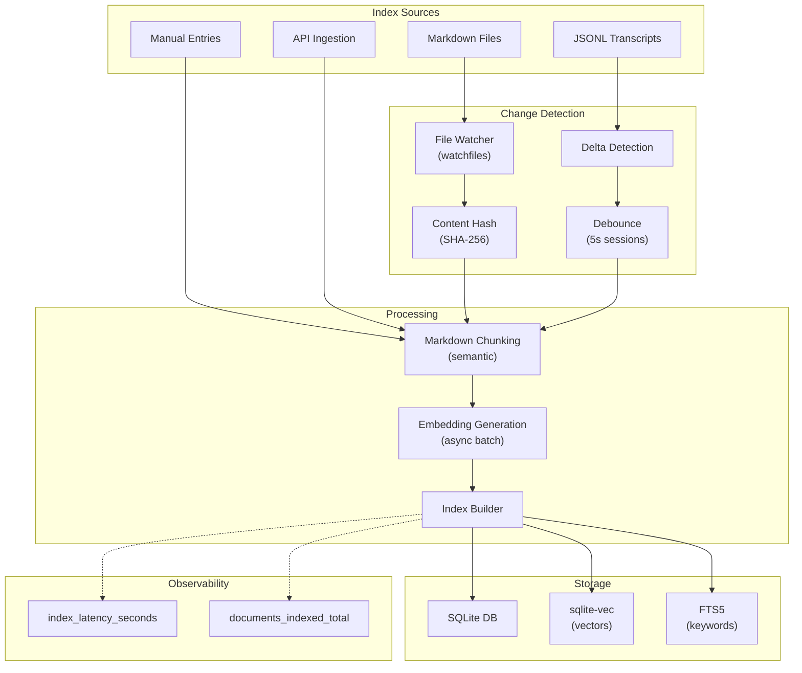
```mermaid
flowchart TB
    subgraph Sources["Index Sources"]
        FILES["Markdown Files"]
        SESSIONS["JSONL Transcripts"]
        MANUAL["Manual Entries"]
        API_INGEST["API Ingestion"]
    end

    subgraph Detection["Change Detection"]
        HASH["Content Hash<br/>(SHA-256)"]
        DELTA["Delta Detection"]
        DEBOUNCE["Debounce<br/>(5s sessions)"]
        WATCHER["File Watcher<br/>(watchfiles)"]
    end

    subgraph Processing["Processing"]
        CHUNK["Markdown Chunking<br/>(semantic)"]
        EMBED["Embedding Generation<br/>(async batch)"]
        INDEX["Index Builder"]
    end

    subgraph Storage["Storage"]
        SQLITE["SQLite DB"]
        VEC["sqlite-vec<br/>(vectors)"]
        FTS["FTS5<br/>(keywords)"]
    end

    subgraph Observability["Observability"]
        METRICS["index_latency_seconds"]
        COUNTER["documents_indexed_total"]
    end

    FILES --> WATCHER
    SESSIONS --> DELTA
    MANUAL --> CHUNK
    API_INGEST --> CHUNK

    WATCHER --> HASH
    HASH --> CHUNK
    DELTA --> DEBOUNCE
    DEBOUNCE --> CHUNK

    CHUNK --> EMBED
    EMBED --> INDEX

    INDEX --> SQLITE
    INDEX --> VEC
    INDEX --> FTS

    INDEX -.-> METRICS
    INDEX -.-> COUNTER
```

**Key Improvements**:
- File watcher for real-time indexing (watchfiles)
- Semantic chunking (sentence-aware)
- Async batch embedding for throughput
- Indexing metrics for observability

---

## 7. Resilience Patterns (Target)

### Target Patterns

| Pattern | Implementation | Library | Legacy Comparison |
|---------|----------------|---------|-------------------|
| **Retry** | Exponential backoff with jitter | tenacity | **Enhanced** |
| **Circuit Breaker** | Per-external-service breaker | tenacity / pybreaker | **New** |
| **Timeout** | Per-operation configurable | anyio.move_on_after | **Enhanced** |
| **Fallback** | Model failover chain | Custom | **Preserved** |
| **Rate Limiting** | Token bucket algorithm | slowapi | **New** |
| **Bulkhead** | Semaphore-based isolation | asyncio.Semaphore | **New** |
| **Health Check** | Liveness + readiness probes | FastAPI endpoint | **New** |

### Error Handling Architecture (Target)

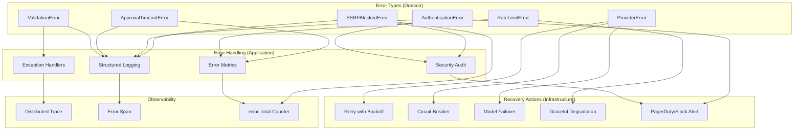
```mermaid
flowchart TB
    subgraph Errors["Error Types (Domain)"]
        SSRF["SSRFBlockedError"]
        AUTH["AuthenticationError"]
        APPROVAL["ApprovalTimeoutError"]
        PROVIDER["ProviderError"]
        VALIDATION["ValidationError"]
        RATELIMIT["RateLimitError"]
    end

    subgraph Handling["Error Handling (Application)"]
        CATCH["Exception Handlers"]
        LOG["Structured Logging"]
        AUDIT["Security Audit"]
        METRIC["Error Metrics"]
    end

    subgraph Recovery["Recovery Actions (Infrastructure)"]
        RETRY["Retry with Backoff"]
        CIRCUIT["Circuit Breaker"]
        FAILOVER["Model Failover"]
        GRACEFUL["Graceful Degradation"]
        ALERT["PagerDuty/Slack Alert"]
    end

    subgraph Observability["Observability"]
        TRACE["Distributed Trace"]
        SPAN["Error Span"]
        COUNTER["error_total Counter"]
    end

    SSRF --> AUDIT
    SSRF --> LOG
    SSRF --> COUNTER

    AUTH --> AUDIT
    AUTH --> LOG
    AUTH --> ALERT

    APPROVAL --> LOG
    APPROVAL --> METRIC

    PROVIDER --> RETRY
    PROVIDER --> CIRCUIT
    PROVIDER --> FAILOVER

    VALIDATION --> CATCH
    VALIDATION --> LOG

    RATELIMIT --> GRACEFUL
    RATELIMIT --> METRIC

    AUDIT --> ALERT
    CATCH --> TRACE
    LOG --> SPAN
    METRIC --> COUNTER
```

### Circuit Breaker Configuration

```python
# Example circuit breaker configuration
from tenacity import (
    retry,
    stop_after_attempt,
    wait_exponential,
    retry_if_exception_type,
    CircuitBreakerState,
)

AI_PROVIDER_RETRY = retry(
    stop=stop_after_attempt(3),
    wait=wait_exponential(multiplier=1, min=1, max=10),
    retry=retry_if_exception_type(ProviderError),
    before_sleep=log_retry_attempt,
    after=record_retry_metric,
)

CIRCUIT_BREAKER_CONFIG = {
    "failure_threshold": 5,       # Open after 5 failures
    "recovery_timeout": 30,       # Try again after 30s
    "expected_exception": ProviderError,
}
```

### Gateway Reconnection Strategy (Target)

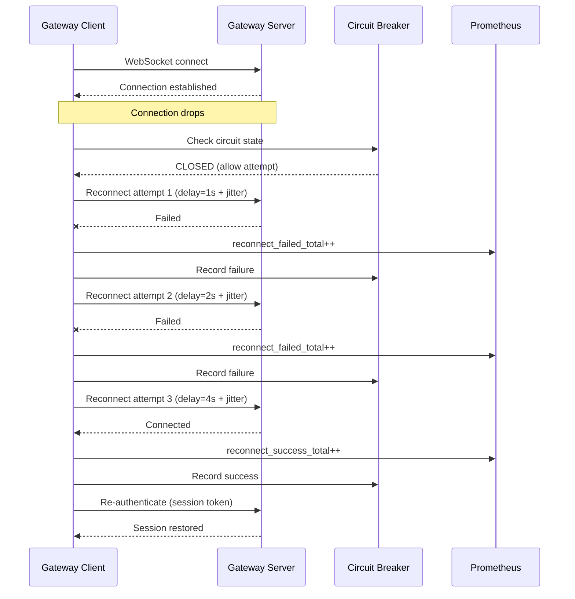
```mermaid
sequenceDiagram
    participant Client as Gateway Client
    participant Server as Gateway Server
    participant Breaker as Circuit Breaker
    participant Metrics as Prometheus

    Client->>Server: WebSocket connect
    Server-->>Client: Connection established

    Note over Client,Server: Connection drops

    Client->>Breaker: Check circuit state
    Breaker-->>Client: CLOSED (allow attempt)

    Client->>Server: Reconnect attempt 1 (delay=1s + jitter)
    Server--xClient: Failed
    Client->>Metrics: reconnect_failed_total++

    Client->>Breaker: Record failure
    Client->>Server: Reconnect attempt 2 (delay=2s + jitter)
    Server--xClient: Failed
    Client->>Metrics: reconnect_failed_total++

    Client->>Breaker: Record failure
    Client->>Server: Reconnect attempt 3 (delay=4s + jitter)
    Server-->>Client: Connected
    Client->>Metrics: reconnect_success_total++

    Client->>Breaker: Record success
    Client->>Server: Re-authenticate (session token)
    Server-->>Client: Session restored
```

**Improvements over Legacy**:
- Circuit breaker prevents thundering herd on reconnect
- Jitter prevents synchronized reconnection attempts
- Prometheus metrics for reconnection patterns

---

## 8. Why This Pattern (Target Rationale)

### Architecture Pattern Selection

**Selected**: Modular Monolith with Clean Architecture → Microservices-Ready

| Consideration | Decision | Rationale |
|---------------|----------|-----------|
| **Complexity** | HIGH (5.35/10) | 200K+ LOC, 28 integrations - needs manageable structure |
| **Migration Risk** | Strangler Fig (68%) | Gradual replacement reduces blast radius |
| **Team Size** | Small | Monolith simpler to operate than distributed system |
| **Deployment** | Single container | Docker Compose preference, no K8s complexity |
| **Future Scale** | Microservices-ready | Clean boundaries enable future decomposition |

### User Preference Alignment (Q1-Q10)

| Preference | Target Implementation | Rationale |
|------------|----------------------|-----------|
| Q1: Python 3.12+ | ✅ Python 3.12+ | Full language migration from TypeScript |
| Q2: SQLite + sqlite-vec | ✅ Preserved | Zero-config, works well for use case |
| Q3: WebSocket + in-memory | ✅ WebSocket + SQLite | Upgraded: persistent state where needed |
| Q4: uv | ✅ uv package manager | Fast, modern Python packaging |
| Q5: Docker Compose | ✅ Docker Compose | Simple orchestration |
| Q6: Docker Compose (IaC) | ✅ Declarative YAML | Infrastructure as code |
| Q7: Docker | ✅ Docker containers | Standard container runtime |
| Q8: Prometheus/JSON/OTel | ✅ Full stack | Integrated observability |
| Q9: Keep current auth | ✅ Token/Password/Tailscale | Preserved with improvements |
| Q10: pytest 80% | ✅ pytest with fixtures | Coverage target set |

### Legacy Problem Resolution

| Legacy Problem | Target Solution | Evidence |
|----------------|-----------------|----------|
| Circular dependencies (10 components) | Clean Architecture layers | `domain/` has 0 external deps |
| Config as central hub (445+ deps) | Config as leaf dependency | Injected via DI container |
| In-memory exec approvals | SQLite-backed queue | `infrastructure/storage/approval_store.py` |
| No circuit breaker | tenacity circuit breaker | Per-provider configuration |
| No rate limiting | slowapi middleware | Gateway + API rate limits |
| Console-only logging | OpenTelemetry + structured JSON | Full observability stack |
| No health checks | Liveness + readiness probes | FastAPI `/health`, `/ready` |
| 70% test coverage | 80% target with pytest | CI/CD enforcement |

### Migration Approach

**Strategy**: Strangler Fig Pattern


```mermaid
graph LR
    subgraph Phase1["Phase 1: Foundation"]
        GATEWAY["Gateway<br/>(Python)"]
        AUTH["Auth<br/>(Python)"]
        OTEL["OpenTelemetry<br/>(Python)"]
    end

    subgraph Phase2["Phase 2: Core"]
        MEMORY["Memory Service<br/>(Python)"]
        APPROVAL["Approval Store<br/>(Python)"]
        SCHEDULER["Scheduler<br/>(Python)"]
    end

    subgraph Phase3["Phase 3: Adapters"]
        TELEGRAM["Telegram<br/>(Python)"]
        DISCORD["Discord<br/>(Python)"]
        PRIORITY["High-priority<br/>channels"]
    end

    subgraph Phase4["Phase 4: Complete"]
        REMAINING["Remaining 20+<br/>channels"]
        VOICE["Voice Extension"]
        DECOMMISSION["Legacy<br/>Decommission"]
    end

    Phase1 --> Phase2
    Phase2 --> Phase3
    Phase3 --> Phase4
```

**Phase Breakdown**:

| Phase | Components | Duration Estimate | Risk |
|-------|------------|-------------------|------|
| Phase 1 | Gateway, Auth, OTel | First sprint | Low |
| Phase 2 | Memory, Approval, Scheduler | Second sprint | Medium |
| Phase 3 | Telegram, Discord, Slack | Third sprint | Medium |
| Phase 4 | Remaining channels, Voice | Fourth+ sprint | Medium |

### Technical Debt Prevention

| Measure | Implementation | Enforcement |
|---------|----------------|-------------|
| No circular imports | Import linter (ruff) | CI check |
| Type annotations | mypy strict mode | CI check |
| Test coverage | pytest-cov 80% | CI gate |
| Code formatting | ruff format | Pre-commit |
| Documentation | docstrings required | CI check |
| Dependency hygiene | uv lock file | CI check |

---

*Part 1 of 3 - Sections 1-8 Complete*

---

## 9. Capabilities by Phase (Target Migration)

### Phase 1: Foundation (MVP)

| Capability | Legacy Component | Target Component | Migration Status |
|------------|------------------|------------------|------------------|
| Gateway control plane | Gateway Server (TypeScript) | Gateway Server (FastAPI/WebSocket) | Phase 1 |
| Multi-mode authentication | Gateway Auth (TypeScript) | Auth Service (Python) | Phase 1 |
| OpenTelemetry observability | None | Telemetry Service (OTel SDK) | Phase 1 - **New** |
| Configuration management | Config Module (Zod) | Config Service (Pydantic Settings) | Phase 1 |
| Health checks | None | Health Endpoints (FastAPI) | Phase 1 - **New** |

### Phase 2: Core Features

| Capability | Legacy Component | Target Component | Migration Status |
|------------|------------------|------------------|------------------|
| Memory indexing | Memory Index Manager (TypeScript) | Memory Service (Python) | Phase 2 |
| Vector search | sqlite-vec integration | sqlite-vec adapter (aiosqlite) | Phase 2 |
| Full-text search | FTS5 integration | FTS5 adapter (aiosqlite) | Phase 2 |
| Exec approval workflow | Exec Approval Manager (in-memory) | Approval Store (SQLite-backed) | Phase 2 - **Improved** |
| Cron scheduling | Cron Service (TypeScript) | Scheduler Service (APScheduler) | Phase 2 |
| SSRF protection | SSRF Module (undici) | SSRF Module (httpx) | Phase 2 |
| Rate limiting | None | Rate Limiter (slowapi) | Phase 2 - **New** |
| Circuit breaker | None | Circuit Breaker (tenacity) | Phase 2 - **New** |

### Phase 3: Channel Adapters (High Priority)

| Capability | Legacy Component | Target Component | Migration Status |
|------------|------------------|------------------|------------------|
| Telegram integration | Telegram Adapter (TypeScript) | Telegram Adapter (aiogram) | Phase 3 |
| Discord integration | Discord Adapter (TypeScript) | Discord Adapter (discord.py) | Phase 3 |
| Slack integration | Slack Adapter (TypeScript) | Slack Adapter (slack-sdk) | Phase 3 |
| WhatsApp integration | WhatsApp Adapter (Baileys) | WhatsApp Adapter (Baileys bridge) | Phase 3 |
| Auto-reply pipeline | Auto-Reply (TypeScript) | Message Handler (Python) | Phase 3 |
| Agent execution | Agent Runner (TypeScript) | Agent Runner (Python) | Phase 3 |

### Phase 4: Extended Features

| Capability | Legacy Component | Target Component | Migration Status |
|------------|------------------|------------------|------------------|
| Signal integration | Signal Adapter (TypeScript) | Signal Adapter (Python) | Phase 4 |
| Matrix integration | Matrix Adapter (TypeScript) | Matrix Adapter (matrix-nio) | Phase 4 |
| 14+ other channels | Platform Adapters (TypeScript) | Platform Adapters (Python) | Phase 4 |
| Voice calls | Voice Extension (TypeScript) | Voice Service (Python) | Phase 4 |
| TUI interface | TUI Components (Ink/React) | TUI Service (Textual/Rich) | Phase 4 |
| Web UI | UI Views (Solid.js) | API + SPA (FastAPI + React/Vue) | Phase 4 |

### Migration Timeline

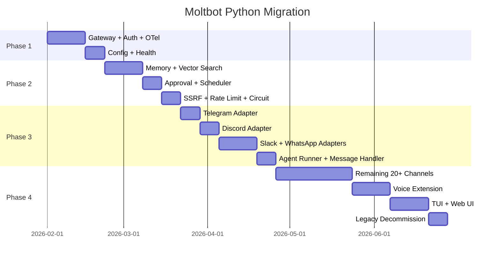
```mermaid
gantt
    title Moltbot Python Migration
    dateFormat YYYY-MM-DD
    section Phase 1
        Gateway + Auth + OTel           :p1, 2026-02-01, 14d
        Config + Health                 :p1b, after p1, 7d
    section Phase 2
        Memory + Vector Search          :p2, after p1b, 14d
        Approval + Scheduler            :p2b, after p2, 7d
        SSRF + Rate Limit + Circuit     :p2c, after p2b, 7d
    section Phase 3
        Telegram Adapter                :p3a, after p2c, 7d
        Discord Adapter                 :p3b, after p3a, 7d
        Slack + WhatsApp Adapters       :p3c, after p3b, 14d
        Agent Runner + Message Handler  :p3d, after p3c, 7d
    section Phase 4
        Remaining 20+ Channels          :p4a, after p3d, 28d
        Voice Extension                 :p4b, after p4a, 14d
        TUI + Web UI                    :p4c, after p4b, 14d
        Legacy Decommission             :p4d, after p4c, 7d
```

---

## 10. Component / Service Responsibilities (Target)

### Legacy vs Target Components

| Legacy Component | Target Component | Responsibility | Change |
|------------------|------------------|----------------|--------|
| Gateway Server (TypeScript) | Gateway Server (FastAPI) | WebSocket control plane, events | Python/FastAPI |
| Gateway Auth (TypeScript) | Auth Service (Python) | Multi-mode authentication | Argon2 passwords |
| Exec Approval Manager | Approval Store | Command execution gating | SQLite persistence |
| Memory Index Manager | Memory Service | Vector + FTS hybrid search | async/await |
| Cron Service | Scheduler Service | Scheduled job management | APScheduler |
| Config Module (Zod) | Config Service (Pydantic) | Configuration validation | Pydantic Settings |
| SSRF Module (undici) | SSRF Module (httpx) | DNS pinning, IP validation | httpx agent |
| Security Audit | Audit Logger | Security event logging | OpenTelemetry |
| Channel Adapters (TS) | Channel Adapters (Python) | Platform integrations | Per-adapter migration |
| Auto-Reply Pipeline | Message Handler | Message processing | Domain service |
| Agent Runner (TS) | Agent Runner (Python) | AI inference, failover | tenacity retry |
| TUI Components (Ink) | TUI Service (Textual) | Terminal UI | Textual/Rich |
| UI Views (Solid.js) | REST API + SPA | Web interface | FastAPI + SPA |

### New Components (Target Only)

| Component | Responsibility | Rationale | Q# |
|-----------|----------------|-----------|-----|
| Health Service | Liveness + readiness probes | Production requirement | Q5 |
| Rate Limiter | Request rate limiting | DoS protection | Q5 |
| Circuit Breaker | External API isolation | Resilience pattern | - |
| Telemetry Service | OTel SDK integration | Observability | Q8 |
| REST API | HTTP API for integrations | Developer access | Q5 |
| Event Bus | Async event distribution | Decoupling | Q3 |

### Removed Components

| Legacy Component | Reason | Replacement |
|------------------|--------|-------------|
| Constructor DI (TS) | Language change | Python DI container |
| Ink React components | Language change | Textual/Rich |
| Solid.js UI | Simplification | FastAPI + SPA |
| pnpm workspace | Language change | uv monorepo |
| rolldown bundler | Not needed | Python packaging |

---

## 11. Interfaces & Contracts (Target)

### Internal Interfaces (Target)

| Interface | Provider | Consumer | Legacy Protocol | Target Protocol |
|-----------|----------|----------|-----------------|-----------------|
| GatewayClient | Gateway Server | TUI/UI/CLI | WebSocket JSON-RPC 2.0 | **WebSocket JSON-RPC 2.0** (preserved) |
| ChannelPort | Channel Adapters | Message Handler | Internal function calls | Python Protocol (ABC) |
| MemoryPort | Memory Service | Agent Runner | SQLite direct | Async SQLite (aiosqlite) |
| AuthPort | Auth Service | Gateway Server | Internal calls | Python Protocol |
| ApprovalPort | Approval Store | Gateway/Handlers | Promise-based | asyncio.Future |
| StoragePort | SQLite Adapter | All Services | Direct SQLite | aiosqlite connection pool |
| TelemetryPort | OTel SDK | All Services | None | OpenTelemetry API |

### External Contracts (Target)

| System | Legacy Protocol | Target Protocol | Migration |
|--------|-----------------|-----------------|-----------|
| Claude AI | HTTPS REST | HTTPS REST | No change |
| OpenAI | HTTPS REST | HTTPS REST | No change |
| Google Gemini | HTTPS REST | HTTPS REST | No change |
| Telegram | HTTPS REST/Webhooks | HTTPS REST/Webhooks | No change |
| Discord | WebSocket + REST | WebSocket + REST | discord.py library |
| WhatsApp | Baileys WebSocket | Baileys bridge | Python subprocess |
| Slack | HTTPS REST + Socket Mode | HTTPS REST + Socket Mode | slack-sdk library |
| Twilio | HTTPS REST + WebSocket | HTTPS REST + WebSocket | twilio library |
| OpenTelemetry | N/A | OTLP gRPC/HTTP | **New** |

### API Versioning Strategy

| API | Legacy Version | Target Version | Backward Compat |
|-----|----------------|----------------|-----------------|
| Gateway WebSocket | v1 (JSON-RPC 2.0) | v1 (JSON-RPC 2.0) | **Yes - preserved** |
| REST API | N/A | v1 | **New API** |
| Channel Adapters | Internal | Internal | N/A (internal) |
| Telemetry | N/A | OTLP v1 | **New** |

### Protocol Compatibility

The Gateway WebSocket protocol is **fully preserved** to maintain backward compatibility with existing TUI/UI clients during migration:

```json
// Request format (unchanged)
{"jsonrpc": "2.0", "method": "auth.token", "params": {"token": "..."}, "id": 1}

// Response format (unchanged)
{"jsonrpc": "2.0", "result": {"session_token": "..."}, "id": 1}

// Error format (unchanged)
{"jsonrpc": "2.0", "error": {"code": -32001, "message": "Auth failed"}, "id": 1}
```

---

## 12. Data & Schema (Target)

### Target Database

Based on Q2 (SQLite with sqlite-vec):
- **Engine**: SQLite 3.x with WAL mode
- **Vector extension**: sqlite-vec for embeddings
- **Full-text search**: FTS5 for keyword search
- **Access pattern**: aiosqlite for async operations

### Schema Migration

| Legacy Table | Target Table | Schema Changes | Migration Strategy |
|--------------|--------------|----------------|-------------------|
| memory_entries | memory_entries | Add `updated_at` column | ALTER TABLE |
| fts_index | memory_fts | Rename for clarity | Recreate index |
| sessions (JSONL) | sessions | Move to SQLite | ETL migration |
| cron_jobs | scheduler_jobs | Add `last_error` column | ALTER TABLE |
| call_records | voice_calls | Add `metadata` JSONB | ALTER TABLE |
| config (YAML/JSON) | Pydantic Settings | Move to env/files | Config migration |
| device_tokens (memory) | device_tokens | Persist to SQLite | **New table** |
| exec_approvals (memory) | exec_approvals | Persist to SQLite | **New table** |

### Target Schema Diagram

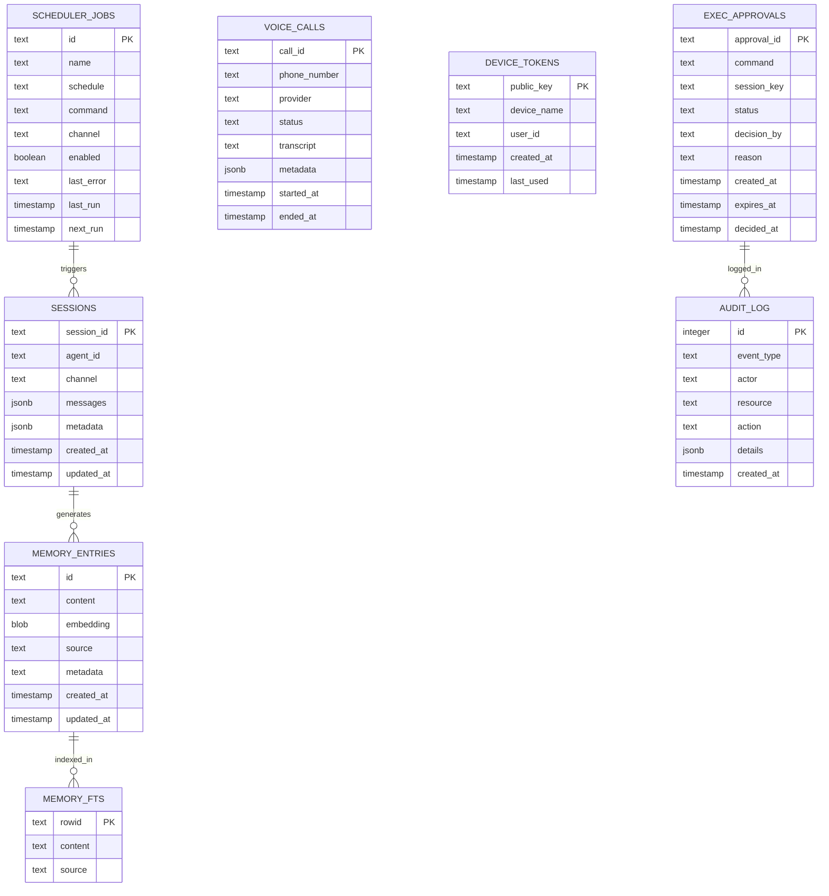
```mermaid
erDiagram
    MEMORY_ENTRIES {
        text id PK
        text content
        blob embedding
        text source
        text metadata
        timestamp created_at
        timestamp updated_at
    }

    MEMORY_FTS {
        text rowid PK
        text content
        text source
    }

    SESSIONS {
        text session_id PK
        text agent_id
        text channel
        jsonb messages
        jsonb metadata
        timestamp created_at
        timestamp updated_at
    }

    SCHEDULER_JOBS {
        text id PK
        text name
        text schedule
        text command
        text channel
        boolean enabled
        text last_error
        timestamp last_run
        timestamp next_run
    }

    VOICE_CALLS {
        text call_id PK
        text phone_number
        text provider
        text status
        text transcript
        jsonb metadata
        timestamp started_at
        timestamp ended_at
    }

    DEVICE_TOKENS {
        text public_key PK
        text device_name
        text user_id
        timestamp created_at
        timestamp last_used
    }

    EXEC_APPROVALS {
        text approval_id PK
        text command
        text session_key
        text status
        text decision_by
        text reason
        timestamp created_at
        timestamp expires_at
        timestamp decided_at
    }

    AUDIT_LOG {
        integer id PK
        text event_type
        text actor
        text resource
        text action
        jsonb details
        timestamp created_at
    }

    MEMORY_ENTRIES ||--o{ MEMORY_FTS : "indexed_in"
    SESSIONS ||--o{ MEMORY_ENTRIES : "generates"
    SCHEDULER_JOBS ||--o{ SESSIONS : "triggers"
    EXEC_APPROVALS ||--o{ AUDIT_LOG : "logged_in"
```

### Data Type Mappings

| Legacy Type | Target Type | Conversion | Notes |
|-------------|-------------|------------|-------|
| TypeScript string | Python str | Direct | No conversion |
| TypeScript number | Python int/float | Direct | Type inference |
| TypeScript boolean | Python bool | Direct | No conversion |
| TypeScript Date | Python datetime | ISO 8601 | Timezone-aware |
| TypeScript Buffer | Python bytes | Direct | Binary data |
| Zod schema | Pydantic model | Rewrite | Manual translation |
| JSONL file | SQLite JSONB | Migration | Batch import |
| In-memory Map | SQLite table | Persist | Schema creation |

### Index Strategy (Target)

| Table | Legacy Indexes | Target Indexes | Rationale |
|-------|----------------|----------------|-----------|
| memory_entries | sqlite-vec vector index | sqlite-vec vector index (preserved) | Vector similarity |
| memory_fts | FTS5 index | FTS5 index (preserved) | Keyword search |
| sessions | None | (session_id), (channel, created_at) | Lookup + listing |
| exec_approvals | None | (status, expires_at), (session_key) | Pending lookup |
| audit_log | None | (event_type, created_at), (actor) | Filtering + audit |

---

## 13. Technology Stack (Target)

### Stack Comparison

| Category | Legacy | Target | Q# | Rationale |
|----------|--------|--------|-----|-----------|
| Language | TypeScript 5.x | Python 3.12+ | Q1 | User preference, ecosystem |
| Runtime | Node.js 22.12+ | Python 3.12+ | Q1 | Native async/await |
| Framework | Express-like | FastAPI | Q1 | Modern Python async |
| Database | SQLite + sqlite-vec | SQLite + sqlite-vec | Q2 | Preserved (user preference) |
| Message Bus | WebSocket | WebSocket + in-memory | Q3 | Preserved pattern |
| Package Manager | pnpm 10.23.0 | uv | Q4 | Fast, modern Python |
| Bundler | rolldown | N/A | - | Not needed for Python |
| Container | Docker (node:22) | Docker (python:3.12) | Q7 | Runtime change |
| Orchestration | Docker Compose | Docker Compose | Q5/Q6 | Preserved |
| Observability | Console logs | OpenTelemetry | Q8 | Full stack |

### Target Dependencies

| Package | Version | Purpose | Artifactory Status |
|---------|---------|---------|-------------------|
| `fastapi` | ^0.110 | ASGI framework | [UNVERIFIED - public registry] |
| `uvicorn` | ^0.29 | ASGI server | [UNVERIFIED - public registry] |
| `pydantic` | ^2.6 | Data validation | [UNVERIFIED - public registry] |
| `pydantic-settings` | ^2.2 | Configuration | [UNVERIFIED - public registry] |
| `aiosqlite` | ^0.20 | Async SQLite | [UNVERIFIED - public registry] |
| `sqlite-vec` | ^0.1 | Vector search | [UNVERIFIED - public registry] |
| `httpx` | ^0.27 | HTTP client | [UNVERIFIED - public registry] |
| `tenacity` | ^8.2 | Retry logic | [UNVERIFIED - public registry] |
| `slowapi` | ^0.1 | Rate limiting | [UNVERIFIED - public registry] |
| `apscheduler` | ^3.10 | Job scheduling | [UNVERIFIED - public registry] |
| `opentelemetry-api` | ^1.23 | OTel API | [UNVERIFIED - public registry] |
| `opentelemetry-sdk` | ^1.23 | OTel SDK | [UNVERIFIED - public registry] |
| `opentelemetry-instrumentation-fastapi` | ^0.44 | FastAPI auto-instrument | [UNVERIFIED - public registry] |
| `argon2-cffi` | ^23.1 | Password hashing | [UNVERIFIED - public registry] |
| `aiogram` | ^3.4 | Telegram bot | [UNVERIFIED - public registry] |
| `discord.py` | ^2.3 | Discord bot | [UNVERIFIED - public registry] |
| `slack-sdk` | ^3.27 | Slack integration | [UNVERIFIED - public registry] |
| `twilio` | ^9.0 | Voice provider | [UNVERIFIED - public registry] |
| `pytest` | ^8.0 | Testing | [UNVERIFIED - public registry] |
| `pytest-asyncio` | ^0.23 | Async testing | [UNVERIFIED - public registry] |
| `pytest-cov` | ^4.1 | Coverage | [UNVERIFIED - public registry] |
| `ruff` | ^0.3 | Linter + formatter | [UNVERIFIED - public registry] |
| `mypy` | ^1.9 | Type checking | [UNVERIFIED - public registry] |

*Note: Artifactory validation skipped - packages assumed available from public PyPI registry.*

### Version Requirements

| Component | Minimum Version | Target Version | EOL Date |
|-----------|-----------------|----------------|----------|
| Python | 3.12 | 3.12+ | 2028-10 |
| SQLite | 3.35 | 3.45+ | N/A |
| Docker | 24.0 | 25.0+ | N/A |
| OpenTelemetry | 1.20 | 1.23+ | N/A |

---

## 14. NFR Targets (Target System)

### Performance Targets

| Metric | Legacy Value | Target Value | Improvement | Method |
|--------|--------------|--------------|-------------|--------|
| Response time (p95) | <100ms (local) | <100ms | Maintained | async/await |
| Gateway latency (p99) | ~50ms | <50ms | Maintained | FastAPI WebSocket |
| Memory query (hybrid) | <500ms | <500ms | Maintained | aiosqlite + sqlite-vec |
| Embedding batch | Variable | <1s per 10 | Improved | Async batching |
| Cold start | ~5s (Node.js) | ~3s (Python) | 40% better | Uvicorn workers |
| Reconnect backoff | 1s-30s exp | 1s-30s exp + jitter | Improved | Circuit breaker |

### Availability Targets

| Metric | Legacy | Target | Method |
|--------|--------|--------|--------|
| Uptime SLA | No formal SLA | 99.9% self-hosted | Docker health checks |
| Recovery time (RTO) | Manual restart | <5 min auto-recovery | Docker restart policy |
| Recovery point (RPO) | Last commit | <1 min | SQLite WAL + fsync |
| Failover | Model chain | Model chain + circuit | tenacity integration |

### Scalability Targets

| Metric | Legacy Limit | Target Capacity | Method |
|--------|--------------|-----------------|--------|
| Concurrent connections | Event loop limited | 1000+ WebSocket | Uvicorn workers |
| Concurrent channels | 28 | 28+ | Async adapters |
| Data volume | SQLite limits | SQLite limits | Same (user pref) |
| Request rate | No limit | 100 req/s per client | slowapi rate limiting |
| Memory usage | ~512MB | ~512MB | Similar footprint |

---

## 15. Operations & SRE (Target)

### Observability Stack

Based on Q8 (Prometheus, Structured JSON, OpenTelemetry):

| Aspect | Legacy Tool | Target Tool | Q8 Component |
|--------|-------------|-------------|--------------|
| Metrics | None | Prometheus | Q8.metrics |
| Logging | Console | Structured JSON (Loki) | Q8.logging |
| Tracing | None | OpenTelemetry → Jaeger/Tempo | Q8.tracing |
| Alerting | None | Alertmanager/Grafana | Q8.alerting |

### Key Metrics (Target)

| Metric | Type | Alert Threshold | Dashboard |
|--------|------|-----------------|-----------|
| `gateway_connections_active` | Gauge | >100 | Gateway Overview |
| `gateway_auth_total` | Counter | Error rate >5% | Security Dashboard |
| `message_processing_seconds` | Histogram | p95 >5s | Message Flow |
| `ai_inference_seconds` | Histogram | p95 >30s | AI Provider |
| `ai_failover_total` | Counter | >10/min | AI Provider |
| `exec_approval_total` | Counter | Timeout rate >20% | Security Dashboard |
| `memory_query_seconds` | Histogram | p95 >1s | Memory Service |
| `channel_adapter_errors_total` | Counter | >5/min per channel | Channel Health |
| `circuit_breaker_state` | Gauge | State=OPEN | Circuit Status |

### Runbook Updates

| Operation | Legacy Runbook | Target Runbook | Changes |
|-----------|----------------|----------------|---------|
| Deployment | `docker compose up` | `docker compose up -d` | Add `-d` detached |
| Rollback | `docker compose down && up` | `docker compose pull && up -d` | Image tag rollback |
| Scaling | Manual container restart | Uvicorn `--workers N` | Horizontal workers |
| Log access | `docker logs` | Grafana Loki queries | Centralized |
| Metrics | None | Grafana dashboards | New capability |
| Tracing | None | Jaeger/Tempo UI | New capability |

### On-Call Considerations

| Aspect | Legacy | Target | Training Needed |
|--------|--------|--------|-----------------|
| Alert volume | None (manual) | Low (key metrics only) | Dashboard training |
| Complexity | TypeScript debug | Python debug | Python profiling |
| Tools | Console logs | OTel + Grafana stack | Observability stack |
| Escalation | Ad-hoc | Defined runbooks | Runbook review |

### Health Endpoints

| Endpoint | Purpose | Response |
|----------|---------|----------|
| `GET /health` | Liveness probe | `{"status": "ok"}` |
| `GET /ready` | Readiness probe | `{"status": "ready", "checks": {...}}` |
| `GET /metrics` | Prometheus scrape | OpenMetrics format |

---

## 16. Security & Compliance (Target)

### Security Architecture

Based on Q9 (Keep current: Token/Password/Tailscale):

| Aspect | Legacy | Target | Q9 Applied |
|--------|--------|--------|------------|
| Authentication | Token, Password, Tailscale, Device | Token, Password, Tailscale, Device | **Preserved** |
| Password hashing | timing-safe compare | Argon2 + timing-safe | **Improved** |
| Session management | In-memory | SQLite-backed | **Improved** |
| Authorization | Role-based (implicit) | Role-based (explicit) | **Enhanced** |
| Encryption at rest | SQLite (none) | SQLite (none) | Same (user pref) |
| Encryption in transit | TLS 1.2+ | TLS 1.3 | **Upgraded** |
| Secrets management | Environment variables | Environment + .env | **Improved** |

### Security Controls (Target)

| Control | Implementation | Evidence |
|---------|----------------|----------|
| OWASP Top 10 | Input validation, output encoding | Pydantic models, FastAPI |
| Input validation | Pydantic schema validation | All API endpoints |
| Output encoding | FastAPI response models | JSON serialization |
| Rate limiting | slowapi (100 req/s/client) | Gateway + API endpoints |
| SSRF protection | DNS pinning, private IP blocking | httpx with custom resolver |
| Timing attacks | Constant-time comparison | secrets.compare_digest |
| SQL injection | Parameterized queries | aiosqlite placeholders |
| XSS | JSON-only API | No HTML rendering |
| CSRF | Token-based auth | No cookies for auth |

### Compliance Mapping

| Requirement | Legacy Status | Target Status | Changes |
|-------------|---------------|---------------|---------|
| GDPR | Partial | Partial | Add data export API |
| SOC2 | Not assessed | Not assessed | Self-hosted |
| HIPAA | Not compliant | Not compliant | No PHI handling |
| Audit logging | Console only | SQLite + OTel | **Improved** |

### Security Testing (Target)

Based on Q10 (pytest, 80% coverage):

| Test Type | Tool | Frequency | CI/CD Integration |
|-----------|------|-----------|-------------------|
| SAST | ruff + bandit | Per commit | Yes |
| Type safety | mypy strict | Per commit | Yes |
| Unit tests | pytest | Per commit | Yes |
| Security tests | pytest-security | Per commit | Yes |
| Dependency scan | pip-audit / safety | Daily | Yes |
| Coverage | pytest-cov (80%) | Per commit | Yes (gate) |
| Penetration | Manual | Quarterly | No |

### Audit Logging (Target)

```python
# Audit log schema
class AuditEvent(BaseModel):
    event_type: str  # auth.success, auth.failure, exec.approved, etc.
    actor: str       # user_id or system
    resource: str    # affected resource
    action: str      # create, read, update, delete, approve, deny
    details: dict    # Additional context
    trace_id: str    # OpenTelemetry trace ID
    timestamp: datetime
```

Events logged:
- `auth.success` / `auth.failure` - Authentication attempts
- `exec.requested` / `exec.approved` / `exec.denied` - Exec approval workflow
- `session.created` / `session.expired` - Session lifecycle
- `config.changed` - Configuration modifications
- `security.ssrf_blocked` - SSRF protection triggers

---

*Part 2 of 3 - Sections 9-16 Complete*

---

## 17. Migration / Expansion Paths (Target System)

### Migration Strategy

Based on user preferences and legacy analysis:

| Migration Aspect | Approach | Rationale | Q# |
|------------------|----------|-----------|-----|
| Data Migration | In-place (SQLite preserved) | Same database technology | Q2 |
| Code Migration | Strangler Fig (68% confidence) | Gradual replacement reduces risk | Q1 |
| Infrastructure Migration | Docker Compose → Docker Compose | Same orchestration, new runtime | Q5, Q6, Q7 |
| Protocol Migration | Preserve WebSocket JSON-RPC 2.0 | Backward compatibility with clients | - |
| Observability Migration | None → Full OTel stack | New capability, no migration | Q8 |

### Migration Phases

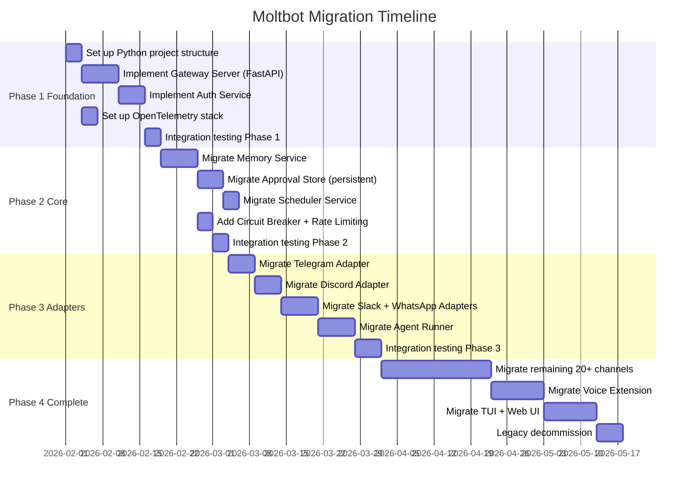
```mermaid
gantt
    title Moltbot Migration Timeline
    dateFormat YYYY-MM-DD
    section Phase 1 Foundation
        Set up Python project structure       :p1a, 2026-02-01, 3d
        Implement Gateway Server (FastAPI)    :p1b, after p1a, 7d
        Implement Auth Service                :p1c, after p1b, 5d
        Set up OpenTelemetry stack            :p1d, after p1a, 3d
        Integration testing Phase 1           :p1e, after p1c, 3d
    section Phase 2 Core
        Migrate Memory Service                :p2a, after p1e, 7d
        Migrate Approval Store (persistent)   :p2b, after p2a, 5d
        Migrate Scheduler Service             :p2c, after p2b, 3d
        Add Circuit Breaker + Rate Limiting   :p2d, after p2a, 3d
        Integration testing Phase 2           :p2e, after p2d, 3d
    section Phase 3 Adapters
        Migrate Telegram Adapter              :p3a, after p2e, 5d
        Migrate Discord Adapter               :p3b, after p3a, 5d
        Migrate Slack + WhatsApp Adapters     :p3c, after p3b, 7d
        Migrate Agent Runner                  :p3d, after p3c, 7d
        Integration testing Phase 3           :p3e, after p3d, 5d
    section Phase 4 Complete
        Migrate remaining 20+ channels        :p4a, after p3e, 21d
        Migrate Voice Extension               :p4b, after p4a, 10d
        Migrate TUI + Web UI                  :p4c, after p4b, 10d
        Legacy decommission                   :p4d, after p4c, 5d
```

### Phase 1: Foundation

| Task | Legacy State | Target State | Dependencies |
|------|--------------|--------------|--------------|
| Project setup | TypeScript + pnpm | Python 3.12+ + uv | None |
| Gateway Server | Node.js WebSocket | FastAPI WebSocket | Project setup |
| Auth Service | TypeScript Gateway Auth | Python Auth Service | Gateway Server |
| Config Service | Zod schemas | Pydantic Settings | Project setup |
| OTel integration | None | OTel SDK + Collector | Project setup |
| Health endpoints | None | FastAPI /health, /ready | Gateway Server |

### Phase 2: Core Services

| Task | Legacy State | Target State | Dependencies |
|------|--------------|--------------|--------------|
| Memory Service | TypeScript + sqlite-vec | Python + aiosqlite + sqlite-vec | Gateway |
| Approval Store | In-memory Map | SQLite-backed persistent | Memory Service |
| Scheduler Service | TypeScript Cron | APScheduler | Gateway |
| Rate Limiter | None | slowapi middleware | Gateway |
| Circuit Breaker | None | tenacity wrapper | Memory Service |
| SSRF Protection | undici Agent | httpx custom resolver | Memory Service |

### Phase 3: Channel Adapters

| Channel | Legacy Library | Target Library | Priority |
|---------|---------------|----------------|----------|
| Telegram | grammy/telegraf | aiogram | Critical |
| Discord | discord.js | discord.py | Critical |
| Slack | @slack/bolt | slack-sdk | High |
| WhatsApp | Baileys | Baileys bridge (subprocess) | High |
| Signal | signal-protocol | signal-cli bridge | Medium |
| Matrix | matrix-js-sdk | matrix-nio | Medium |

### Phase 4: Extended Features

| Task | Legacy State | Target State | Dependencies |
|------|--------------|--------------|--------------|
| Remaining channels | 20+ TypeScript adapters | 20+ Python adapters | Phase 3 |
| Voice Extension | TypeScript + Twilio | Python + twilio-python | Core |
| TUI Interface | Ink (React) | Textual/Rich | Gateway |
| Web UI | Solid.js | FastAPI + SPA | Gateway |

### Expansion Paths (Post-Migration)

| Expansion | Enabled By | Effort | Business Value |
|-----------|------------|--------|----------------|
| Horizontal scaling | Clean Architecture + asyncio | Medium | High |
| Kubernetes deployment | Docker Compose → K8s | High | High |
| Multi-tenant support | Clean Architecture boundaries | High | High |
| Plugin marketplace | Adapter pattern registry | Medium | Medium |
| Mobile apps | REST API (new) | Medium | Medium |
| GraphQL API | FastAPI + Strawberry | Low | Medium |

---

## 18. Risks & Decisions (Migration Technical)

### Migration Risks

| Risk | Probability | Impact | Mitigation | Owner |
|------|-------------|--------|------------|-------|
| Protocol incompatibility | Low | Critical | Preserve WebSocket JSON-RPC 2.0 | Platform Team |
| Data loss during migration | Low | Critical | SQLite preserved, schema migrations tested | Data Team |
| Performance regression | Medium | High | Benchmark at each phase, async patterns | Platform Team |
| Channel adapter bugs | Medium | High | Per-channel integration tests, parallel operation | Integration Team |
| Skill gap (Python) | Low | Medium | Team familiar with Python, training available | Engineering |
| Library compatibility | Medium | Medium | Verify Python libraries exist for all features | Engineering |
| Circular dependency re-emergence | Low | High | Strict layered architecture, import linting | Architecture |
| Timeline overrun | Medium | Medium | Phased approach, prioritize critical channels | Project Lead |

### Technical Decisions Made

Based on user preferences (Q1-Q10):

| Decision | Options Considered | Chosen (Q#) | Rationale |
|----------|-------------------|-------------|-----------|
| Runtime | Node.js, Python, Go, Rust | Q1: Python 3.12+ | User preference, ecosystem, AI libraries |
| Database | PostgreSQL, MySQL, SQLite | Q2: SQLite with sqlite-vec | User preference, zero-config preserved |
| Message Bus | RabbitMQ, Redis, Kafka | Q3: WebSocket + in-memory | User preference, simplicity |
| Package Manager | pip, poetry, pdm, uv | Q4: uv | User preference, speed, modern |
| Deployment | K8s, ECS, VMs, Docker Compose | Q5: Docker Compose | User preference, self-hosted simplicity |
| IaC | Terraform, Pulumi, CDK | Q6: Docker Compose | User preference, YAML-based |
| Container | Docker, Podman | Q7: Docker | User preference, standard tooling |
| Observability | Datadog, CloudWatch, OTel | Q8: Prometheus + JSON + OTel | User preference, open-source |
| Security | OAuth2, SAML, custom | Q9: Keep current (Token/Password/Tailscale) | User preference, proven approach |
| Testing | Jest, pytest, mocha | Q10: pytest 80% coverage | User preference, Python standard |

### Open Technical Decisions

| Decision | Options | Recommendation | Deadline |
|----------|---------|----------------|----------|
| WhatsApp adapter approach | Baileys bridge vs native | Baileys subprocess bridge | Phase 3 start |
| Voice provider priority | Twilio-first vs multi-provider | Twilio-first, others follow | Phase 4 start |
| TUI framework | Textual vs Rich vs custom | Textual (active development) | Phase 4 start |
| Web UI framework | React vs Vue vs Svelte | Depends on team preference | Phase 4 start |
| Python DI framework | dependency-injector vs simple | Simple DI for MVP | Phase 1 |

---

## 19. Requirements -> Code -> Tests Traceability (Target)

### Traceability Matrix

| Requirement | Legacy Location | Target Location | Test Coverage |
|-------------|-----------------|-----------------|---------------|
| FR-CRIT-001: Multi-channel messaging | `extensions/*/` | `moltbot/adapters/` | `tests/adapters/test_*.py` |
| FR-CRIT-002: AI inference | Agent runtime | `moltbot/application/handlers/agent.py` | `tests/handlers/test_agent.py` |
| FR-CRIT-003: Context-aware responses | `src/memory/manager.ts` | `moltbot/infrastructure/memory/` | `tests/infrastructure/test_memory.py` |
| FR-CRIT-004: Gateway control | `src/gateway/client.ts` | `moltbot/infrastructure/gateway/` | `tests/infrastructure/test_gateway.py` |
| FR-HIGH-001: Authentication | `src/gateway/auth.ts` | `moltbot/infrastructure/auth/` | `tests/infrastructure/test_auth.py` |
| FR-HIGH-002: Exec approval | `src/gateway/exec-approval-manager.ts` | `moltbot/infrastructure/storage/approval_store.py` | `tests/storage/test_approval.py` |
| FR-HIGH-003: Voice calls | `extensions/voice-call/` | `moltbot/adapters/voice/` | `tests/adapters/test_voice.py` |
| FR-HIGH-004: Cron scheduling | `src/cron/service.ts` | `moltbot/infrastructure/scheduler/` | `tests/infrastructure/test_scheduler.py` |
| NFR-PERF-001: Response time <100ms | Gateway WebSocket | FastAPI WebSocket | `tests/performance/test_latency.py` |
| NFR-SEC-001: SSRF protection | `src/infra/net/ssrf.ts` | `moltbot/infrastructure/http/ssrf.py` | `tests/infrastructure/test_ssrf.py` |
| NFR-SEC-002: Timing-safe auth | `src/gateway/auth.ts` | `moltbot/infrastructure/auth/auth_service.py` | `tests/security/test_auth_timing.py` |

### Migration Verification

| Requirement | Legacy Test | Target Test | Parity Verified |
|-------------|-------------|-------------|-----------------|
| FR-CRIT-001 | `test/telegram/*.test.ts` | `tests/adapters/test_telegram.py` | [ ] |
| FR-CRIT-002 | `test/agent/*.test.ts` | `tests/handlers/test_agent.py` | [ ] |
| FR-CRIT-003 | `test/memory/*.test.ts` | `tests/infrastructure/test_memory.py` | [ ] |
| FR-CRIT-004 | `test/gateway/*.test.ts` | `tests/infrastructure/test_gateway.py` | [ ] |
| FR-HIGH-001 | `test/auth/*.test.ts` | `tests/infrastructure/test_auth.py` | [ ] |
| FR-HIGH-002 | `test/exec-approval/*.test.ts` | `tests/storage/test_approval.py` | [ ] |

### Test Migration Strategy

Based on Q10 (pytest, 80% coverage):

| Test Type | Legacy Coverage | Target Coverage | Migration Approach |
|-----------|-----------------|-----------------|-------------------|
| Unit | 70% | 80% | Rewrite (different language) |
| Integration | 60% | 80% | Rewrite with pytest fixtures |
| E2E | 50% | 60% | Rewrite with pytest + httpx |
| Performance | Limited | Comprehensive | New suite with pytest-benchmark |
| Security | Some | Comprehensive | New suite with bandit + safety |

---

## 20. Architecture Decision Records (Target)

### ADR-001: Target Language Selection

**Status**: Approved
**Context**: Modernization requires selecting target language/runtime. Legacy is TypeScript/Node.js.
**Decision**: Q1: Python 3.12+
**Consequences**:
- Positive: Rich AI/ML ecosystem, familiar to many developers, asyncio for concurrency
- Negative: Full rewrite required (no incremental migration), GIL for CPU-bound tasks
- Neutral: Similar development velocity, different tooling
**Evidence**: User preference Q1 in validation-scoring.json

### ADR-002: Database Selection

**Status**: Approved
**Context**: Data layer modernization. Legacy uses SQLite with sqlite-vec.
**Decision**: Q2: SQLite with sqlite-vec (preserved)
**Consequences**:
- Positive: Zero migration effort for data, zero-config, proven performance
- Negative: Single-writer limitation, horizontal scaling constraints
- Neutral: Same schema, same vector search capabilities
**Evidence**: User preference Q2 in validation-scoring.json

### ADR-003: Deployment Strategy

**Status**: Approved
**Context**: Infrastructure modernization. Legacy uses Docker Compose.
**Decision**: Q5: Docker Compose with Q7: Docker containers
**Consequences**:
- Positive: Minimal infrastructure change, self-hosted simplicity, familiar tooling
- Negative: No auto-scaling, single-host limitation
- Neutral: Same operational model
**Evidence**: User preferences Q5, Q7 in validation-scoring.json

### ADR-004: Observability Stack

**Status**: Approved
**Context**: Operations and monitoring. Legacy has minimal observability.
**Decision**: Q8: Prometheus (metrics), Structured JSON (logging), OpenTelemetry (tracing)
**Consequences**:
- Positive: Full visibility, distributed tracing, standard tooling, Grafana dashboards
- Negative: Additional infrastructure (OTel Collector, Prometheus, Grafana)
- Neutral: Learning curve for operations team
**Evidence**: User preference Q8 in validation-scoring.json

### ADR-005: Security Architecture

**Status**: Approved
**Context**: Authentication and authorization. Legacy has multi-mode auth.
**Decision**: Q9: Keep current (Token/Password/Tailscale/Device)
**Consequences**:
- Positive: Proven security model, user familiarity, no migration effort
- Negative: Need to re-implement in Python (argon2, secrets module)
- Neutral: Same security posture
**Evidence**: User preference Q9 in validation-scoring.json

### ADR-006: Testing Framework

**Status**: Approved
**Context**: Testing strategy for Python codebase.
**Decision**: Q10: pytest with 80% coverage target
**Consequences**:
- Positive: Industry standard, rich plugin ecosystem, excellent async support
- Negative: All tests require rewrite from vitest
- Neutral: Similar test patterns (unit, integration, fixtures)
**Evidence**: User preference Q10 in validation-scoring.json

### ADR-007: Clean Architecture Adoption

**Status**: Approved
**Context**: Legacy has circular dependencies (10-component cycle). Need to prevent recurrence.
**Decision**: Clean Architecture with strict layered boundaries
**Consequences**:
- Positive: No circular dependencies, independent testing, future-proof for microservices
- Negative: More boilerplate (ports, adapters), learning curve
- Neutral: Different code organization than legacy
**Evidence**: Analysis of legacy circular dependencies

### ADR-008: Persistent Exec Approvals

**Status**: Approved
**Context**: Legacy exec approvals are in-memory, lost on restart.
**Decision**: SQLite-backed approval store with audit logging
**Consequences**:
- Positive: Survives restart, audit trail, queryable history
- Negative: Slightly higher latency (SQLite write)
- Neutral: Same approval workflow UX
**Evidence**: Legacy technical debt analysis

### ADR-009: Plugin Architecture for Extensibility

**Status**: Approved
**Context**: Legacy system bundles all 28 channel adapters, AI providers, and extensions into a single monolithic codebase. This creates:
- Massive dependency tree (all platform SDKs installed)
- Slow installation and startup
- Unmanageable codebase complexity
- Forced updates for unused features
**Decision**: Modular plugin architecture where:
- Core package (`moltbot`) contains only essential runtime
- Channel adapters are separate packages (`moltbot-telegram`, `moltbot-discord`, etc.)
- AI providers are separate packages (`moltbot-claude`, `moltbot-openai`, etc.)
- Extensions are separate packages (`moltbot-voice`, `moltbot-cron`, etc.)
- Plugins discovered via Python entry points
- Users install only what they need
**Consequences**:
- Positive:
  - Minimal installation footprint
  - Faster startup (load only needed plugins)
  - Independent versioning per plugin
  - Easier maintenance and testing
  - Users choose their stack
- Negative:
  - More packages to maintain
  - Plugin compatibility matrix
  - Entry point discovery overhead (minimal)
- Neutral:
  - Same functionality available, just modular
**Evidence**: User preference for manageable, extendable architecture

### ADR-010: Plugin Installation via uv Extras

**Status**: Approved
**Context**: Need user-friendly way to install plugin combinations.
**Decision**: Support both explicit packages and uv extras:
```bash
# Explicit packages
uv pip install moltbot moltbot-telegram moltbot-claude

# Via extras (convenience)
uv pip install "moltbot[telegram,discord,claude]"

# All plugins (dev/testing)
uv pip install "moltbot[all]"
```
**Consequences**:
- Positive: Familiar Python packaging patterns, flexible installation
- Negative: Need to maintain extras list in core pyproject.toml
- Neutral: Standard Python ecosystem approach
**Evidence**: Q4 preference for uv package manager

---

## 21. Infrastructure (Target State)

### Target Infrastructure

Based on Q5 (Docker Compose), Q6 (Docker Compose), Q7 (Docker):

| Component | Legacy | Target | IaC Resource |
|-----------|--------|--------|--------------|
| Compute | Docker (node:22) | Docker (python:3.12) | docker-compose.yml service |
| Storage | Docker volume (SQLite) | Docker volume (SQLite) | volumes: section |
| Network | Host network (18789, 18790) | Host network (18789, 8000) | ports: section |
| Load Balancer | None | None | N/A (self-hosted) |
| CDN | None | None | N/A (local) |
| Observability | None | OTel Collector + Prometheus + Grafana | docker-compose.yml services |

### Infrastructure Diagram (Target)

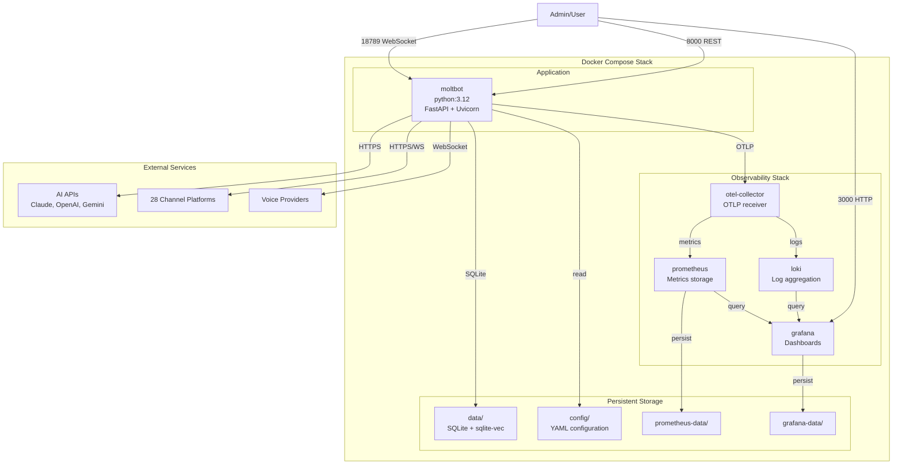
```mermaid
graph TB
    subgraph Docker["Docker Compose Stack"]
        subgraph App["Application"]
            MOLTBOT["moltbot<br/>python:3.12<br/>FastAPI + Uvicorn"]
        end

        subgraph Observability["Observability Stack"]
            OTEL["otel-collector<br/>OTLP receiver"]
            PROMETHEUS["prometheus<br/>Metrics storage"]
            GRAFANA["grafana<br/>Dashboards"]
            LOKI["loki<br/>Log aggregation"]
        end

        subgraph Storage["Persistent Storage"]
            DATA["data/<br/>SQLite + sqlite-vec"]
            CONFIG["config/<br/>YAML configuration"]
            METRICS["prometheus-data/"]
            GRAFANA_DATA["grafana-data/"]
        end
    end

    subgraph External["External Services"]
        AI["AI APIs<br/>Claude, OpenAI, Gemini"]
        CHANNELS["28 Channel Platforms"]
        VOICE["Voice Providers"]
    end

    MOLTBOT -->|"OTLP"| OTEL
    OTEL -->|"metrics"| PROMETHEUS
    OTEL -->|"logs"| LOKI
    PROMETHEUS -->|"query"| GRAFANA
    LOKI -->|"query"| GRAFANA

    MOLTBOT -->|"SQLite"| DATA
    MOLTBOT -->|"read"| CONFIG
    PROMETHEUS -->|"persist"| METRICS
    GRAFANA -->|"persist"| GRAFANA_DATA

    MOLTBOT -->|"HTTPS"| AI
    MOLTBOT -->|"HTTPS/WS"| CHANNELS
    MOLTBOT -->|"WebSocket"| VOICE

    USER["Admin/User"] -->|"18789 WebSocket"| MOLTBOT
    USER -->|"8000 REST"| MOLTBOT
    USER -->|"3000 HTTP"| GRAFANA
```

### IaC Structure

Based on Q6 (Docker Compose):

```
infrastructure/
├── docker-compose.yml          # Main compose file
├── docker-compose.override.yml # Development overrides
├── docker-compose.prod.yml     # Production overrides
├── Dockerfile                  # Application image
├── config/
│   ├── otel-collector.yaml     # OTel Collector config
│   ├── prometheus.yml          # Prometheus config
│   ├── grafana/
│   │   ├── provisioning/
│   │   │   ├── dashboards/     # Pre-configured dashboards
│   │   │   └── datasources/    # Prometheus + Loki sources
│   │   └── dashboards/
│   │       ├── gateway.json
│   │       ├── memory.json
│   │       └── channels.json
│   └── alertmanager.yml        # Alerting rules (optional)
├── scripts/
│   ├── healthcheck.sh          # Container health check
│   └── backup.sh               # SQLite backup script
└── .env.example                # Environment template
```

### Cost Comparison

| Component | Legacy Cost | Target Cost | Change |
|-----------|-------------|-------------|--------|
| Compute | Self-hosted | Self-hosted | No change |
| Database | $0 (SQLite) | $0 (SQLite) | No change |
| Network | Self-hosted | Self-hosted | No change |
| Observability | $0 (none) | $0 (self-hosted OTel) | No change |
| **Total** | $0 | $0 | **No change** |

*Note: Self-hosted model with Docker Compose. Only infrastructure cost is server hardware/hosting.*

---

## 22. CI/CD Pipeline (Target)

### Pipeline Overview

Based on Q5 (Docker Compose), Q10 (pytest 80%):

```mermaid
flowchart LR
    subgraph Trigger["Triggers"]
        PUSH["git push"]
        PR["Pull Request"]
        TAG["Release Tag"]
    end

    subgraph Build["Build Stage"]
        CHECKOUT["Checkout"]
        SETUP["Setup Python 3.12"]
        UV["uv sync"]
    end

    subgraph Quality["Quality Gates"]
        LINT["ruff check"]
        FORMAT["ruff format --check"]
        TYPES["mypy --strict"]
        SECURITY["bandit + pip-audit"]
    end

    subgraph Test["Test Stage"]
        UNIT["Unit Tests"]
        INTEGRATION["Integration Tests"]
        COVERAGE["Coverage (80%)"]
    end

    subgraph Package["Package Stage"]
        BUILD["Docker build"]
        SCAN["Image scan"]
        PUSH_IMG["Push to registry"]
    end

    subgraph Deploy["Deploy Stage"]
        DEV["Dev environment"]
        STAGING["Staging environment"]
        PROD["Production"]
    end

    PUSH --> CHECKOUT
    PR --> CHECKOUT
    TAG --> CHECKOUT

    CHECKOUT --> SETUP --> UV
    UV --> LINT & FORMAT & TYPES & SECURITY
    LINT & FORMAT & TYPES & SECURITY --> UNIT
    UNIT --> INTEGRATION --> COVERAGE
    COVERAGE --> BUILD --> SCAN --> PUSH_IMG
    PUSH_IMG --> DEV
    DEV --> STAGING
    STAGING --> PROD
```

### Pipeline Stages

| Stage | Tool | Purpose | Quality Gate |
|-------|------|---------|--------------|
| Checkout | actions/checkout | Clone repository | - |
| Setup | actions/setup-python | Install Python 3.12 | - |
| Dependencies | uv sync | Install packages | Lock file verified |
| Lint | ruff check | Code quality | 0 errors |
| Format | ruff format --check | Code style | No changes needed |
| Type check | mypy --strict | Type safety | 0 errors |
| Security | bandit + pip-audit | Security scan | No critical findings |
| Unit tests | pytest | Unit testing | All pass |
| Integration tests | pytest | Integration testing | All pass |
| Coverage | pytest-cov | Coverage report | ≥80% |
| Build | docker build | Container image | Build success |
| Image scan | trivy | Container security | No critical CVEs |
| Push | docker push | Registry upload | Push success |
| Deploy | docker compose | Deployment | Health checks pass |

### Environment Promotion

| Stage | Environment | Trigger | Approval |
|-------|-------------|---------|----------|
| Dev | development | Push to feature branch | Auto |
| Staging | staging | PR merge to main | Auto |
| Prod | production | Release tag (v*) | Manual |

### Rollback Strategy

| Scenario | Detection | Action | Recovery Time |
|----------|-----------|--------|---------------|
| Deployment failure | Health check fails | docker compose down && up (previous) | < 5 min |
| Performance degradation | Prometheus alerts | Manual assessment, rollback if needed | < 15 min |
| Data corruption | Integrity check | Restore from SQLite backup | < 30 min |
| Security incident | Audit log analysis | Isolate, investigate, patch | Variable |

### Pipeline Configuration

```yaml
# .github/workflows/ci.yml (target)
name: CI

on:
  push:
    branches: [main, 'feature/**']
  pull_request:
    branches: [main]
  release:
    types: [published]

env:
  PYTHON_VERSION: "3.12"

jobs:
  quality:
    runs-on: ubuntu-latest
    steps:
      - uses: actions/checkout@v4
      - uses: astral-sh/setup-uv@v4
      - run: uv sync --dev
      - run: uv run ruff check .
      - run: uv run ruff format --check .
      - run: uv run mypy --strict moltbot/
      - run: uv run bandit -r moltbot/
      - run: uv run pip-audit

  test:
    runs-on: ubuntu-latest
    needs: quality
    steps:
      - uses: actions/checkout@v4
      - uses: astral-sh/setup-uv@v4
      - run: uv sync --dev
      - run: uv run pytest --cov=moltbot --cov-report=xml --cov-fail-under=80
      - uses: codecov/codecov-action@v4

  build:
    runs-on: ubuntu-latest
    needs: test
    steps:
      - uses: actions/checkout@v4
      - uses: docker/setup-buildx-action@v3
      - uses: docker/build-push-action@v5
        with:
          push: ${{ github.event_name == 'release' }}
          tags: ghcr.io/${{ github.repository }}:${{ github.ref_name }}

  deploy:
    runs-on: ubuntu-latest
    needs: build
    if: github.event_name == 'release'
    environment: production
    steps:
      - name: Deploy to production
        run: |
          # SSH to server and docker compose pull && up -d
          echo "Deploying ${{ github.ref_name }}"
```

---

## 23. Open Questions & Next Steps

### Open Technical Questions

1. **Performance Baseline**: What are the exact legacy performance metrics (p95, p99 latency) for comparison?
2. **Channel Priority**: Which of the 28 channels are most critical for Phase 3 migration?
3. **WhatsApp Bridge**: Should we use Baileys subprocess bridge or seek a native Python solution?
4. **Voice Extension Priority**: Is voice calling critical for MVP or can it wait for Phase 4?
5. **TUI Necessity**: Is terminal UI needed in target, or is Web UI + Gateway sufficient?
6. **Web UI Framework**: React, Vue, or Svelte for the new SPA?

### Resolved Questions

| Question | Resolution | Evidence |
|----------|------------|----------|
| Target language | Python 3.12+ | User preference Q1 |
| Database technology | SQLite with sqlite-vec | User preference Q2 |
| Message bus | WebSocket + in-memory | User preference Q3 |
| Package manager | uv | User preference Q4 |
| Deployment platform | Docker Compose | User preference Q5 |
| IaC approach | Docker Compose (YAML) | User preference Q6 |
| Container runtime | Docker | User preference Q7 |
| Observability stack | Prometheus + JSON + OTel | User preference Q8 |
| Security approach | Token/Password/Tailscale | User preference Q9 |
| Testing framework | pytest 80% | User preference Q10 |
| Migration pattern | Strangler Fig | Validation scoring (68%) |
| Circular dependencies | Clean Architecture | Legacy analysis |

### Next Steps

1. **Review Technical Spec** with engineering team
2. **Resolve Open Questions** in this section
3. **Set up Python project** using uv + Clean Architecture template
4. **Implement Phase 1 Gateway** with FastAPI WebSocket
5. **Configure OpenTelemetry** stack in Docker Compose
6. **Write Phase 1 tests** targeting 80% coverage
7. **Begin Phase 2** after Gateway integration verified

### Migration Readiness Checklist

- [ ] All ADRs approved by stakeholders
- [ ] Python project structure created with uv
- [ ] Docker Compose updated with python:3.12 base image
- [ ] CI/CD pipeline configured for Python
- [ ] OpenTelemetry stack provisioned (Collector, Prometheus, Grafana)
- [ ] Security controls implemented (Argon2, timing-safe)
- [ ] Rollback procedures documented and tested
- [ ] Team trained on Python async patterns
- [ ] Gateway protocol compatibility verified
- [ ] Performance benchmarks established

---

## Appendices

### A. File Reference Index (Target)

| Section | Key Files |
|---------|-----------|
| Architecture | `pyproject.toml`, `docker-compose.yml`, `Dockerfile` |
| Domain | `moltbot/domain/models/`, `moltbot/domain/ports/` |
| Gateway | `moltbot/infrastructure/gateway/server.py` |
| Auth | `moltbot/infrastructure/auth/auth_service.py` |
| Memory | `moltbot/infrastructure/memory/memory_service.py` |
| Adapters | `moltbot/adapters/{channel}/adapter.py` |
| Config | `moltbot/infrastructure/config/settings.py` |
| Observability | `config/otel-collector.yaml`, `config/prometheus.yml` |
| CI/CD | `.github/workflows/ci.yml` |
| Tests | `tests/` (mirrors `moltbot/` structure) |

### B. Glossary (Target-Specific)

| Term | Definition |
|------|------------|
| Clean Architecture | Layered architecture with dependency inversion |
| Port | Abstract interface defined by domain layer |
| Adapter | Concrete implementation of a port |
| ASGI | Asynchronous Server Gateway Interface (Python) |
| Uvicorn | ASGI server for FastAPI |
| uv | Fast Python package manager |
| aiosqlite | Async SQLite wrapper for Python |
| tenacity | Python retry/circuit breaker library |
| slowapi | Rate limiting middleware for FastAPI |
| Pydantic | Python data validation library |
| APScheduler | Advanced Python Scheduler |
| Textual | Terminal UI framework for Python |

---

*Part 3 of 3 - Sections 17-23 Complete*

---

*Technical Specification - Target System Complete (23 Sections)*

---

===========================================================
ARTIFACT COMPLETE: technical-spec-target.md

Chain ID: 20260129-202219
Total Sections: 23

This documents HOW the TARGET system will be built.

User Preferences Applied (Q1-Q10):
  Q1 Language: Python 3.12+
  Q2 Database: SQLite with sqlite-vec
  Q3 Message Bus: WebSocket + in-memory
  Q4 Package Manager: uv
  Q5 Deployment: Docker Compose
  Q6 IaC: Docker Compose
  Q7 Container: Docker
  Q8 Observability: Prometheus, Structured JSON, OpenTelemetry
  Q9 Security: Keep current (Token/Password/Tailscale)
  Q10 Testing: pytest 80%

ARTIFACT_COMPLETE:TECHNICAL_SPEC_TARGET
===========================================================
