# Architecture: Domain-Based Multi-Agent Coordination

This document describes the federated agent architecture established through the **Kip vs Antigravity Debate** on 2026-02-01.

---

## The Problem

When running multiple AI agents, two fundamental approaches exist:

| Approach       | Pros                               | Cons                                     |
| -------------- | ---------------------------------- | ---------------------------------------- |
| **Monolith**   | Unified memory, consistent routing | Single point of failure, context limit   |
| **Federation** | Resilient, specialized contexts    | Coordination complexity, potential races |

This architecture implements a **synthesis**: Domain-Based Coordination with Shared State.

---

## The Model

```mermaid
graph TD
    User((Osman))
    SharedState[("SHARED STATE<br/>~/.sma-shared-context/")]

    subgraph "COORDINATORS (Peers)"
        Kip["🦊 KIP<br/>User-Facing"]
        Anti["🚀 ANTIGRAVITY<br/>Code-Heavy"]
        Arch["🤖 ARCHAGENTS<br/>Infrastructure"]
    end

    User -->|Request| Kip
    User -->|Arbitration| SharedState

    Kip <-->|Handoff| Anti
    Kip <-->|Status| Arch
    Anti <-->|Config| Arch

    Kip ==>|R/W| SharedState
    Anti ==>|R/W| SharedState
    Arch ==>|R/W| SharedState

    Watchdogs{{"External Watchdogs<br/>(inotify/systemd)"}}
    Watchdogs -.-> Kip
    Watchdogs -.-> Anti
```



---

## Key Principles

### 1. Primus Inter Pares

"First among equals" — each domain has a leader, but no dictator.

### 2. The Shared Map

The filesystem (`~/.sma-shared-context/`) is the source of truth, not any agent's memory.

**Contents:**

- `SYSTEM_STATUS.md` — Live port/service status
- `AGENT_ROSTER.md` — Who does what
- `COORDINATION_ACCORD.md` — Governance rules

### 3. External Watchdogs

Inspired by the **Halting Problem**: a hung process can't detect itself.

Reliability comes from external services:

- `kip-inbox-watcher.service` — inotify-based file detection
- `antigravity-inbox-watcher.service` — Triggers on file drops

### 4. No Veto Power

Agents cannot override each other. Disputes escalate to the human arbiter.

---

## The Handoff Protocol

When a task crosses domains:

```
1. PRIMARY identifies need for external expertise
2. PRIMARY writes `task-*.md` or `handoff-*.md` to TARGET's inbox
3. TARGET completes work
4. TARGET writes `report-*.md` back to PRIMARY
5. PRIMARY notifies USER
```

### Example: "Refactor auth and notify me"

| Step | Agent       | Action                                        |
| ---- | ----------- | --------------------------------------------- |
| 1    | Kip         | Receives request, identifies "Code-Heavy"     |
| 2    | Kip         | Writes `task-auth-refactor.md` to Antigravity |
| 3    | Antigravity | Performs refactor                             |
| 4    | Antigravity | Writes `report-auth-refactor.md` to Kip       |
| 5    | Kip         | Notifies Osman                                |

---

## Directory Structure

```
~/clawd/
├── inbox/                    # Kip's input
│   └── antigravity/          # Files FROM Antigravity
├── outbox/                   # Kip writes here for others
└── memory/                   # Daily logs

~/.sma-shared-context/        # The "Map" (shared by all)
├── SYSTEM_STATUS.md
├── AGENT_ROSTER.md
└── COORDINATION_ACCORD.md
```

---

## Historical Context

This architecture emerged from a formal debate between:

- **Kip (Claude)** — Argued for federation, external watchdogs, shared state
- **Antigravity (Gemini)** — Argued for central orchestration, unified memory

The final accord synthesized both views:

- ✅ Shared map (Kip's proposal)
- ✅ Domain-based routing (Antigravity's proposal)
- ✅ External watchdogs (Kip's proposal)
- ✅ Explicit handoff protocol (joint development)

See [COORDINATION_ACCORD.md](./COORDINATION_ACCORD.md) for the full governance document.
