# Steve Architecture Blueprint

> Last updated: January 6, 2026

## Overview

Steve is an AI executive assistant built on the **Clawdis** platform, running locally on David's MacBook Pro. He serves the Hurley family and the One Point Partners team.

```
┌─────────────────────────────────────────────────────────────────────────────┐
│                              STEVE (AI Agent)                                │
│                     "Executive Assistant for Hurleys"                        │
│                        Model: Claude Opus 4.5                                │
└─────────────────────────────────────────────────────────────────────────────┘
                                      │
                    ┌─────────────────┴─────────────────┐
                    ▼                                   ▼
           ┌───────────────┐                   ┌───────────────┐
           │   MESSAGING   │                   │    MEMORY     │
           │   SURFACES    │                   │    LAYER      │
           └───────────────┘                   └───────────────┘
```

---

## System Diagram

```mermaid
flowchart TB
    subgraph Gateway["🖥️ Clawdis Gateway (MacBook Pro)"]
        Steve["🤖 Steve<br/>Claude Opus 4.5"]
        Hooks["Webhooks<br/>:18789"]
        Cron["Cron Engine"]
    end

    subgraph Messaging["💬 Messaging Surfaces"]
        WA["📱 WhatsApp<br/>(Baileys)"]
        Discord["💜 Discord"]
        Web["🌐 Web UI<br/>:18789"]
    end

    subgraph Memory["🧠 Memory Layer"]
        Soul["SOUL.md<br/>Identity & Values"]
        User["USER.md<br/>David's Context"]
        Daily["memory/*.md<br/>Daily Notes"]
        Long["memory.md<br/>Long-term Facts"]
        QMD["qmd<br/>Semantic Search"]
    end

    subgraph CRM["📊 CRM Systems"]
        Twenty["Twenty CRM<br/>api.mollified.app<br/>(One Point Team)"]
        PPL["ppl.gift<br/>(Personal Contacts)"]
    end

    subgraph Google["📧 Google Workspace"]
        Gmail["Gmail<br/>dbh.today@gmail.com"]
        GCal["Calendar"]
        GDrive["Drive"]
        Contacts["Contacts"]
    end

    subgraph Media["🎬 Media Server (Synology)"]
        Plex["Plex :32400"]
        Radarr["Radarr :7878"]
        Sonarr["Sonarr :8989"]
        SAB["SABnzbd :8080"]
    end

    subgraph SmartHome["🏠 Smart Home"]
        Hue["Philips Hue<br/>192.168.4.95"]
        Eight["Eight Sleep"]
        HA["Home Assistant"]
    end

    subgraph External["🌐 External APIs"]
        Twitter["X/Twitter<br/>(bird)"]
        Brave["Brave Search"]
        Spotify["Spotify"]
        GitHub["GitHub"]
        Vercel["Vercel"]
        GoDaddy["GoDaddy"]
    end

    %% Connections
    WA <--> Steve
    Discord <--> Steve
    Web <--> Steve
    
    Steve --> Soul
    Steve --> User
    Steve --> Daily
    Steve --> Long
    Steve <--> QMD
    
    Steve <--> Twenty
    Steve <--> PPL
    
    Steve <--> Gmail
    Steve <--> GCal
    Steve <--> GDrive
    
    Steve <--> Plex
    Steve <--> Radarr
    Steve <--> Sonarr
    
    Steve <--> Hue
    Steve <--> Eight
    
    Steve <--> Twitter
    Steve <--> Brave
    Steve <--> Spotify
    Steve <--> GitHub
    
    Hooks --> Steve
    Cron --> Steve
```



---

## Components

### 🤖 Core Platform

| Component | Description |
|-----------|-------------|
| **Clawdis Gateway** | Local runtime on MacBook Pro, port 18789 |
| **Agent: Steve** | Claude Opus 4.5, executive assistant persona |
| **Workspace** | `/Users/dbhurley/clawd/` |
| **Skills** | 69 skill modules in `skills/` |

### 💬 Messaging Surfaces

| Surface | Status | Notes |
|---------|--------|-------|
| **WhatsApp** | ✅ Active | Primary channel, via Baileys |
| **Discord** | ✅ Active | For specific servers |
| **Web UI** | ✅ Active | localhost:18789 |

### 🧠 Memory System

```
/Users/dbhurley/clawd/
├── SOUL.md          # Who Steve is, values, behavior
├── USER.md          # David's info, family, preferences
├── IDENTITY.md      # Name, emoji, avatar
├── AGENTS.md        # Workspace rules & guidelines
├── TOOLS.md         # Local tool notes (IPs, hosts)
├── memory.md        # Long-term persistent facts
└── memory/
    ├── 2026-01-06.md           # Today's notes
    ├── heartbeat-state.json    # Proactive check tracking
    └── ...                     # Historical daily notes
```

**Semantic Search:** `qmd` indexes memory for natural language recall.

### ⏰ Scheduled Jobs (Crons)

| Job | Schedule | Description |
|-----|----------|-------------|
| **crypto-alert-check** | Every 15 min | Check BTC/ETH price thresholds |
| **daily-verse** | 6:05 AM ET | Bible.com verse to WhatsApp |
| **sync-skills** | Every 4 hours | Git sync workspace → repo |
| **kate-airport-thu** | Thu Jan 9 | One-time reminder |

### 📊 CRM Systems

| System | Purpose | Integration |
|--------|---------|-------------|
| **Twenty CRM** | One Point Partners team CRM | API at api.mollified.app |
| **ppl.gift** | Personal contacts & relationships | API |

### 🔧 Key Skills (69 total)

#### Communication
- `gog` - Google Workspace (Gmail, Calendar, Drive, Contacts)
- `wacli` - WhatsApp CLI (send to others)
- `imsg` - iMessage/SMS
- `bird` - X/Twitter
- `slack` - Slack integration
- `discord` - Discord control

#### CRM & Data
- `twenty` - Twenty CRM for One Point
- `ppl` - ppl.gift personal CRM
- `pptx` - PowerPoint parsing + Twenty sync
- `otter` - Otter.ai transcription

#### Media & Entertainment
- `plex` - Plex media control
- `radarr` - Movie management
- `sonarr` - TV show management
- `spotify-player` - Spotify playback
- `sag` - ElevenLabs TTS

#### Smart Home
- `openhue` - Philips Hue lights
- `eightctl` - Eight Sleep pod
- `homeassistant` - Home Assistant

#### Development
- `github` - GitHub CLI
- `vercel` - Deployments
- `godaddy` - Domain management
- `coding-agent` - Spawn coding assistants

#### Utilities
- `brave-search` - Web search
- `weather` - Forecasts
- `bible` - Verse of the day
- `crypto-tracker` - Price alerts
- `summarize` - URL/file summaries
- `qmd` - Semantic search

### 🔌 Webhooks

| Endpoint | Purpose |
|----------|---------|
| `/hooks/tradingview` | TradingView alerts → WhatsApp |

### 🏠 Network Topology

```
Home Network (192.168.4.x)
├── MacBook Pro (Gateway host)
├── Synology NAS (.84)
│   ├── Plex :32400
│   ├── Radarr :7878
│   ├── Sonarr :8989
│   └── SABnzbd :8080
├── Hue Bridge (.95)
└── Mac Mini (coming Jan 13-15)
```

---

## Data Flow Examples

### 1. WhatsApp Message → Response

```
User sends WhatsApp message
    → Baileys receives
    → Gateway routes to Steve
    → Steve processes (reads memory, uses skills)
    → Response sent back via Baileys
```

### 2. PPTX → Twenty CRM

```
User sends PPTX file
    → pptx skill parses community data
    → Extracts contacts, team, goals, market analysis
    → sync_to_twenty.py creates:
        - Updates engagement (manager, community link)
        - Creates People records
        - Creates Notes linked to engagement
```

### 3. Crypto Alert Check (Cron)

```
Every 15 minutes:
    → Cron triggers crypto-alert-check
    → Script checks BTC/ETH vs thresholds
    → If triggered: Steve sends WhatsApp alert
    → If not: Silent "ok"
```

---

## Multi-Tenant Access (One Point)

Steve serves multiple users with permission tiers:

| Tier | Access |
|------|--------|
| **Owner** (David) | Full access to everything |
| **Family** | All skills |
| **Work** (One Point) | twenty, gog, brave-search, github |
| **Extended Family** | brave-search, weather, ppl |

Permissions checked via `steve-auth` skill using ppl.gift tags.

---

## Future Additions

- [ ] Mac Mini as dedicated "brain" (Jan 13-15)
- [ ] Otter.ai transcription integration
- [ ] More One Point team members in Twenty
- [ ] SharePoint document indexing for One Point

---

*This document auto-generated by Steve. Update as architecture evolves.*
