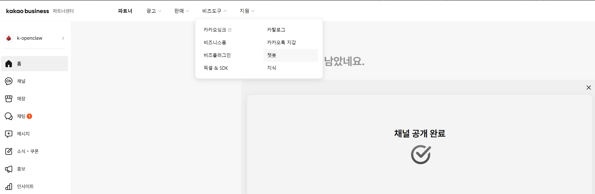
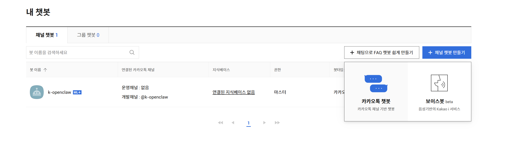
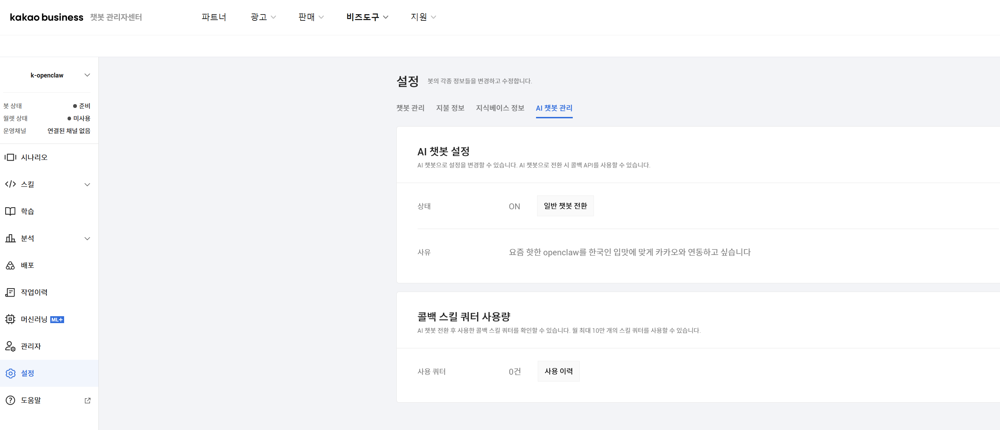
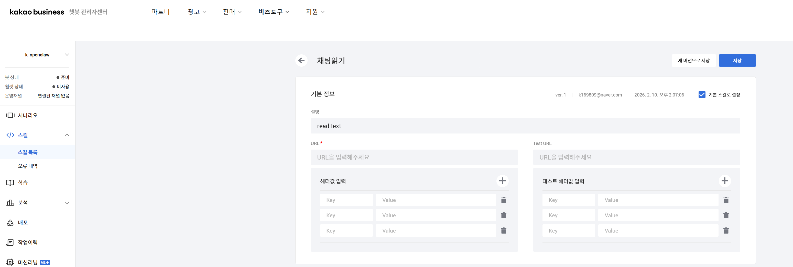
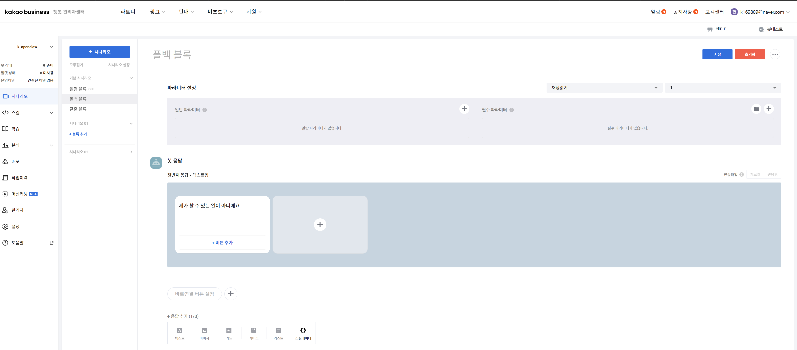
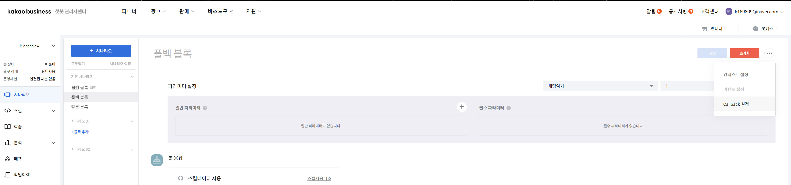
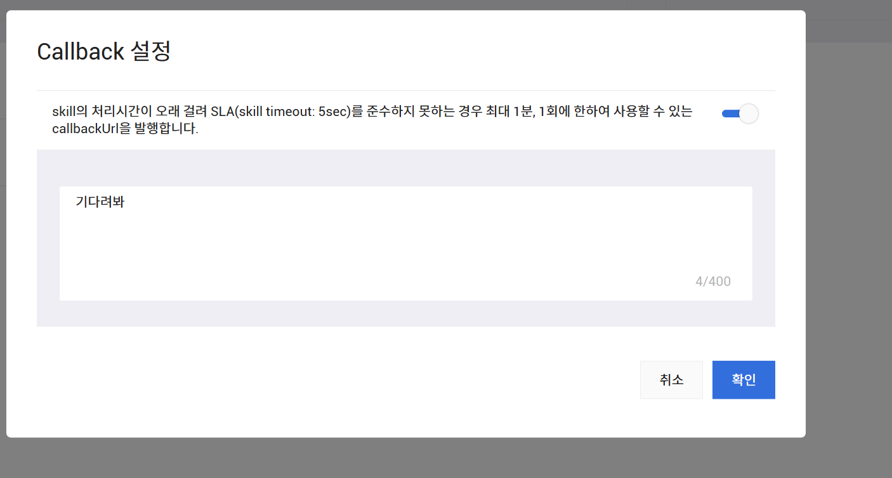

# OpenClaw Kakao Channel Plugin

This plugin wires a KakaoTalk Skill webhook to OpenClaw. It extracts `userRequest.utterance`, sends it to the agent, and replies using Kakao's callback URL.

# 1. 준비 해야 할 것

## 1.1 카카오 챗봇 만들기
https://business.kakao.com/_SxbxdzX/dashboard

우선 해당 링크에 접속하여 계정을 생성합니다.

다음으로 로그인 후 내 챗봇에 접속하여 챗봇을 하나 생성합니다.



다음으로 채널 챗봇 만들기 클릭 후 카카오톡 챗봇을 하나 만듭니다. 



**이렇게 하는 이유는 아직 카카오의 Skill URL이 고정되어 있기 때문에 챗봇 배포를 할 수 없습니다.**

설정 - AI 챗봇 관리에 접속 후 상태를 AI 챗봇으로 전환하면 됩니다.



이제 스킬 - 스킬목록 - 생성을 눌러서 새 스킬을 생성합니다.


스킬 url은 잠시 비워두고 스킬 명과 설명만 추가합니다.



## 1.2 ngrok으로 로컬 터널링하기

원래는 집 와이파이의 공인 ip를 서버 url로 설정하는 것이 더 좋지만 제 환경이 내부망 환경이라 어쩔 수 없이 ngrok을 이용하였습니다.

참고로 ngrok으로 만든 외부 ip는 시간 제한이 있기 때문에 계속 연결해서 쓰고 싶으신 분들은 유료 결제를 하셔야 합니다.

https://ngrok.com/pricing

### 설치
Linux 환경이시라면 아래 명령어를 그대로 치시면 됩니다.

```bash
curl -sSL https://ngrok-agent.s3.amazonaws.com/ngrok.asc \
  | sudo tee /etc/apt/trusted.gpg.d/ngrok.asc >/dev/null \
  && echo "deb https://ngrok-agent.s3.amazonaws.com bookworm main" \
  | sudo tee /etc/apt/sources.list.d/ngrok.list \
  && sudo apt update \
  && sudo apt install ngrok
  ```
  
  설치 이후 다음 명령어를 입력합니다. 이때 your-IP 부분에는 실제 openclaw가 올라와 있는 포트를 입력하시면 됩니다.

  ```bash
  Example with ngrok:
  ngrok http <<your-IP>>
```

이제 아까 생성했던 스킬 URL에 ngrok에서 제공한 URL을 그대로 넣으시고 저장하시면 됩니다.

>  **{url}/kakao/webhook** 처럼 url 뒤에 **/kakao/webhook** 을 붙여주셔야 동작합니다!

## 1.3 시나리오 생성하기

이제 시나리오 - 폴백 블럭으로 넘어와서 아래처럼 응답에 스킬 데이터 사용을 눌러줍니다.



다음으로 초기화 오른쪽 ... 버튼을 누른 후 callback URL 설정을 클릭합니다. **해당 문구가 보이지 않는 분들은 AI 챗봇 설정이 되지 않은 것이므로 다시 확인 부탁드립니다.**



이제 응답을 생성할 동안 사용할 문구를 넣으신 후 활성화 해주시면 됩니다.



# 2. 프로젝트 터미널 설정

**1) Enable the plugin**
```bash
pnpm openclaw plugins enable kakao
```

**2) Configure the Kakao channel**
Use either the default webhook path or provide your own.

Default path (recommended):
```bash
pnpm openclaw config set channels.kakao.webhookPath "/kakao/webhook"
```

Allow all users (skip pairing/allowlist):
```bash
pnpm openclaw config set channels.kakao.dmPolicy "open"
pnpm openclaw config set channels.kakao.allowFrom "[\"*\"]"
```

If you want a stricter policy:
```bash
pnpm openclaw config set channels.kakao.dmPolicy "pairing"
```

**3) Start the gateway**
Pick a port that your tunnel will forward to:
```bash
pnpm openclaw gateway --port <<your-port>> --bind loopback
```

**4) Test with curl**
```bash
curl -X POST https://<your-tunnel-host>/kakao/webhook \
  -H "Content-Type: application/json" \
  -d '{"userRequest":{"utterance":"안녕","user":{"id":"test-user"}}}'
```

